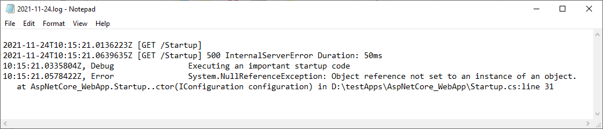
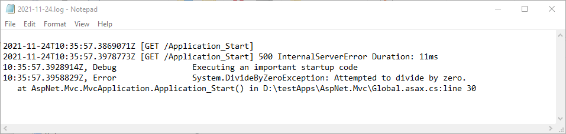

Logging during Application Startup
========================================

In some scenarios you need to log messages during the application startup, prior to any logging configuration.

This can be achieved by invoking a listener programmatically.

In the example below you will save **Startup.cs** events to a local text file using ``LocalTextFileListener``.

.. code-block:: c#

    using KissLog;
    using KissLog.Listeners.FileListener;
    using System;

    namespace AspNetCore_WebApp
    {
        public class Startup
        {
            public Startup(IConfiguration configuration)
            {
                Configuration = configuration;

                Logger logger = new Logger(url: "Startup");
                try
                {
                    logger.Debug("Executing an important startup code");

                    string message = null;
                    int length = message.Length;    // will throw NullReferenceException
                }
                catch (Exception ex)
                {
                    logger.Error(ex);
                    throw;
                }
                finally
                {
                    FlushLogArgs flushLogArgs = FlushLogArgsFactory.Create(new[] { logger });
                    
                    // programmatically invoke LocalTextFileListener
                    var listener = new LocalTextFileListener("logs", FlushTrigger.OnFlush);
                    listener.OnFlush(flushLogArgs);
                }
            }

            public IConfiguration Configuration { get; }

            public void ConfigureServices(IServiceCollection services)
            {
                // [ ... ]
            }

            public void Configure(IApplicationBuilder app, IWebHostEnvironment env)
            {
                // [ ... ]
            }
        }
    }

The same concept can be followed for other scenarios.

In the example below you will save **Global.asax** events to a local text file using ``LocalTextFileListener``.

.. code-block:: c#

    using KissLog;
    using KissLog.Listeners.FileListener;
    using System;

    namespace AspNet.Mvc
    {
        public class MvcApplication : System.Web.HttpApplication
        {
            protected void Application_Start()
            {
                AreaRegistration.RegisterAllAreas();
                RouteConfig.RegisterRoutes(RouteTable.Routes);

                Logger logger = new Logger(url: "Application_Start");
                try
                {
                    logger.Debug("Executing an important startup code");

                    int value = 0;
                    int result = 100 / value;    // will throw DivideByZeroException
                }
                catch (Exception ex)
                {
                    logger.Error(ex);
                    throw;
                }
                finally
                {
                    FlushLogArgs flushLogArgs = FlushLogArgsFactory.Create(new[] { logger });

                    // programmatically invoke LocalTextFileListener
                    var listener = new LocalTextFileListener("logs", FlushTrigger.OnFlush);
                    listener.OnFlush(flushLogArgs);
                }
            }

            // [ ... ]
        }
    }

