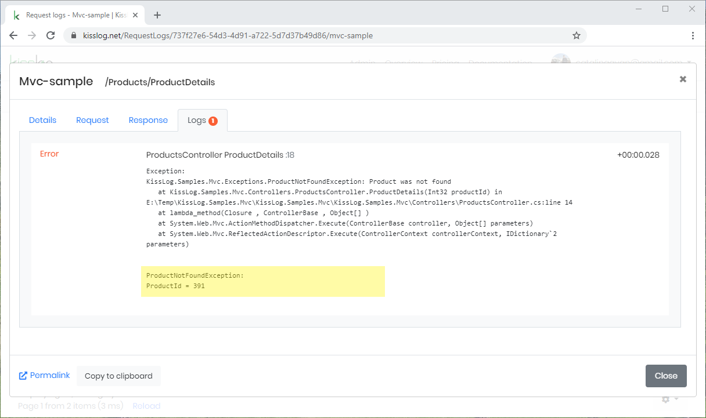
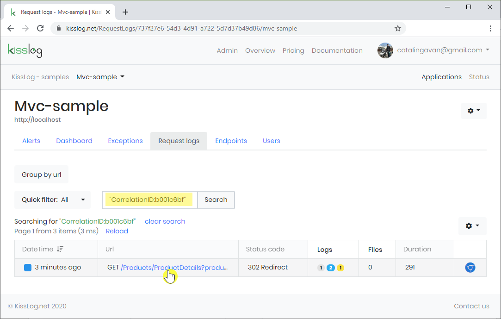
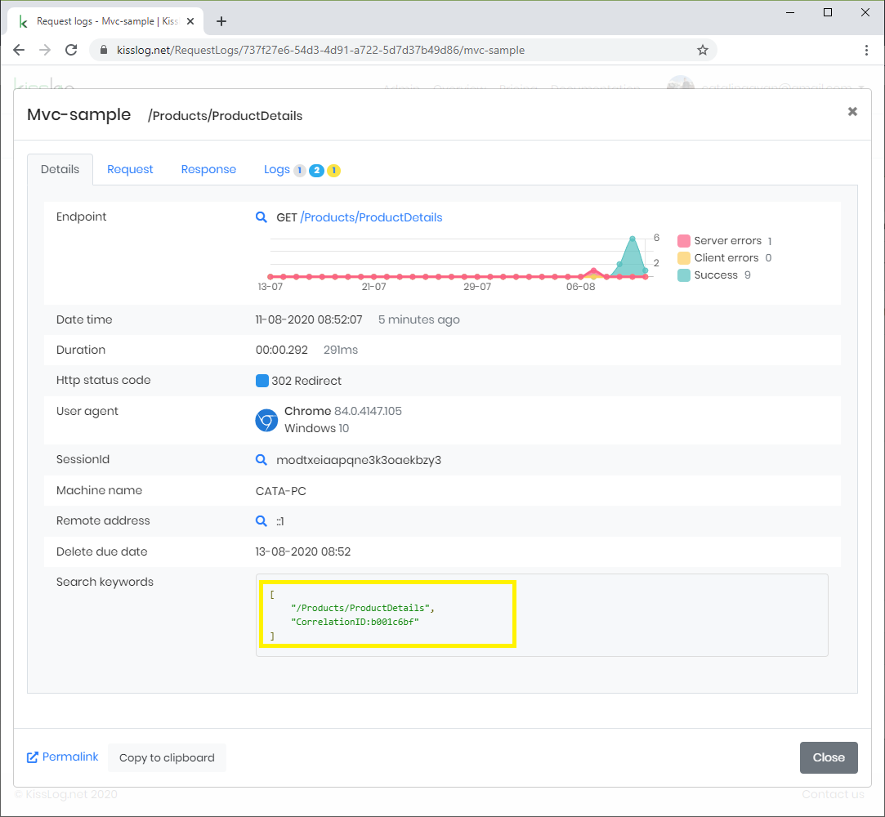
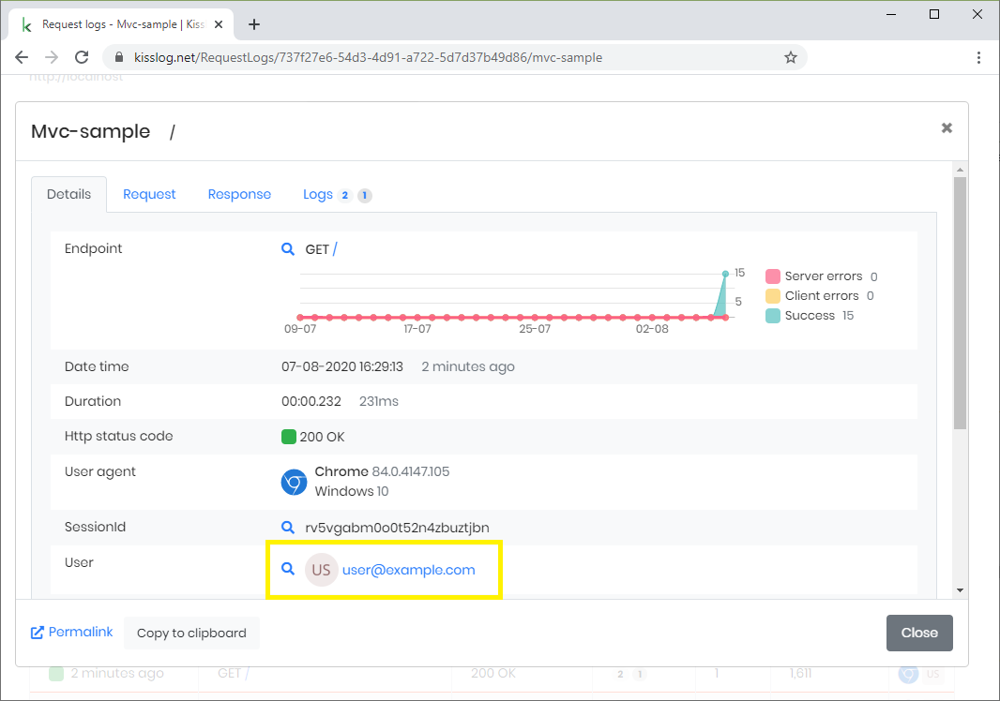
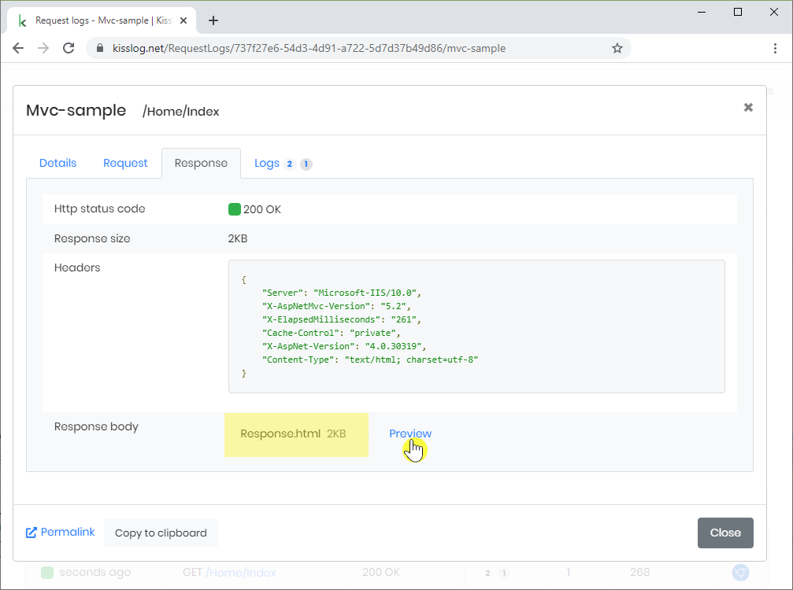
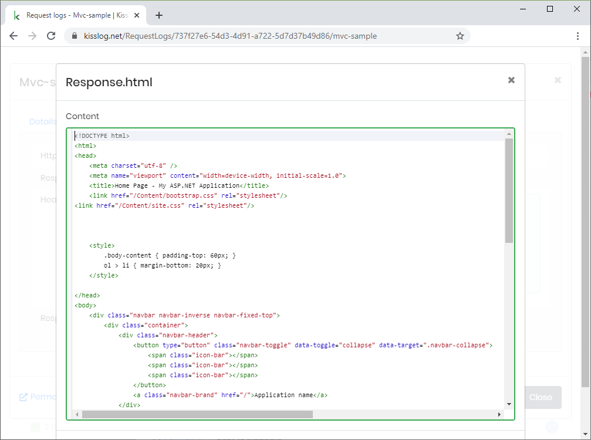

Configuration
=====================

Use ``KissLogConfiguration.Options`` container to extend the logging behavior of KissLog.

.. contents:: Configuration options
   :local:

AppendExceptionDetails
-------------------------------------------------------

Gets executed everytime an exception is logged.

Use this handler to intercept specific exceptions and append additional text to the log message.

.. code-block:: c#

    private void ConfigureKissLog()
    {
        KissLogConfiguration.Options
            .AppendExceptionDetails((Exception ex) =>
            {
                StringBuilder sb = new StringBuilder();

                if (ex is ProductNotFoundException productNotFoundEx)
                {
                    sb.AppendLine("ProductNotFoundException:");
                    sb.AppendLine("ProductId = " + productNotFoundEx.ProductId);
                }

                return sb.ToString();
            });
    }

   AppendExceptionDetails

GenerateKeywords
-------------------------------------------------------

Using this handler you can assign search keywords for a specific http request.

.. code-block:: c#
    :emphasize-lines: 14,16

    private void ConfigureKissLog()
    {
        KissLogConfiguration.Options
            .GenerateKeywords((FlushLogArgs args, IList<string> defaultKeywords) =>
            {
                List<string> keywords = new List<string>();
                bool includeDefaultKeywords = false;

                if (includeDefaultKeywords)
                {
                    keywords.AddRange(defaultKeywords);
                }

                keywords.Add("CorrelationID:b001c6bf");

                return keywords;
            });
    }

   Search using "CorrelationID:b001c6bf" keyword

   Request log with "CorrelationID:b001c6bf" keyword

GetUser
-------------------------------------------------------

This handler is used to customize the captured user display information.

.. code-block:: c#

    private void ConfigureKissLog()
    {
        KissLogConfiguration.Options
            .GetUser((RequestProperties request) =>
            {
                // user name can be retrieved from the Request Claims
                // string nameClaim = "http://schemas.xmlsoap.org/ws/2005/05/identity/claims/name";
                // string name = request.Claims.FirstOrDefault(p => p.Key == nameClaim).Value;

                string name = "user@example.com";
                string avatar = string.Format("https://eu.ui-avatars.com/api/?name={0}&size=256", name);

                return new UserDetails
                {
                    Name = name,
                    Avatar = avatar
                };
            });
    }

   Customized user display information

OnRequestLogsApiListenerException
-------------------------------------------------------

This handler is invoked when the REST request to KissLog server fails.

.. code-block:: c#

    private void ConfigureKissLog()
    {
        KissLogConfiguration.Options
            .OnRequestLogsApiListenerException((ExceptionArgs args) =>
            {
                // KissLog server returned an error while saving the request
                // we will save the logs to local text file instead

                var localTextFileListener = new LocalTextFileListener(Path.Combine(AppDomain.CurrentDomain.BaseDirectory, "Logs"))
                {
                    FlushTrigger = FlushTrigger.OnFlush
                };
                localTextFileListener.OnFlush(args.FlushArgs, null);
            });
    }

ShouldLogRequestClaim
-------------------------------------------------------

Runtime handler used to determine if a request claim should be logged or not. Default: ``true``

.. code-block:: c#

    private void ConfigureKissLog()
    {
        KissLogConfiguration.Options
            .ShouldLogRequestClaim((ILogListener listener, FlushLogArgs args, string claimName) =>
            {
                if (claimName == "secret_claim")
                    return false;

                return true;
            });
    }

ShouldLogRequestCookie
-------------------------------------------------------

Runtime handler used to determine if a request Cookie should be logged or not. Default: ``false``

.. code-block:: c#

    private void ConfigureKissLog()
    {
        KissLogConfiguration.Options
            .ShouldLogRequestCookie((ILogListener listener, FlushLogArgs args, string cookieName) =>
            {
                if (cookieName == ".AspNetCore.Cookies")
                    return false;

                return true;
            });
    }

ShouldLogRequestFormData
-------------------------------------------------------

Runtime handler used to determine if a request FormData should be logged or not. Default: ``true``

.. code-block:: c#

    private void ConfigureKissLog()
    {
        KissLogConfiguration.Options
            .ShouldLogRequestFormData((ILogListener listener, FlushLogArgs args, string name) =>
            {
                if (name == "PinNumber")
                    return false;

                return true;
            });
    }

ShouldLogRequestHeader
-------------------------------------------------------

Runtime handler used to determine if a request Header should be logged or not. Default: ``true``

.. code-block:: c#

    private void ConfigureKissLog()
    {
        KissLogConfiguration.Options
            .ShouldLogRequestHeader((ILogListener listener, FlushLogArgs args, string headerName) =>
            {
                if (headerName == "X-JWT-Token")
                    return false;

                return true;
            });
    }

ShouldLogRequestInputStream
-------------------------------------------------------

Runtime handler used to determine if a request InputStream should be logged or not. Default: ``true``

.. code-block:: c#

    private void ConfigureKissLog()
    {
        KissLogConfiguration.Options
            .ShouldLogRequestInputStream((ILogListener listener, FlushLogArgs args) =>
            {
                if ((int)args.WebProperties.Response.HttpStatusCode >= 400)
                    return true;

                return false;
            });
    }

ShouldLogRequestServerVariable
-------------------------------------------------------

Runtime handler used to determine if a request ServerVariable should be logged or not. Default: ``true``

.. code-block:: c#

    private void ConfigureKissLog()
    {
        KissLogConfiguration.Options
            .ShouldLogRequestServerVariable((ILogListener listener, FlushLogArgs args, string name) =>
            {
                if (name == "SERVER_NAME")
                    return true;

                return false;
            });
    }

ShouldLogResponseBody
-------------------------------------------------------

Runtime handler used to determine if the response body should be logged or not.

``defaultValue = true`` when the response Content-Type is "application/json".

.. code-block:: c#

    private void ConfigureKissLog()
    {
        KissLogConfiguration.Options
            .ShouldLogResponseBody((ILogListener listener, FlushLogArgs args, bool defaultValue) =>
            {
                string url = args.WebProperties.Request.Url.LocalPath;

                // always log the "/Home/Index" response body
                if(string.Compare(url, "/Home/Index", true) == 0)
                    return true;

                return defaultValue;
            });
    }

   "/Home/Index" Response body

   Response body preview

ShouldLogResponseHeader
-------------------------------------------------------

Runtime handler used to determine if a response Header should be logged or not. Default: ``true``

.. code-block:: c#

    private void ConfigureKissLog()
    {
        KissLogConfiguration.Options
            .ShouldLogResponseHeader((ILogListener listener, FlushLogArgs args, string headerName) =>
            {
                if (headerName == "X-Auth-Token")
                    return false;

                return true;
            });
    }

ToggleListener
-------------------------------------------------------

Runtime handler used to enable/disable a registered log listener for a particular request.

.. code-block:: c#

    private void ConfigureKissLog()
    {
        KissLogConfiguration.Options
            .ToggleListener((ILogListener listener, FlushLogArgs args) =>
            {
                if(listener.GetType() == typeof(SqlLogListener))
                {
                    if ((int)args.WebProperties.Response.HttpStatusCode >= 400)
                        return true;

                    return false;
                }

                return true;
            });
    }

