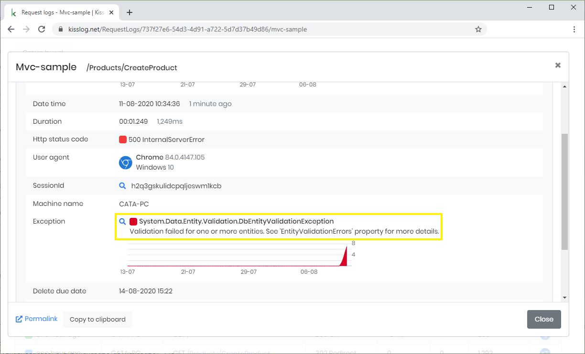
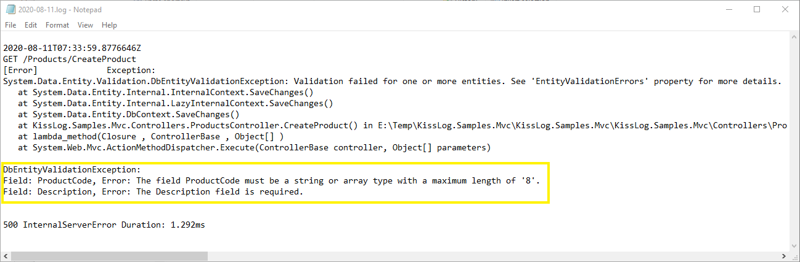

Entity Framework validation exception
=======================================

DbEntityValidationException is the exception thrown by Entity Framework when the entity validation fails.

.. code-block:: none

    System.Data.Entity.Validation.DbEntityValidationException:
    Validation failed for one or more entities. See 'EntityValidationErrors' property for more details.

You can use the :ref:`AppendExceptionDetails handler <appendexceptiondetails>` to capture the exception and log the validation errors.

**Example**

.. code-block:: c#
    :caption: Global.asax
    :linenos:
    :emphasize-lines: 19,21,30
    
    namespace MyApp.Mvc
    {
        public class MvcApplication : System.Web.HttpApplication
        {
            protected void Application_Start()
            {
                // [...]
    
                ConfigureKissLog();
            }
    
            private void ConfigureKissLog()
            {
                KissLogConfiguration.Options
                    .AppendExceptionDetails((Exception ex) =>
                    {
                        StringBuilder sb = new StringBuilder();
    
                        if (ex is DbEntityValidationException dbException)
                        {
                            sb.AppendLine("DbEntityValidationException:");

                            foreach (var error in dbException.EntityValidationErrors.SelectMany(p => p.ValidationErrors))
                            {
                                string message = string.Format("Field: {0}, Error: {1}", error.PropertyName, error.ErrorMessage);
                                sb.AppendLine(message);
                            }
                        }
    
                        return sb.ToString();
                    });
            }
        }
    }

**Result**

   DbEntityValidationException

.. figure:: images/DbEntityValidationException/DbEntityValidationException-ValidationErrors.png
   :alt: Appending ValidationErrors to the log message
   :align: center

   Inspect the ValidationErrors (kisslog.net)

   Inspect the ValidationErrors (text logs)