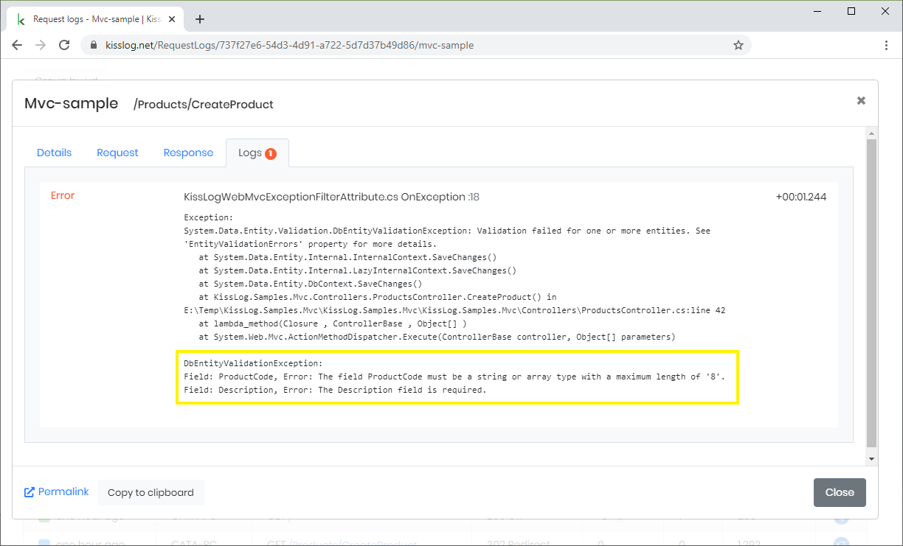

Entity Framework Validation Exception
=====================================================

When Entity Framework attempts to save an entity and the validation fails, ``SaveChanges()`` will throw a generic ``DbEntityValidationException``.

The exception doesn't specify the actual validation errors, making the troubleshooting process difficult.

.. code-block:: none

    System.Data.Entity.Validation.DbEntityValidationException:
    Validation failed for one or more entities. See 'EntityValidationErrors' property for more details.

**Solution**

We can configure KissLog to capture and log the Entity Framework validation errors.

.. code-block:: none

    DbEntityValidationException:
    Field: ProductCode, Error: The field ProductCode must be a string or array type with a maximum length of '8'.
    Field: Description, Error: The Description field is required.

**Implementation**

.. code-block:: c#
    :caption: Global.asax
    :linenos:
    :emphasize-lines: 19,21,30
    
    namespace MyApp.Mvc
    {
        public class MvcApplication : System.Web.HttpApplication
        {
            protected void Application_Start()
            {
                // [...]
    
                ConfigureKissLog();
            }
    
            private void ConfigureKissLog()
            {
                KissLogConfiguration.Options
                    .AppendExceptionDetails((Exception ex) =>
                    {
                        StringBuilder sb = new StringBuilder();
    
                        if (ex is DbEntityValidationException dbException)
                        {
                            sb.AppendLine("DbEntityValidationException:");

                            foreach (var error in dbException.EntityValidationErrors.SelectMany(p => p.ValidationErrors))
                            {
                                string message = string.Format("Field: {0}, Error: {1}", error.PropertyName, error.ErrorMessage);
                                sb.AppendLine(message);
                            }
                        }
    
                        return sb.ToString();
                    });
            }
        }
    }
