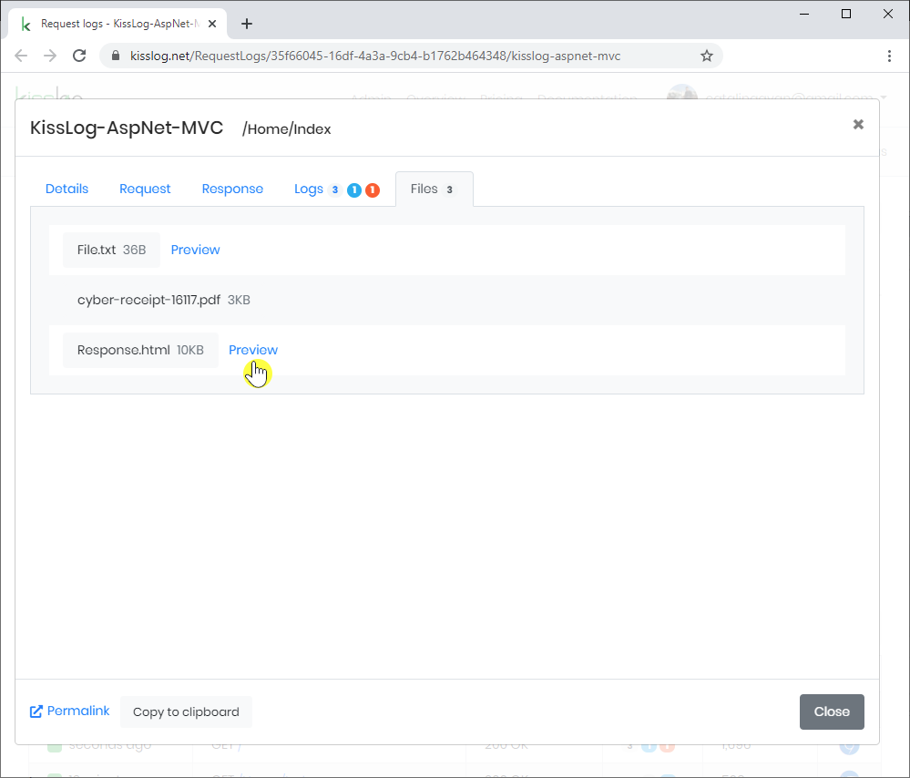
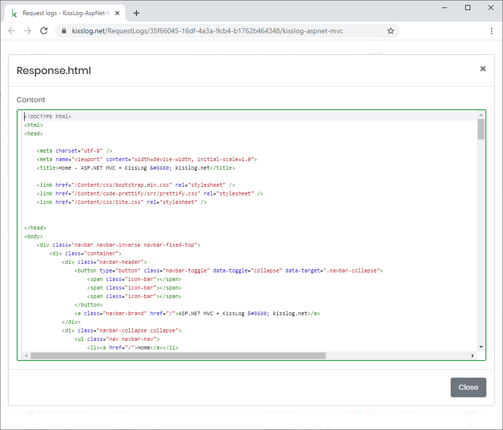

Log files
=====================================================

KissLog can be used to log files. This is useful when you need to:

* log large text messages which would normally be truncated
* save files which have been generated / processed throughout the request
* save response body

.. code-block:: c#
    :caption: HomeController.cs
    :emphasize-lines: 15-17

    using KissLog;

    namespace MyApp.Mvc.Controllers
    {
        public class HomeController : Controller
        {
            private readonly ILogger _logger;
            public HomeController()
            {
                _logger = Logger.Factory.Get();
            }
    
            public ActionResult Index()
            {
                _logger.LogAsFile("This content will be saved as a file", "File.txt");
                _logger.LogFile(@"C:\\Users\\Downloads\\cyber-receipt-16117.pdf", "cyber-receipt.pdf");
                _logger.LogResponseBody(true);

                return View();
            }
        }
    }

