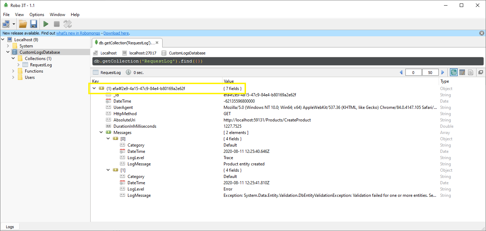
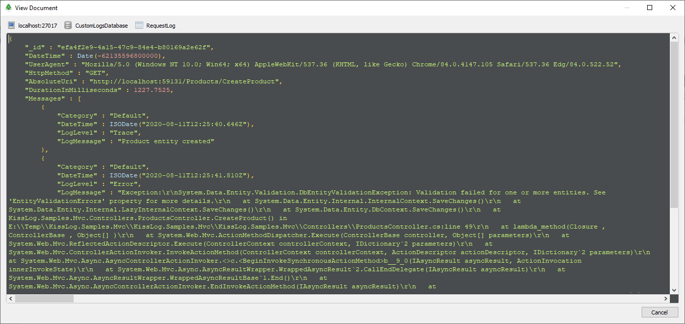

Custom MongoDB listener
============================

In the following example, we will create a custom ``ILogListener`` which saves the logs to MongoDB database.

To start, we define two entities which will store the logs data, respectively ``RequestLog`` and ``Message``.

.. code-block:: c#

    namespace MyApp.Models
    {
        public class RequestLog
        {
            public string Id { get; private set; }
            public DateTime DateTime { get; set; }
            public string UserAgent { get; set; }
            public string HttpMethod { get; set; }
            public string AbsoluteUri { get; set; }
            public double DurationInMilliseconds { get; set; }

            public IEnumerable<Message> Messages { get; set; }

            public RequestLog()
            {
                Id = Guid.NewGuid().ToString();
                Messages = new List<Message>();
            }
        }
    }

.. code-block:: c#

    namespace MyApp.Models
    {
        public class Message
        {
            public string Category { get; set; }
            public DateTime DateTime { get; set; }
            public string LogLevel { get; set; }
            public string LogMessage { get; set; }
        }
    }

Next, we create the ``MongoDbContext``, which will help us query the MongoDB database.

.. code-block:: c#

    using MongoDB.Driver;
    using MyApp.Models; 

    namespace MyApp.MongoDb
    {
        public class MongoDbContext
        {
            private readonly IMongoDatabase _db;
            public MongoDbContext()
            {
                var mongoClient = new MongoClient("mongodb://localhost:27017");
                _db = mongoClient.GetDatabase("CustomLogsDatabase");
            }

            // we define a "RequestLog" collection
            public IMongoCollection<RequestLog> RequestLogs => _db.GetCollection<RequestLog>("RequestLog");
        }
    }

Finally, we create the ``MongoDbListener``, which will save the logs to MongoDB.

.. code-block:: c#
    :emphasize-lines: 32-33

    using MyApp.Models;
    using KissLog;
    using KissLog.Web;

    namespace MyApp.MongoDb
    {
        public class MongoDbListener : ILogListener
        {
            public int MinimumResponseHttpStatusCode { get; set; } = 0;
            public LogLevel MinimumLogMessageLevel { get; set; } = LogLevel.Trace;
            public LogListenerParser Parser { get; set; } = new LogListenerParser();

            public void OnBeginRequest(HttpRequest httpRequest, ILogger logger)
            {
                // do nothing
            }

            public void OnMessage(LogMessage message, ILogger logger)
            {
                // do nothing
            }

            public void OnFlush(FlushLogArgs args, ILogger logger)
            {
                var logMessages = args.MessagesGroups.SelectMany(p => p.Messages).OrderBy(p => p.DateTime).ToList();

                // create the entities
                RequestLog requestLog = ToModel(args.WebProperties);
                requestLog.Messages = logMessages.Select(p => ToModel(p)).ToList();

                // save the entities to MongoDB
                MongoDbContext dbContext = new MongoDbContext();
                dbContext.RequestLogs.InsertOne(requestLog);
            }

            private Message ToModel(LogMessage logMessage)
            {
                return new Message
                {
                    Category = logMessage.CategoryName,
                    DateTime = logMessage.DateTime,
                    LogLevel = logMessage.LogLevel.ToString(),
                    LogMessage = logMessage.Message
                };
            }

            private RequestLog ToModel(WebProperties webProperties)
            {
                HttpRequest request = webProperties.Request;
                HttpResponse response = webProperties.Response;

                double durationInMs = (response.EndDateTime - request.StartDateTime).TotalMilliseconds;

                return new RequestLog
                {
                    UserAgent = request.UserAgent,
                    HttpMethod = request.HttpMethod,
                    AbsoluteUri = request.Url.AbsoluteUri,
                    DurationInMilliseconds = durationInMs
                };
            }
        }
    }

Last step is to register the newly created MongoDbListener.

.. code-block:: c#
    :linenos:
    :emphasize-lines: 12

    using KissLog;
    using MyApp.MongoDb

    namespace MyApp
    {
        public class MvcApplication : System.Web.HttpApplication
        {
            // [...]

            private void RegisterKissLogListeners()
            {
                KissLogConfiguration.Listeners.Add(new MongoDbListener());
            }
        }
    }

**Result**

   MongoDbListener output

   Inspecting the request log entity

