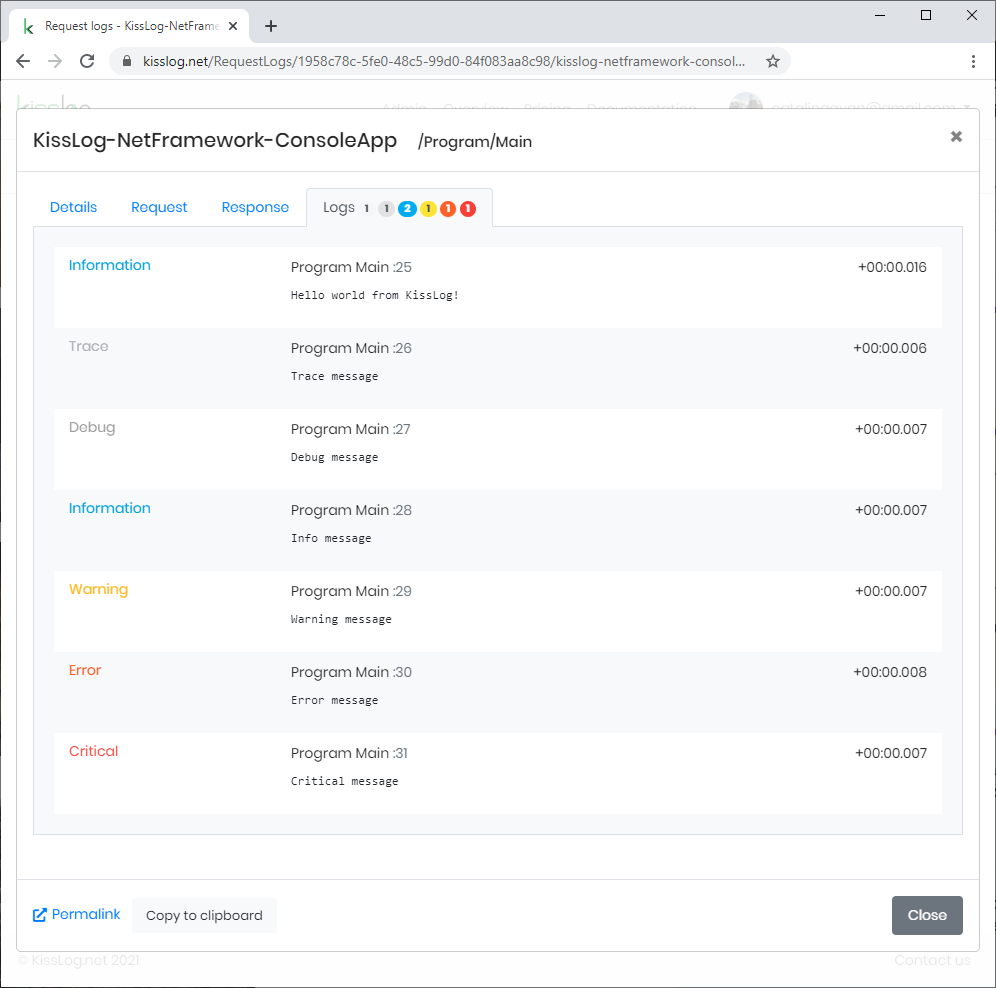

Console applications
====================

These steps describe how to install and configure KissLog for a Console application.

1. Install NuGet Packages

.. code-block:: none
    :caption: Package Manager Console

    PM> Install-Package KissLog
    PM> Install-Package KissLog.CloudListeners

2. Update **App.config**

.. code-block:: xml
    :caption: App.config

    <configuration>
        <appSettings>
            <add key="KissLog.OrganizationId" value="_OrganizationId_" />
            <add key="KissLog.ApplicationId" value="_ApplicationId_" />
            <add key="KissLog.ApiUrl" value="https://api.kisslog.net" />
        </appSettings>
    </configuration>

3. Update **Program.cs**

.. code-block:: c#
    :caption: Program.cs
    :linenos:
    :emphasize-lines: 1-3,11,16,42

    using KissLog;
    using KissLog.CloudListeners.Auth;
    using KissLog.CloudListeners.RequestLogsListener;

    namespace MyApp.ConsoleApp
    {
        class Program
        {
            static void Main(string[] args)
            {
                ConfigureKissLog();

                // [...]
            }

            static void ConfigureKissLog()
            {
                // optional KissLog configuration
                KissLogConfiguration.Options
                    .AppendExceptionDetails((Exception ex) =>
                    {
                        StringBuilder sb = new StringBuilder();
    
                        if (ex is DivideByZeroException divideByZeroException)
                        {
                            sb.AppendLine("DivideByZeroException");
                        }
    
                        return sb.ToString();
                    });
    
                // KissLog internal logs
                KissLogConfiguration.InternalLog = (message) =>
                {
                    Debug.WriteLine(message);
                };

                // register logs output
                RegisterKissLogListeners();
            }

            static void RegisterKissLogListeners()
            {
                // multiple listeners can be registered using KissLogConfiguration.Listeners.Add() method

                // add KissLog.net cloud listener
                 KissLogConfiguration.Listeners.Add(new RequestLogsApiListener(new Application(
                    ConfigurationManager.AppSettings["KissLog.OrganizationId"],
                    ConfigurationManager.AppSettings["KissLog.ApplicationId"])
                )
                {
                    ApiUrl = ConfigurationManager.AppSettings["KissLog.ApiUrl"],
                    UseAsync = false
                });
            }
        }
    }

4. Write logs using **ILogger**

.. code-block:: c#
    :caption: Program.cs
    :linenos:
    :emphasize-lines: 9,13,23

    namespace MyApp.ConsoleApp
    {
        class Program
        {
            static void Main(string[] args)
            {
                ConfigureKissLog();
    
                ILogger logger = new Logger(url: "/Program/Main");

                try
                {
                    logger.Info("Hello world from KissLog!");
                    logger.Trace("Trace message");
                    logger.Debug("Debug message");
                    logger.Info("Info message");
                    logger.Warn("Warning message");
                    logger.Error("Error message");
                    logger.Critical("Critical message");
                }
                finally
                {
                    Logger.NotifyListeners(logger);
                }
            }
        }
    }

   Console Application + KissLog

`AspNetCore ConsoleApp sample application <https://github.com/KissLog-net/KissLog.Samples/tree/master/src/KissLog-AspNetCore-ConsoleApp>`_

`ASP.NET ConsoleApp sample application <https://github.com/KissLog-net/KissLog.Samples/tree/master/src/KissLog-NetFramework-ConsoleApp>`_
