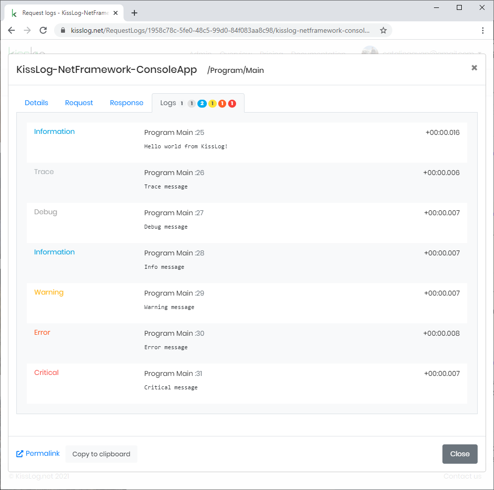

Console App (.NET Framework)
==============================

These steps describe how to install and configure KissLog for a .NET Framework Console application.

A full working example can be found `here <https://github.com/KissLog-net/KissLog.Sdk/tree/master/testApps/ConsoleApp_NetFramework>`_.

By following the install instructions, you will:

- create a "main" logger instance and use it throughout the ``Main(string[] args)`` method execution
- register ``RequestLogsApiListener`` listener which will save the captured data to `kisslog.net <https://kisslog.net>`_

Instructions
----------------------------------------------

1. Install NuGet Packages

.. code-block:: none
    :caption: Package Manager Console

    PM> Install-Package KissLog
    PM> Install-Package KissLog.CloudListeners

2. Update **App.config**

.. code-block:: xml
    :caption: App.config

    <configuration>
        <appSettings>
            <add key="KissLog.OrganizationId" value="_OrganizationId_" />
            <add key="KissLog.ApplicationId" value="_ApplicationId_" />
            <add key="KissLog.ApiUrl" value="https://api.kisslog.net" />
        </appSettings>
    </configuration>

3. Update **Program.cs**

.. code-block:: c#
    :caption: Program.cs
    :linenos:
    :emphasize-lines: 1-3,11,13,15,23

    using KissLog;
    using KissLog.CloudListeners.Auth;
    using KissLog.CloudListeners.RequestLogsListener;

    namespace ConsoleApp_NetFramework
    {
        class Program
        {
            static void Main(string[] args)
            {
                Logger.SetFactory(new LoggerFactory(new Logger(url: "ConsoleApp/Main")));

                ConfigureKissLog();

                IKLogger logger = Logger.Factory.Get();

                logger.Trace("Trace log");
                logger.Debug("Debug log");
                logger.Info("Information log");

                // notify the listeners
                var loggers = Logger.Factory.GetAll();
                Logger.NotifyListeners(loggers);
            }

            static void ConfigureKissLog()
            {
                KissLogConfiguration.InternalLog = (message) =>
                {
                    Debug.WriteLine(message);
                };

                KissLogConfiguration.Listeners
                    .Add(new RequestLogsApiListener(new Application(ConfigurationManager.AppSettings["KissLog.OrganizationId"], ConfigurationManager.AppSettings["KissLog.ApplicationId"]))
                    {
                        ApiUrl = ConfigurationManager.AppSettings["KissLog.ApiUrl"],
                        UseAsync = false
                    });
            }
        }
    }

