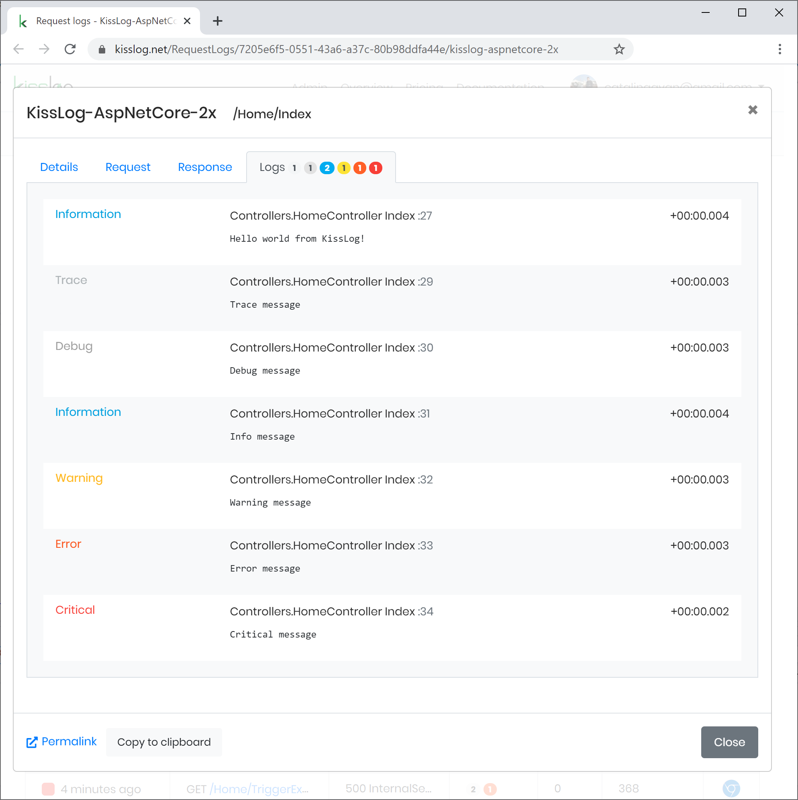

.NET Core 2.x
====================

These steps describe how to install and configure KissLog for a .NET Core 2.x application.

1. Install NuGet Package

.. code-block:: none
    :caption: Package Manager Console

    PM> Install-Package KissLog.AspNetCore
   

2. Update **appsettings.json**

.. code-block:: javascript
    :caption: appsettings.json

    {
        "KissLog.OrganizationId": "_OrganizationId_",
        "KissLog.ApplicationId": "_ApplicationId_",
        "KissLog.ApiUrl": "https://api.kisslog.net"
    }

3. Update **Startup.cs**

.. code-block:: c#
    :caption: Startup.cs
    :linenos:
    :emphasize-lines: 1-4,19-23,43-45,55,78,81

    using KissLog;
    using KissLog.AspNetCore;
    using KissLog.CloudListeners.Auth;
    using KissLog.CloudListeners.RequestLogsListener;
        
    namespace MyApp.NetCore20
    {
        public class Startup
        {
            public Startup(IConfiguration configuration)
            {
                Configuration = configuration;
            }

            public IConfiguration Configuration { get; }

            public void ConfigureServices(IServiceCollection services)
            {
                services.AddSingleton<IHttpContextAccessor, HttpContextAccessor>();
                services.AddScoped<ILogger>((context) =>
                {
                    return Logger.Factory.Get();
                });

                services.AddMvc();
            }

            public void Configure(IApplicationBuilder app, IHostingEnvironment env)
            {
                if (env.IsDevelopment())
                {
                    app.UseDeveloperExceptionPage();
                }
                else
                {
                    app.UseExceptionHandler("/Home/Error");
                }

                app.UseStaticFiles();
                app.UseAuthentication()
                app.UseSession()

                app.UseKissLogMiddleware(options => {
                    ConfigureKissLog(options);
                });

                app.UseMvc(routes =>
                {
                    routes.MapRoute(
                        name: "default",
                        template: "{controller=Home}/{action=Index}/{id?}");
                });
            }

            private void ConfigureKissLog(IOptionsBuilder options)
            {
                // optional KissLog configuration
                options.Options
                    .AppendExceptionDetails((Exception ex) =>
                    {
                        StringBuilder sb = new StringBuilder();

                        if (ex is System.NullReferenceException nullRefException)
                        {
                            sb.AppendLine("Important: check for null references");
                        }

                        return sb.ToString();
                    });

                // KissLog internal logs
                options.InternalLog = (message) =>
                {
                    Debug.WriteLine(message);
                };

                // register logs output
                RegisterKissLogListeners(options);
            }

            private void RegisterKissLogListeners(IOptionsBuilder options)
            {
                // multiple listeners can be registered using options.Listeners.Add() method

                // add KissLog.net cloud listener
                options.Listeners.Add(new RequestLogsApiListener(new Application(
                    Configuration["KissLog.OrganizationId"],
                    Configuration["KissLog.ApplicationId"])
                )
                {
                    ApiUrl = Configuration["KissLog.ApiUrl"]
                });
            }
        }
    }

4. Write logs using **ILogger**

.. code-block:: c#
    :caption: HomeController.cs
    :linenos:
    :emphasize-lines: 1,8,11,16

    using KissLog;
    using Microsoft.AspNetCore.Mvc;
    
    namespace MyApp.NetCore20.Controllers
    {
        public class HomeController : Controller
        {
            private readonly ILogger _logger;
            public HomeController(ILogger logger)
            {
                _logger = logger;
            }
    
            public IActionResult Index()
            {
                _logger.Info("Hello world from KissLog!");
                _logger.Trace("Trace message");
                _logger.Debug("Debug message");
                _logger.Info("Info message");
                _logger.Warn("Warning message");
                _logger.Error("Error message");
                _logger.Critical("Critical message");

                return View();
            }
        }
    }

   AspNetCore 2.x