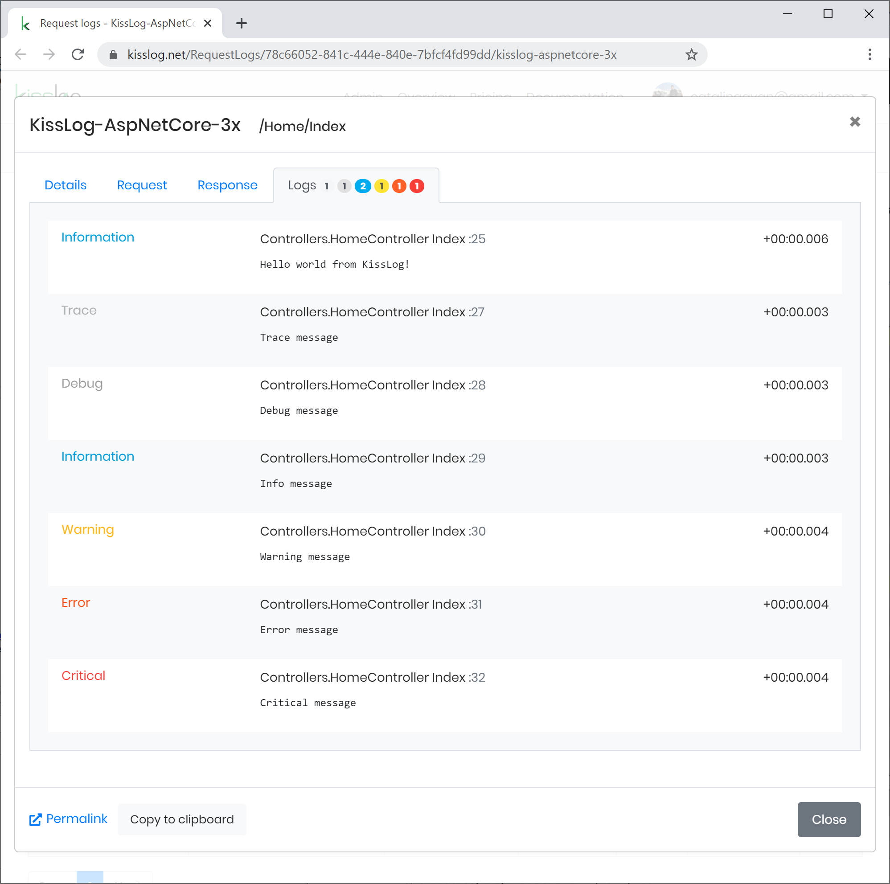

.NET Core 3.x
====================

These steps describe how to install and configure KissLog for a .NET Core 3.x application.

1. Install NuGet Package

.. code-block:: none
    :caption: Package Manager Console

    PM> Install-Package KissLog.AspNetCore
   

2. Update **appsettings.json**

.. code-block:: javascript
    :caption: appsettings.json
    :emphasize-lines: 9-11

    {
        "Logging": {
            "LogLevel": {
                "Default": "Trace",
                "Microsoft": "Information"
            }
        },

        "KissLog.OrganizationId": "_OrganizationId_",
        "KissLog.ApplicationId": "_ApplicationId_",
        "KissLog.ApiUrl": "https://api.kisslog.net"
    }

3. Update **Startup.cs**

.. code-block:: c#
    :caption: Startup.cs
    :linenos:
    :emphasize-lines: 1-4,19-23,25-28,51-53,86

    using KissLog;
    using KissLog.AspNetCore;
    using KissLog.CloudListeners.Auth;
    using KissLog.CloudListeners.RequestLogsListener;
        
    namespace MyApp.NetCore30
    {
        public class Startup
        {
            public Startup(IConfiguration configuration)
            {
                Configuration = configuration;
            }

            public IConfiguration Configuration { get; }

            public void ConfigureServices(IServiceCollection services)
            {
                services.AddHttpContextAccessor();

                services.AddLogging(logging =>
                {
                    logging.AddKissLog(options =>
                    {
                        options.Formatter = (FormatterArgs args) =>
                        {
                            string message = args.DefaultValue;

                            if (args.Exception == null)
                                return message;

                            string exceptionStr = new ExceptionFormatter().Format(args.Exception, args.Logger);

                            StringBuilder sb = new StringBuilder();
                            sb.AppendLine(message);
                            sb.Append(exceptionStr);

                            return sb.ToString();
                        };
                    });
                });

                services.AddSession();

                services.AddControllersWithViews();
            }

            public void Configure(IApplicationBuilder app, IWebHostEnvironment env)
            {
                if (env.IsDevelopment())
                {
                    app.UseDeveloperExceptionPage();
                }
                else
                {
                    app.UseExceptionHandler("/Home/Error");
                }

                app.UseStaticFiles();
                app.UseRouting();
                app.UseAuthorization();
                app.UseSession();

                app.UseKissLogMiddleware(options => {
                    ConfigureKissLog(options);
                });

                app.UseEndpoints(endpoints =>
                {
                    endpoints.MapControllerRoute(
                        name: "default",
                        pattern: "{controller=Home}/{action=Index}/{id?}");
                });
            }

            private void ConfigureKissLog(IOptionsBuilder options)
            {
                // optional KissLog configuration
                options.Options
                    .AppendExceptionDetails((Exception ex) =>
                    {
                        StringBuilder sb = new StringBuilder();

                        if (ex is System.NullReferenceException nullRefException)
                        {
                            sb.AppendLine("Important: check for null references");
                        }

                        return sb.ToString();
                    });

                // KissLog internal logs
                options.InternalLog = (message) =>
                {
                    Debug.WriteLine(message);
                };

                // register logs output
                RegisterKissLogListeners(options);
            }

            private void RegisterKissLogListeners(IOptionsBuilder options)
            {
                // multiple listeners can be registered using options.Listeners.Add() method

                // add KissLog.net cloud listener
                options.Listeners.Add(new RequestLogsApiListener(new Application(
                    Configuration["KissLog.OrganizationId"],
                    Configuration["KissLog.ApplicationId"])
                )
                {
                    ApiUrl = Configuration["KissLog.ApiUrl"]
                });
            }
        }
    }

4. Write logs:

.. code-block:: c#
    :caption: HomeController.cs
    :linenos:
    :emphasize-lines: 1,7,15

    using Microsoft.Extensions.Logging;
    
    namespace MyApp.NetCore30.Controllers
    {
        public class HomeController : Controller
        {
            private readonly ILogger<HomeController> _logger;
            public HomeController(ILogger<HomeController> logger)
            {
                _logger = logger;
            }
    
            public IActionResult Index()
            {
                _logger.LogInformation("Hello world from KissLog!");
                _logger.LogTrace("Trace message");
                _logger.LogDebug("Debug message");
                _logger.LogInformation("Info message");
                _logger.LogWarning("Warning message");
                _logger.LogError("Error message");
                _logger.LogCritical("Critical message");

                return View();
            }
        }
    }

   AspNetCore 3.x
