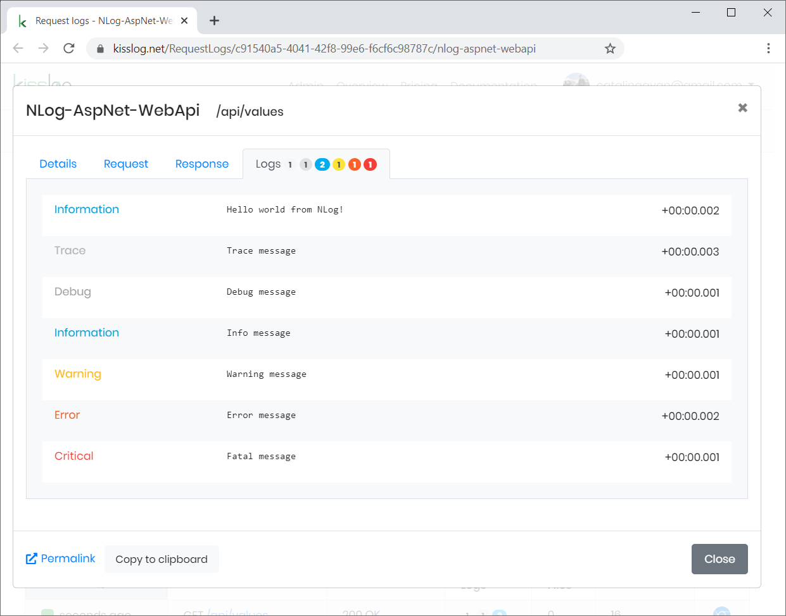

NLog + ASP.NET WebApi
======================

If you have an ASP.NET WebApi application which is already using NLog, you can configure it to save the logs to kisslog.net.

1. Install NuGet Package

.. code-block:: none
    :caption: Package Manager Console

    PM> Install-Package KissLog.AspNet.WebApi
    PM> Install-Package KissLog.Adapters.NLog

2. Update **web.config**

.. code-block:: xml
    :caption: web.config

    <configuration>
        <appSettings>
            <add key="KissLog.OrganizationId" value="_OrganizationId_" />
            <add key="KissLog.ApplicationId" value="_ApplicationId_" />
            <add key="KissLog.ApiUrl" value="https://api.kisslog.net" />
        </appSettings>
    </configuration>

3. Update **NLog.config**

.. code-block:: xml
    :caption: NLog.config
    :emphasize-lines: 3-5,9,14

    <?xml version="1.0" encoding="utf-8" ?>
    <nlog xmlns="http://www.nlog-project.org/schemas/NLog.xsd" xmlns:xsi="http://www.w3.org/2001/XMLSchema-instance">
        <extensions>
            <add assembly="KissLog.Adapters.NLog"/>
        </extensions>
 
        <targets>
            <target name="logfile" xsi:type="File" fileName="${baseDir}/logs/nlog-${shortdate}.log" layout="${longdate} ${uppercase:${level}} ${message}" />
            <target name="kisslog" xsi:type="KissLog" layout="${message}" />
        </targets>
 
        <rules>
            <logger name="*" minlevel="Trace" writeTo="logfile" />
            <logger name="*" minlevel="Trace" writeTo="kisslog" />
        </rules>
    </nlog>

4. Update **Global.asax**

.. code-block:: c#
    :caption: Global.asax
    :linenos:
    :emphasize-lines: 1-4,14,17-30,32,55,58,73,75-80

    using KissLog;
    using KissLog.AspNet.Web;
    using KissLog.CloudListeners.Auth;
    using KissLog.CloudListeners.RequestLogsListener;
    
    namespace MyApp.WebApi
    {
        public class WebApiApplication : System.Web.HttpApplication
        {
            protected void Application_Start()
            {
                GlobalConfiguration.Configure(WebApiConfig.Register);

                ConfigureKissLog();
            }

            protected void Application_Error(object sender, EventArgs e)
            {
                Exception exception = Server.GetLastError();
                if (exception != null)
                {
                    var logger = Logger.Factory.Get();
                    logger.Error(exception);

                    if(logger.AutoFlush() == false)
                    {
                        Logger.NotifyListeners(logger);
                    }
                }
            }

            private void ConfigureKissLog()
            {
                // optional KissLog configuration
                KissLogConfiguration.Options
                    .AppendExceptionDetails((Exception ex) =>
                    {
                        StringBuilder sb = new StringBuilder();
    
                        if (ex is System.NullReferenceException nullRefException)
                        {
                            sb.AppendLine("Important: check for null references");
                        }
    
                        return sb.ToString();
                    });
    
                // KissLog internal logs
                KissLogConfiguration.InternalLog = (message) =>
                {
                    Debug.WriteLine(message);
                };

                // register logs output
                RegisterKissLogListeners();
            }

            private void RegisterKissLogListeners()
            {
                // multiple listeners can be registered using KissLogConfiguration.Listeners.Add() method

                // add KissLog.net cloud listener
                KissLogConfiguration.Listeners.Add(new RequestLogsApiListener(new Application(
                    ConfigurationManager.AppSettings["KissLog.OrganizationId"],
                    ConfigurationManager.AppSettings["KissLog.ApplicationId"])
                )
                {
                    ApiUrl = ConfigurationManager.AppSettings["KissLog.ApiUrl"]
                });
            }

            // Register HttpModule
            public static KissLogHttpModule KissLogHttpModule = new KissLogHttpModule();

            public override void Init()
            {
                base.Init();

                KissLogHttpModule.Init(this);
            }
        }
    }

5. Update **WebApiConfig.cs**

.. code-block:: c#
    :caption: WebApiConfig.cs
    :linenos:
    :emphasize-lines: 12, 15

    using KissLog.AspNet.WebApi;
    using System.Web.Http;
    using System.Web.Http.ExceptionHandling;
    
    namespace MyApp.WebApi
    {
        public static class WebApiConfig
        {
            public static void Register(HttpConfiguration config)
            {
                // Add KissLog Exception logger
                config.Services.Replace(typeof(IExceptionLogger), new KissLogExceptionLogger());
    
                // Add KissLog exception filter
                config.Filters.Add(new KissLogWebApiExceptionFilterAttribute());
    
                // Web API routes
                config.MapHttpAttributeRoutes();
    
                config.Routes.MapHttpRoute(
                    name: "DefaultApi",
                    routeTemplate: "api/{controller}/{id}",
                    defaults: new { id = RouteParameter.Optional }
                );
            }
        }
    }

6. Write logs using **ILogger**

.. code-block:: c#
    :caption: ValuesController.cs
    :linenos:
    :emphasize-lines: 1,7,10,15

    using NLog;

    namespace MyApp.WebApi.Controllers
    {
        public class ValuesController : ApiController
        {
            private readonly ILogger _logger;
            public ValuesController()
            {
                _logger = LogManager.GetCurrentClassLogger();
            }

            public IEnumerable<string> Get()
            {
                _logger.Info("Hello world from NLog!");
                _logger.Trace("Trace message");
                _logger.Debug("Debug message");
                _logger.Info("Info message");
                _logger.Warn("Warning message");
                _logger.Error("Error message");
                _logger.Fatal("Fatal message");

                return new string[] { "value1", "value2" };
            }
        }
    }

   ASP.NET WebApi + NLog

`View sample application <https://github.com/KissLog-net/KissLog.Samples/tree/master/src/NLog-AspNet-WebApi>`_