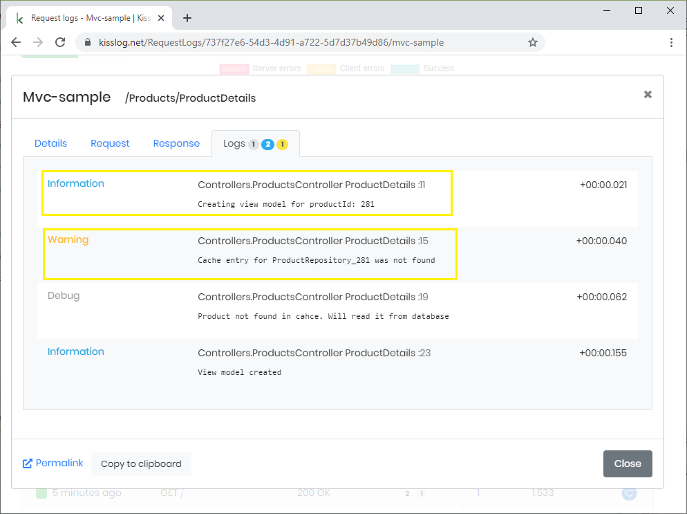
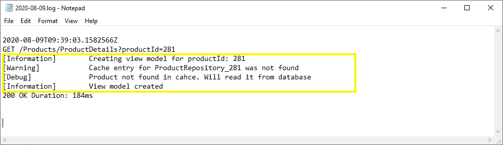
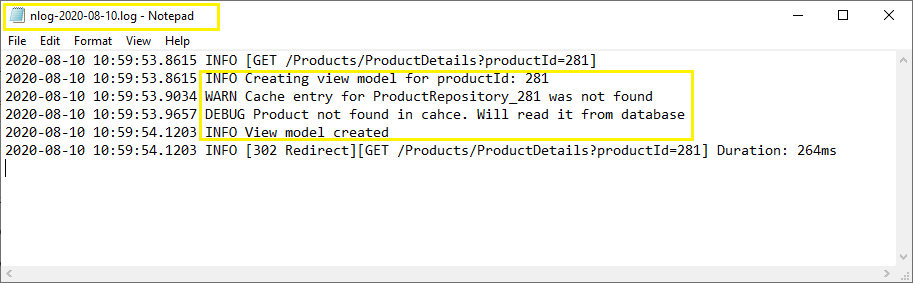
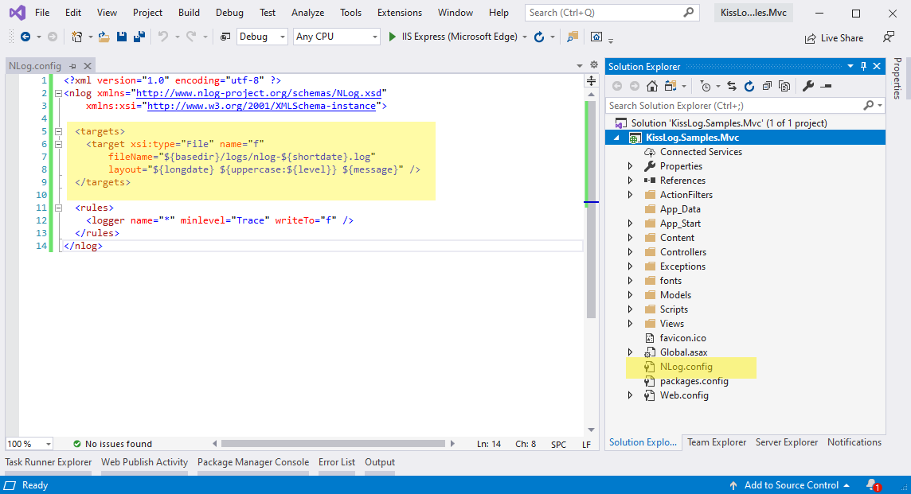
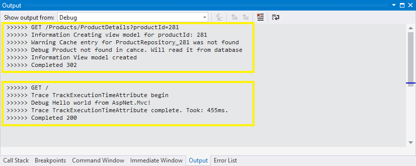

Logs output
====================

KissLog saves the logs to multiple output locations by using log listeners.

Log listeners are registered at application startup using the ``KissLogConfiguration.Listeners`` container.

.. contents:: Log listeners
   :local:

KissLog.net listener
----------------------------------------------

`RequestLogsApiListener <https://github.com/KissLog-net/KissLog.Sdk/blob/master/src/KissLog.CloudListeners/RequestLogsListener/RequestLogsApiListener.cs>`_ saves the logs to kisslog.net (or KissLog on-premises).

   RequestLogsApiListener output

.. code-block:: c#
    :caption: Usage
    :linenos:
    :emphasize-lines: 1-3,13-16,19

    using KissLog;
    using KissLog.CloudListeners.Auth;
    using KissLog.CloudListeners.RequestLogsListener;

    namespace MyApplication
    {
        public class MvcApplication : System.Web.HttpApplication
        {
            // [...]

            private void RegisterKissLogListeners()
            {
                ILogListener listener = new RequestLogsApiListener(new Application("_OrganizationId_", "_ApplicationId_"))
                {
                    ApiUrl = "https://api.kisslog.net"
                };

                // register KissLog.net cloud listener
                KissLogConfiguration.Listeners.Add(listener);
            }
        }
    }

    
Text file listener
----------------------------------------------

`LocalTextFileListener <https://github.com/KissLog-net/KissLog.Sdk/blob/master/src/KissLog/Listeners/LocalTextFileListener.cs>`_ saves the logs on local text files.

   LocalTextFileListener output

.. code-block:: c#
    :caption: Usage
    :linenos:
    :emphasize-lines: 1,11-14,17

    using KissLog;

    namespace MyApplication
    {
        public class MvcApplication : System.Web.HttpApplication
        {
            // [...]

            private void RegisterKissLogListeners()
            {
                ILogListener listener = new LocalTextFileListener(Path.Combine(AppDomain.CurrentDomain.BaseDirectory, "Logs"))
                {
                    FlushTrigger = FlushTrigger.OnMessage
                };

                // register local text file listener
                KissLogConfiguration.Listeners.Add(listener);
            }
        }
    }

NLog listener
----------------------------------------------

`NLogTargetListener <https://github.com/KissLog-net/KissLog.Sdk/blob/master/src/KissLog.Adapters.NLog/NLogTargetListener.cs>`_ saves the logs created with ``KissLog`` to all the ``NLog`` targets defined in **NLog.config**.

This is useful when you want to use save the logs to both ``kisslog.net`` and ``NLog`` text-files.

   NLog output

   NLog.config

.. code-block:: c#
    :caption: Registering NLog listener
    :linenos:
    :emphasize-lines: 1,12

    using KissLog;

    namespace MyApplication
    {
        public class MvcApplication : System.Web.HttpApplication
        {
            // [...]

            private void RegisterKissLogListeners()
            {
                // register NLog listener
                KissLogConfiguration.Listeners.Add(new NLogTargetListener());

                // optionally, we register the KissLog.net cloud listener
                KissLogConfiguration.Listeners.Add(new RequestLogsApiListener(new Application("_OrganizationId_", "_ApplicationId_"))
                {
                    ApiUrl = "https://api.kisslog.net"
                });
            }
        }
    }

Custom listeners
----------------------------------------------

Custom log listeners can be created by implementing the ``ILogListener`` interface.

.. code-block:: c#
    :linenos:
    :caption: Creating custom log listener:
    :emphasize-lines: 11,18,30

    public class DebugOutputListener : ILogListener
    {
        public int MinimumResponseHttpStatusCode { get; set; } = 0;
        public LogLevel MinimumLogMessageLevel { get; set; } = LogLevel.Trace;
        public LogListenerParser Parser { get; set; } = new LogListenerParser();

        public void OnBeginRequest(HttpRequest httpRequest, ILogger logger)
        {
            string text = string.Format(">>>>>> {0} {1}", httpRequest.HttpMethod, httpRequest.Url.PathAndQuery);

            Debug.WriteLine(text);
        }

        public void OnMessage(LogMessage message, ILogger logger)
        {
            string text = string.Format(">>>>>> {0} {1}", message.LogLevel, message.Message);

            Debug.WriteLine(text);
        }

        public void OnFlush(FlushLogArgs args, ILogger logger)
        {
            HttpRequest request = args.WebProperties.Request;
            HttpResponse response = args.WebProperties.Response;

            int httpStatusCode = (int)response.HttpStatusCode;

            string text = string.Format(">>>>>> Completed {0}", httpStatusCode);

            Debug.WriteLine(text);
        }
    }

.. code-block:: c#
    :caption: Registering the custom DebugOutputListener:
    :linenos:
    :emphasize-lines: 11

    using KissLog;

    namespace MyApplication
    {
        public class MvcApplication : System.Web.HttpApplication
        {
            // [...]

            private void RegisterKissLogListeners()
            {
                KissLogConfiguration.Listeners.Add(new DebugOutputListener());
            }
        }
    }

   DebugOutputListener output

Another custom log listener can be found on the :doc:`/SDK/examples/MongoDbListener` example.

