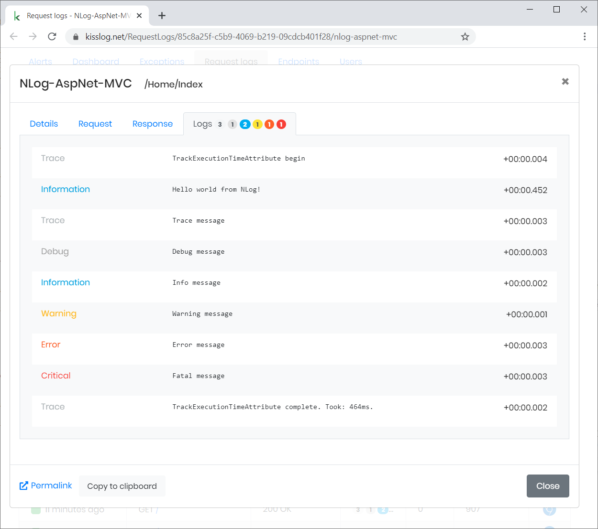

NLog integration
====================

If you have a .NET application which is already using NLog, you can configure it to save the logs to kisslog.net.

**Install instructions:**

- :ref:`NLog + ASP.NET MVC <NLog + ASP.NET MVC>` 

- :ref:`NLog + ASP.NET WebApi <NLog + ASP.NET WebApi>` 

.. code-block:: c#
    :caption: HomeController.cs + NLog
    :linenos:
    :emphasize-lines: 1,10,15

    using NLog;

    namespace NLog_AspNet_MVC.Controllers
    {
        public class HomeController : Controller
        {
            private readonly ILogger _logger;
            public HomeController()
            {
                _logger = LogManager.GetCurrentClassLogger();
            }

            public ActionResult Index()
            {
                _logger.Info("Hello world from NLog!");
                _logger.Trace("Trace message");
                _logger.Debug("Debug message");
                _logger.Info("Info message");
                _logger.Warn("Warning message");
                _logger.Error("Error message");
                _logger.Fatal("Fatal message");

                return View();
            }
        }
    }

