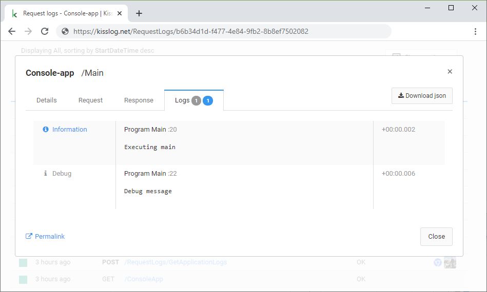

Console applications
=======================

.. contents::
   :local:
   :depth: 1

Usage
~~~~~~~~~~~~~~~~~~~~~~~~~~~~~~~~~~~

For console applications, the ``ILogger`` needs to be created and flushed manually.

This can be achieved by using a **try-catch-finally** block, which simulates the BEGIN and the END of a method.

We flush the logs in the **finally** block by executing ``Logger.NotifyListeners()`` method.

.. code-block:: c#
    :emphasize-lines: 7,11,17,23

    class Program
    {
        static void Main(string[] args)
        {
            ConfigureKissLog();

            ILogger logger = new Logger(url: "Main");

            try
            {
                logger.Info("Executing main");

                logger.Debug("Debug message");
            }
            catch(Exception ex)
            {
                logger.Error(ex);
                throw;
            }
            finally
            {
                // notify the listeners
                Logger.NotifyListeners(logger);
            }
        }

        static void ConfigureKissLog()
        {
            ILogListener cloudListener = new KissLogApiListener(new Application("OrganizationId", "ApplicationId"))
            {
                ApiUrl = "https://api.kisslog.net",
                UseAsync = false
            };

            KissLogConfiguration.Listeners.Add(cloudListener);
        }
    }

Create ILogger instance
~~~~~~~~~~~~~~~~~~~~~~~~~~~~~~~~~~~

.. code-block:: c#

    ILogger logger = new Logger(url: "Main");

Log listeners events
~~~~~~~~~~~~~~~~~~~~~~~~~~~~~~~~~~~

The registered log listeners are notified as following:

.. code-block:: c#

    static void Main(string[] args)
    {
        ConfigureKissLog();

        ILogger logger = new Logger(url: "Main");   // <-- OnBeginRequest()

        try
        {
            logger.Info("Executing main");          // <-- OnMessage()

            logger.Debug("Debug message");          // <-- OnMessage()
        }
        catch(Exception ex)
        {
            logger.Error(ex);                       // <-- OnMessage()
            throw;
        }
        finally
        {
            Logger.NotifyListeners(logger);         // <-- OnFlush()
        }
    }

Use separate instances
~~~~~~~~~~~~~~~~~~~~~~~~~~~~~~~~~~~

``ILogger`` has a scoped lifetime. In Console applications, the *scope* is defined by the method itself.

If you have different root methods, you need to create and flush a separate logger for each of them.

.. code-block:: c#
    :emphasize-lines: 7,28

    class Program
    {
        static void SyncDatabase()
        {
            ConfigureKissLog();

            ILogger logger = new Logger(url: "SyncDatabase");

            try
            {
                // executing
            }
            catch(Exception ex)
            {
                logger.Error(ex);
                throw;
            }
            finally
            {
                Logger.NotifyListeners(logger);
            }
        }

        static void ImportFromXml(string xmlPath)
        {
            ConfigureKissLog();

            ILogger logger = new Logger(url: "ImportFromXml");

            try
            {
                // executing
            }
            catch(Exception ex)
            {
                logger.Error(ex);
                throw;
            }
            finally
            {
                Logger.NotifyListeners(logger);
            }
        }
    }