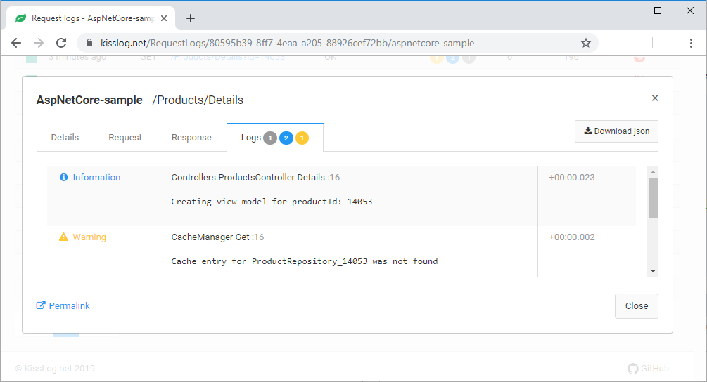

Basic usage
====================

.. toctree::
    :maxdepth: 1

    web-applications
    console-applications

.. code-block:: c#
    :emphasize-lines: 1,18

    using KissLog;

    public class CaheManager : ICacheManager
    {
        private readonly IMemoryCache _cache;
        private readonly ILogger _logger;
        public CaheManager(IMemoryCache cache, ILogger logger)
        {
            _cache = cache;
            _logger = logger;
        }

        public T Get<T>(string key)
        {
            var item = _cache.Get<T>(key);
            if(item == null)
            {
                _logger.Warn(string.Format("Cache entry for {0} was not found", key));
            }

            return item;
        }
    }

