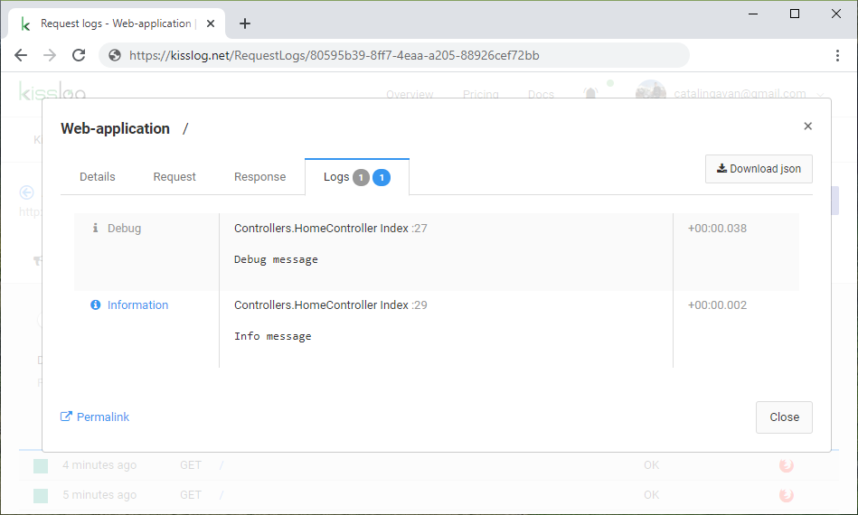

Web applications
==================

For web applications, the ``ILogger`` is created, shared and flushed automatically for each http request (connection).

.. code-block:: c#
    :emphasize-lines: 6, 11, 13

    public class HomeController : Controller
    {
        private readonly ILogger _logger;
        public HomeController()
        {
            _logger = Logger.Factory.Get();
        }

        public IActionResult Index()
        {
            _logger.Debug("Debug message");

            _logger.Info("Info message");

            return View();
        }
    }

Log listeners events
~~~~~~~~~~~~~~~~~~~~~~~~~~~~~~~~~~~

The registered log listeners are notified automatically as following:

.. code-block:: none

    GET /Home/Index                         <---- OnBeginRequest()
    

    ILogger logger = Logger.Factory.Get();

    logger.Debug("Debug message");          <---- OnMessage()

    logger.Debug("Info message");           <---- OnMessage()

   
    HTTP 200 OK                             <---- OnFlush()

