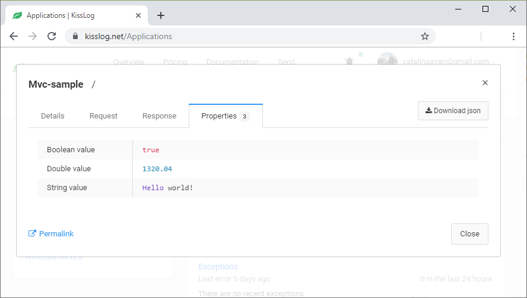
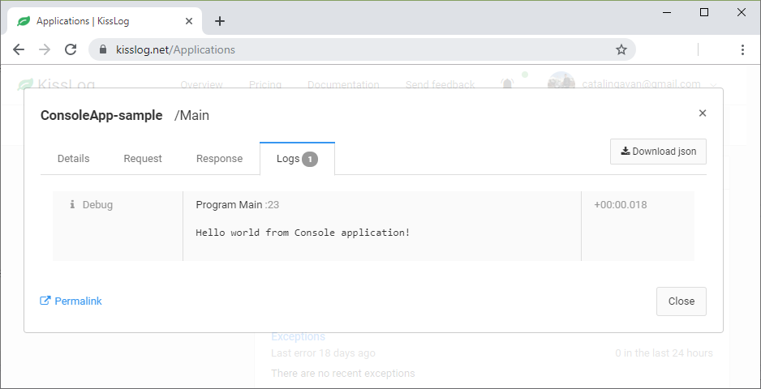

Change log
=======================================================

KissLog 3.5.6
--------------------------

KissLog.AspNetCore 2.5.6 | KissLog.AspNet.Mvc 3.5.6 | KissLog.AspNet.WebApi 3.5.6 | KissLog.Apis.v1 2.5.6

Release date: 03-03-2020

Breaking changes
~~~~~~~~~~~~~~~~~~~~~~~~~~~~~~

``KissLogConfiguration.Options.AddRequestKeywords()`` has been deprecated.

Use ``KissLogConfiguration.Options.GenerateKeywords()`` instead.

.. code-block:: c#

    protected void Application_Start()
    {
        // before
        KissLogConfiguration.Options
            .AddRequestKeywords((FlushLogArgs args) =>
            {
                return new List<string>();
            });

        // after
        KissLogConfiguration.Options
            .GenerateKeywords((FlushLogArgs args, IList<string> defaultKeywords) =>
            {
                return defaultKeywords;
            });
    }

Improvements
~~~~~~~~~~~~~~~~~~~~~~~~~~~~~~~~

Implemented ``KissLogConfiguration.Options.GenerateKeywords()``.

This handler allows developers to specify search keywords for a particular request.

.. code-block:: c#
    :emphasize-lines: 8

    protected void Application_Start()
    {
        KissLogConfiguration.Options
            .GenerateKeywords((FlushLogArgs args, IList<string> defaultKeywords) =>
            {
                List<string> keywords = new List<string>();

                keywords.Add("CorrelationID:b001c6bf");

                return keywords;
            });
    }

.. figure:: /docs/examples/images/Options-GenerateKeywords.png
   :alt: Options.GenerateKeywords
   :align: center

   Searching for the "CorrelationID:b001c6bf" keyword

Implemented ``KissLogConfiguration.Options.ShouldLogRequestFormData()``.

Using this handler, developers can prevent KissLog from reading the FormData parameters.

In the example below, we instruct KissLog not to log the FormData parameters when ``Content-Type="multipart/*"``.

.. code-block:: c#

    protected void Application_Start()
    {
        KissLogConfiguration.Options
            .ShouldLogRequestFormData((HttpRequest request) =>
            {
                string contentType = request.Properties.Headers.FirstOrDefault(p => string.Compare(p.Key, "Content-Type", true) == 0).Value;

                if (!string.IsNullOrEmpty(contentType))
                {
                    if (contentType.ToLowerInvariant().StartsWith("multipart/"))
                    {
                        return false;
                    }
                }

                return true;
            });
    }

KissLog 3.5.5
--------------------------

KissLog.AspNetCore 2.5.5 | KissLog.AspNet.Mvc 3.5.5 | KissLog.AspNet.WebApi 3.5.5

Release date: 14-12-2019

General improvements

KissLog 3.5.2
--------------------------

KissLog.AspNetCore 2.5.3 | KissLog.AspNet.Mvc 3.5.4 | KissLog.AspNet.WebApi 3.5.4

Release date: 22-11-2019

Improvements
~~~~~~~~~~~~~~~~~~~~~~~~~~~~~~~~

Improved fire-and-forget logging for ``KissLogApiListener``.

.. code-block:: c#
    :emphasize-lines: 11

    namespace KissLog.Apis.v1.Listeners
    {
        public class KissLogApiListener : ILogListener
        {
            public void OnFlush(FlushLogArgs args, ILogger logger)
            {
                IFlusher flusher = CreateFlusher(flushProperties);

                if (UseAsync == true)
                {
                    flusher.FlushAsync(request, copy).ConfigureAwait(false);
                }
                else
                {
                    flusher.Flush(request, copy);
                }
            }
        }
    }

KissLog 3.5.1
--------------------------

KissLog.AspNetCore 2.5.1 | KissLog.AspNet.Mvc 3.5.1 | KissLog.AspNet.WebApi 3.5.1

Release date: 16-10-2019

Fixes: https://github.com/KissLog-net/KissLog.Sdk/issues/19

Improvements
~~~~~~~~~~~~~~~~~~~~~~~~~~~~~~~~

``LogListenerParser`` exposes an additional event:

.. code-block:: c#

    public class LogListenerParser
    {
        public virtual bool ShouldLog(BeginRequestArgs args, ILogListener logListener)
        {
            HttpRequest request = args.Request;

            return true;
        }
    }

The event gets executed at the beginning of the request. If returns ``false``, the ILogListener will skip the current request.

.. code-block:: none

    Begin GET /swagger/         <---- start of the request

                                <---- ShouldFlush(BeginRequestArgs args) is executed
                                <---- if false, the listener will skip the request

    _logger.Debug("step 1");    <---- skipped
    _logger.Debug("step 2");    <---- skipped
    ...
    _logger.Debug("step n");    <---- skipped

    END 200 OK GET /swagger/    <---- end of the request

KissLog 3.5.0
--------------------------

KissLog.AspNetCore 2.5.0 | KissLog.AspNet.Mvc 3.5.0 | KissLog.AspNet.WebApi 3.5.0

Release date: 12-10-2019

Breaking changes
~~~~~~~~~~~~~~~~~~~~~~~~~~~~~~

The changes will affect only the custom implementations of LogListeners.

``ILogListener`` implements two additional methods:

.. code-block:: c#
    :emphasize-lines: 3,4

    public interface ILogListener
    {
        void OnBeginRequest(HttpRequest httpRequest, ILogger logger);
        void OnMessage(LogMessage message, ILogger logger);
        void OnFlush(FlushLogArgs args, ILogger logger);
    }

- ``OnBeginRequest(HttpRequest httpRequest)`` is executed at the beginning of the HTTP request.

- ``OnMessage(LogMessage message)`` is executed each time a log message is created.

These changes allows for more flexibility when creating custom LogListeners.

Improvements
~~~~~~~~~~~~~~~~~~~~~~~~~~~~~

Updated ``LocalTextFileListener`` log listener, which now can write the logs as soon as they get created.

.. code-block:: c#
    :emphasize-lines: 5

    protected void Application_Start()
    {
        KissLogConfiguration.Listeners.Add(new LocalTextFileListener(Path.Combine(AppDomain.CurrentDomain.BaseDirectory, "Logs"))
        {
            FlushTrigger = FlushTrigger.OnFlush // OnFlush | OnMessage
        });
    }

Implemented ``NLogTargetListener`` which writes the ``ILogger`` logs to the ``NLog`` targets.

This is useful when you want to save the logs to both KissLog.net cloud and to the NLog targets - defined in **NLog.config**.

.. code-block:: c#

    protected void Application_Start()
    {
        KissLogConfiguration.Listeners.Add(new NLogTargetListener());
    }

KissLog.AspNetCore 2.4.2
----------------------------------------------

KissLog.AspNet.Mvc 3.4.1 | KissLog.AspNet.WebApi 3.4.1

Release date: 26-09-2019

Fixes: https://github.com/KissLog-net/KissLog.Sdk/issues/15

KissLog.AspNetCore is now compatible with **.NET Core 3.0**

Fixed errors caused by the ``ILogger`` trying to read Request/Response content.

KissLog 3.4.0
----------------------------------------------

Release date: 05-07-2019

Improvements
~~~~~~~~~~~~~~~~~~~~~~~~~~~~~

Implemented ``logger.AddCustomProperty(key, value)`` method.

Custom properties can be viewed from the RequestLog view, and they can be accessed from within the Alerts JavaScript context.

.. code-block:: c#

    public class HomeController : Controller
    {
        public ActionResult Index()
        {
            ILogger logger = Logger.Factory.Get();

            logger.AddCustomProperty("Boolean value", true);
            logger.AddCustomProperty("Double value", 1320.04);
            logger.AddCustomProperty("String value", "Hello world!");

            return View();
        }
    }

   logger.AddCustomProperty

Breaking changes
~~~~~~~~~~~~~~~~~~~~~~~~~~~~~

For **.NET MVC** and **.NET WebApi** applications, ``Application_Error`` method needs to be updated to ensure that KissLog logs startup exceptions.

.. code-block:: c#
    :linenos:
    :emphasize-lines: 9-12

    protected void Application_Error(object sender, EventArgs e)
    {
        Exception exception = Server.GetLastError();
        if (exception != null)
        {
            var logger = Logger.Factory.Get();
            logger.Error(exception);

            if(logger.AutoFlush() == false)
            {
                Logger.NotifyListeners(logger);
            }
        }
    }

KissLog 3.3.0
----------------------------------------------

Implemented logging integration for Windows / Console applications.

.. code-block:: c#
    :linenos:
    :emphasize-lines: 7,11,15,20

    namespace ConsoleApp_sample
    {
        class Program
        {
            static void Main(string[] args)
            {
                ILogger logger = new Logger(url: "Main");

                try
                {
                    logger.Debug("Hello world from Console application!");
                }
                catch (Exception ex)
                {
                    logger.Error(ex);
                    throw;
                }
                finally
                {
                    Logger.NotifyListeners(logger);
                }
            }
        }
    }

   Console application

KissLog.AspNetCore 2.2.1
----------------------------------------------

Release date: 21-05-2019

Updated ``app.UseKissLogMiddleware(options)``

.. code-block:: c#
    :linenos:
    :emphasize-lines: 7-16

    public class Startup
    {
        public void Configure(IApplicationBuilder app, IHostingEnvironment env)
        {
            app.UseStaticFiles();

            app.UseKissLogMiddleware(options => {
                options.Listeners.Add(new KissLogApiListener(new KissLog.Apis.v1.Auth.Application(
                    Configuration["KissLog.OrganizationId"],
                    Configuration["KissLog.ApplicationId"])
                ));

                options.Options.ShouldLogResponseBody((logListener, logArgs, defaultValue) => {
                    return logArgs.WebRequestProperties.Response.HttpStatusCode >= System.Net.HttpStatusCode.BadRequest;
                });
            });

            app.UseMvc();
        }
    }

KissLog 3.2.0
----------------------------------------------

Release date: 19-05-2019

Breaking changes
~~~~~~~~~~~~~~~~~~~~~~~~~~~~~

**Environment** configuration has been removed.

Old usage:

.. code-block:: c#

    protected void Application_Start()
    {
        KissLogConfiguration.Listeners.Add(new KissLogApiListener(
            Configuration["KissLog.OrganizationId"],
            Configuration["KissLog.ApplicationId"],
            Configuration["KissLog.Environment"]
        ));
    }

New usage:

.. code-block:: c#

    protected void Application_Start()
    {
        KissLogConfiguration.Listeners.Add(
            new KissLogApiListener(new KissLog.Apis.v1.Auth.Application(
                Configuration["KissLog.OrganizationId"], 
                Configuration["KissLog.ApplicationId"])
            )
        );
    }

Options
~~~~~~~~~~~~~~~~~~~~~~~~~~~~~

New methods and properties:

- ``Options.AddRequestKeywords()`` - adds search keywords for the current request

.. code-block:: c#
    :caption: Find the request by searching for "checkoutFailed"

    protected void Application_Start()
    {
        KissLogConfiguration.Options
            .AddRequestKeywords((FlushLogArgs args) =>
            {
                if ((int)args.WebRequestProperties.Response.HttpStatusCode >= 400)
                {
                    if(args.WebRequestProperties.Url.LocalPath.Contains("/checkout/process"))
                    {
                        return new[] { "checkoutFailed" };
                    }
                }

                return null;
            });
    }

General improvements and fixes
~~~~~~~~~~~~~~~~~~~~~~~~~~~~~~~~~~~

Creating multiple log categories would not work in some scenarios.

This issue has been fixed.

.. code-block:: c#

    public void Foo(string sqlScript)
    {
        ILogger logger = Logger.Factory.Get("EntityFramework");

        logger.Debug("ExecuteSqlCommand script " + sqlScript);

        _db.Database.ExecuteSqlCommand(new RawSqlString(sqlScript));
    }

``KissLogApiListener`` has been improved.

KissLog 3.1.1
----------------------------------------------

Release date: 27-03-2019

Options
~~~~~~~~~~~~~~~~~~~~~~~~~~~~~

New methods and properties:

.. code-block:: c#

    public class Options
    {
        // runtime handler used to include / exclude ResponseBody
        ShouldLogResponseBody(Func<ILogListener, FlushLogArgs, bool, bool> handler) => defaultValue;
    }

Usage:

.. code-block:: c#

    void Application_Start()
    {
        KissLogConfiguration.Options
            .ShouldLogResponseBody((ILogListener listener, FlushLogArgs args, bool defaultValue) =>
            {
                if ((int) args.WebRequestProperties.Response.HttpStatusCode >= 400)
                {
                    // explicitly log the ResponseBody if the HTTP request was unsuccessful
                    return true;
                }

                // use the defaultValue (which is calculated based on the Response Content-Type header)
                return defaultValue;
            });
    }

KissLog 3.1.0
----------------------------------------------

Release date: 26-03-2019

Starting with this version, Response.ContentLength will be automatically logged for all the HTTP requests.

KissLog 3.0.0
----------------------------------------------

Release date: 15-03-2019

Logger
~~~~~~~~~~~~~~~~~~~~~~~~~~~~~

New methods and properties:

.. code-block:: c#
    :emphasize-lines: 3,4

    public void Foo()
    {
        ILogger logger = Logger.Factory.Get();
        FlushLogArgs args = Logger.CreateFlushArgs(logger);

        Console.WriteLine(args.MessagesGroups.Count());
    }

KissLogConfiguration
~~~~~~~~~~~~~~~~~~~~~~~~~~~~~

Removed methods and properties:

.. code-block:: c#

    public static class KissLogConfiguration
    {
        // -> moved to Options.GetUser
        Func<RequestProperties, string> GetLoggedInUserName { get; set; }
        Func<RequestProperties, string> GetLoggedInUserEmailAddress { get; set; }
        Func<RequestProperties, string> GetLoggedInUserAvatar { get; set; }

        // -> moved to Options.ShouldLogRequestInputStream
        Func<WebRequestProperties, bool> ShouldLogRequestInputStream { get; set; }

        // -> moved to Options.ShouldLogRequestCookie
        Func<string, bool> ShouldLogCookie = { get; set; }

        // -> moved to Options.AppendExceptionDetails
        Func<Exception, string> AppendExceptionDetails { get; set; }

        // removed
        Func<WebRequestProperties, bool> ShouldLogResponseBody { get; set; }
    }

New methods and properties:

.. code-block:: c#

    public static class KissLogConfiguration
    {
        // holds all the KissLog configuration
        Options Options { get; }
    }

LogListenerParser
~~~~~~~~~~~~~~~~~~~~~~~~~~~~~

Removed methods and properties:

.. code-block:: c#

    public class LogListenerParser
    {
        // removed
        List<string> KeysToObfuscate { get; set; }

        // removed
        virtual bool ShouldLog(WebRequestProperties webRequestProperties, ILogListener logListener)

        // -> moved to BeforeFlush(FlushLogArgs args, ILogListener logListener)
        virtual void AlterDataBeforePersisting(FlushLogArgs args)

        // -> moved to BeforeFlush(FlushLogArgs args, ILogListener logListener)
        virtual void RemoveDataBeforePersisting(FlushLogArgs args)
    }

New methods and properties:

.. code-block:: c#

    public class LogListenerParser
    {
        // callback which is called automatically before persisting the logs. FlushLogArgs can be altered at this step
        virtual void BeforeFlush(FlushLogArgs args, ILogListener logListener)
    }

Options
~~~~~~~~~~~~~~~~~~~~~~~~~~~~~

Container for KissLog configuration.

.. code-block:: c#

    public class Options
    {
        // JSON settings used when serializing the object arguments on log message
        JsonSerializerSettings JsonSerializerSettings { get; }

        // handler to populate the logged-in user properties (used for https://kisslog.net user interface)
        GetUser(Func<RequestProperties, UserDetails> handler)

        // runtime handlers used to include / exclude different HTTP properties
        ShouldLogRequestHeader(Func<ILogListener, FlushLogArgs, string, bool> handler) => true;
        ShouldLogRequestCookie(Func<ILogListener, FlushLogArgs, string, bool> handler) => false;
        ShouldLogRequestQueryString(Func<ILogListener, FlushLogArgs, string, bool> handler) => true;
        ShouldLogRequestFormData(Func<ILogListener, FlushLogArgs, string, bool> handler) => true;
        ShouldLogRequestServerVariable(Func<ILogListener, FlushLogArgs, string, bool> handler) => true;
        ShouldLogRequestClaim(Func<ILogListener, FlushLogArgs, string, bool> handler) => true;
        ShouldLogRequestInputStream(Func<ILogListener, FlushLogArgs, bool> handler) => true;
        ShouldLogResponseHeader(Func<ILogListener, FlushLogArgs, string, bool> handler) => true;

        // runtime handler used to toggle a specific LogListener
        ToggleListener(Func<ILogListener, FlushLogArgs, bool> handler) => true;

        // runtime handler used to append custom text when an Exception is encountered
        AppendExceptionDetails(Func<Exception, string> handler) => null;
    }
    

Usage:

.. code-block:: c#

    void Application_Start()
    {
        // update JSON settings
        KissLogConfiguration.Options
            .JsonSerializerSettings.Converters.Add(new StringEnumConverter());

        // prevent CardNumber parameter from being logged
        KissLogConfiguration.Options
            .ShouldLogRequestFormData((ILogListener listener, FlushLogArgs args, string name) =>
            {
                if (name == "CardNumber")
                    return false;

                return true;
            });

        // append EntityFramework validation exceptions to the log messages
        KissLogConfiguration.Options
            .AppendExceptionDetails((Exception ex) =>
            {
                if (ex is DbEntityValidationException dbException)
                {
                    StringBuilder sb = new StringBuilder();

                    foreach (var validationErrors in dbException.EntityValidationErrors)
                    {
                        foreach (var validationError in validationErrors.ValidationErrors)
                        {
                            sb.AppendLine(string.Format("Property: {0} Error: {1}", validationError.PropertyName, validationError.ErrorMessage));
                        }
                    }

                    return sb.ToString();
                }

                return null;
            });
    }
