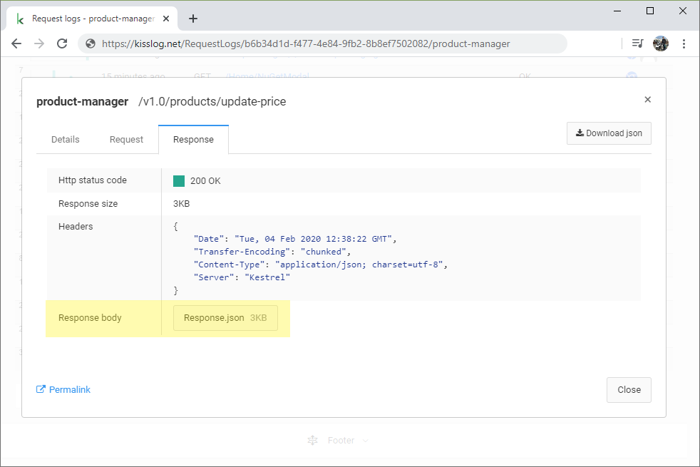

Configuration
=======================================================

.. contents::
   :local:

KissLog exposes several configuration options which allows developers to customize the logging behavior.

KissLog configuration can be extended by using the ``KissLogConfiguration.Options`` container.

.. code-block:: c#

    public class MvcApplication : System.Web.HttpApplication
    {
        protected void Application_Start()
        {
            KissLogConfiguration.Options
                .ShouldLogResponseHeader((listener, args, headerName) =>
                {
                    if (string.Compare(headerName, "X-Auth-Token", true) == 0)
                        return false;

                    return true;
                })
                .ShouldLogRequestFormData((ILogListener listener, FlushLogArgs args, string name) =>
                {
                    if (name == "PinNumber")
                        return false;

                    return true;
                });
        }
    }

AppendExceptionDetails
-------------------------------------------------------

Gets executed everytime an exception is captured.

You can use this handler to append additional information about an exception.

The string returned will be appended to the logged exception message.

.. code-block:: c#

    protected void Application_Start()
    {
        KissLogConfiguration.Options
            .AppendExceptionDetails((Exception ex) =>
            {
                if (ex is DbEntityValidationException dbException)
                {
                    StringBuilder sb = new StringBuilder();
                    sb.AppendLine("DbEntityValidationException:");

                    foreach (var error in dbException.EntityValidationErrors.SelectMany(p => p.ValidationErrors))
                    {
                        string message = string.Format("Field: {0}, Error: {1}", error.PropertyName, error.ErrorMessage);
                        sb.AppendLine(message);
                    }

                    return sb.ToString();
                }

                return null;
            });
    }

GetUser
-------------------------------------------------------

This handler is used to customize the captured user display information.

.. code-block:: c#

    protected void Application_Start()
    {
        KissLogConfiguration.Options
            .GetUser((RequestProperties request) =>
            {
                return new UserDetails
                {
                    Name = request.Claims.First(p => p.Key == "user_name").Value,
                    EmailAddress = request.Claims.First(p => p.Key == "user_email").Value
                };
            });
    }

ShouldLogRequestClaim
-------------------------------------------------------

Runtime handler used to determine if a request claim should be logged or not. Default: ``true``

.. code-block:: c#

    protected void Application_Start()
    {
        KissLogConfiguration.Options
            .ShouldLogRequestClaim((ILogListener listener, FlushLogArgs args, string claimName) =>
            {
                if (claimName == "secret_claim")
                    return false;

                return true;
            });
    }

ShouldLogRequestCookie
-------------------------------------------------------

Runtime handler used to determine if a request Cookie should be logged or not. Default: ``false``

.. code-block:: c#

    protected void Application_Start()
    {
        KissLogConfiguration.Options
            .ShouldLogRequestCookie((ILogListener listener, FlushLogArgs args, string cookieName) =>
            {
                if (cookieName == ".AspNetCore.Cookies")
                    return false;

                return true;
            });
    }

ShouldLogRequestFormData
-------------------------------------------------------

Runtime handler used to determine if a request FormData should be logged or not. Default: ``true``

.. code-block:: c#

    protected void Application_Start()
    {
        KissLogConfiguration.Options
            .ShouldLogRequestFormData((ILogListener listener, FlushLogArgs args, string name) =>
            {
                if (name == "PinNumber")
                    return false;

                return true;
            });
    }

ShouldLogRequestHeader
-------------------------------------------------------

Runtime handler used to determine if a request Header should be logged or not. Default: ``true``

.. code-block:: c#

    protected void Application_Start()
    {
        KissLogConfiguration.Options
            .ShouldLogRequestHeader((ILogListener listener, FlushLogArgs args, string headerName) =>
            {
                if (headerName == "X-JWT-Token")
                    return false;

                return true;
            });
    }

ShouldLogRequestInputStream
-------------------------------------------------------

Runtime handler used to determine if a request InputStream should be logged or not. Default: ``true``

.. code-block:: c#

    protected void Application_Start()
    {
        KissLogConfiguration.Options
            .ShouldLogRequestInputStream((ILogListener listener, FlushLogArgs args) =>
            {
                if ((int)args.WebProperties.Response.HttpStatusCode >= 400)
                    return true;

                return false;
            });
    }

ShouldLogRequestQueryString
-------------------------------------------------------

Runtime handler used to determine if a request QueryString should be logged or not. Default: ``true``

.. code-block:: c#

    protected void Application_Start()
    {
        KissLogConfiguration.Options
            .ShouldLogRequestQueryString((ILogListener listener, FlushLogArgs args, string name) =>
            {
                if (name == "_version")
                    return false;

                return true;
            });
    }

ShouldLogRequestServerVariable
-------------------------------------------------------

Runtime handler used to determine if a request ServerVariable should be logged or not. Default: ``true``

.. code-block:: c#

    protected void Application_Start()
    {
        KissLogConfiguration.Options
            .ShouldLogRequestServerVariable((ILogListener listener, FlushLogArgs args, string name) =>
            {
                if (name == "SERVER_NAME")
                    return true;

                return false;
            });
    }

ShouldLogResponseHeader
-------------------------------------------------------

Runtime handler used to determine if a response Header should be logged or not. Default: ``true``

.. code-block:: c#

    protected void Application_Start()
    {
        KissLogConfiguration.Options
            .ShouldLogResponseHeader((ILogListener listener, FlushLogArgs args, string headerName) =>
            {
                if (headerName == "X-Auth-Token")
                    return false;

                return true;
            });
    }

ShouldLogResponseBody
-------------------------------------------------------

Runtime handler used to determine if the response body should be logged or not.

``defaultValue = true`` when the response Content-Type is "application/json".

.. code-block:: c#

    protected void Application_Start()
    {
        KissLogConfiguration.Options
            .ShouldLogResponseBody((ILogListener listener, FlushLogArgs args, bool defaultValue) =>
            {
                if (args.WebProperties.Request.Url.LocalPath == "/v1.0/products/update-price")
                    return true;

                return defaultValue;
            });
    }

   Response body

ToggleListener
-------------------------------------------------------

Runtime handler used to enable/disable a registered log listener for a particular request.

.. code-block:: c#

    protected void Application_Start()
    {
        KissLogConfiguration.Options
            .ToggleListener((ILogListener listener, FlushLogArgs args) =>
            {
                if(listener.GetType() == typeof(SqlLogListener))
                {
                    if ((int)args.WebProperties.Response.HttpStatusCode >= 400)
                        return true;

                    return false;
                }

                return true;
            });
    }

