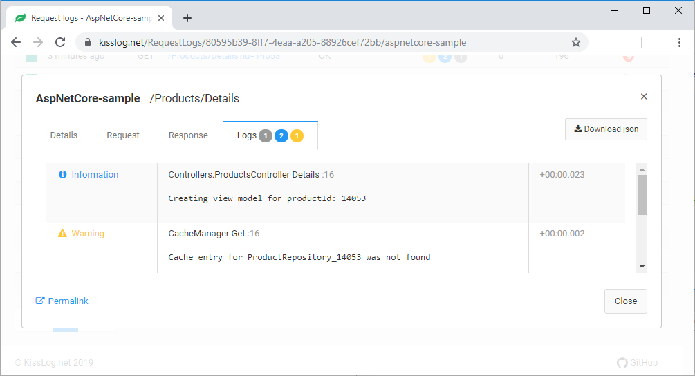

Getting started
================

.. contents::
   :local:
   :depth: 1

ILogger represents the principal component used to write log messages.

.. code-block:: c#
    :emphasize-lines: 3,8

    public T Get<T>(string key)
    {
        ILogger logger = Logger.Factory.Get();

        var item = _cache.Get<T>(key);
        if(item == null)
        {
            logger.Warn(string.Format("Cache entry for {0} was not found", key));
        }

        return item;
    }

   Viewing log messages

Create instance
-------------------------

ILogger has a scoped lifetime. 

It should be created at the beginning of a method, and flushed at the end of the methods execution.

Web applications
~~~~~~~~~~~~~~~~~~~~~~~~~~~~~~~~

For web applications, the ILogger is created and flushed automatically per each http request (connection).

To acquire the ILogger instance, use the ``Logger.Factory.Get()`` factory method.

.. code-block:: c#
    :emphasize-lines: 6

    public class HomeController : Controller
    {
        private readonly ILogger _logger;
        public HomeController()
        {
            _logger = Logger.Factory.Get();
        }

        public IActionResult Index()
        {
            _logger.Debug("Hello World!");

            return View();
        }
    }

Calling the ``Logger.Factory.Get()`` method multiple times will return the same instance of ILogger.

.. code-block:: c#

    [TestMethod]
    public void Factory_Returns_The_Same_Instance()
    {
        for(int i = 1; i <= 5; i++)
        {
            ILogger logger = Logger.Factory.Get();
            logger.Info("Hello " + i);
        }

        ILogger myLogger = Logger.Factory.Get();

        int numberOfLogs = (Logger(myLogger)).DataContainer.LogMessages.Count();

        int expected = 5;
        int actual = numberOfLogs;

        Assert.IsTrue(actual == expected, "Logger.Factory.Get() should return the same instance");
    }

Register the listeners
-------------------------

Listeners are responsible with saving the logs.

Listeners are registered at application startup using the ``KissLogConfiguration.Listeners`` container.

.. code-block:: c#

    protected void Application_Start()
    {
        // register the KissLog.net listener
        KissLogConfiguration.Listeners.Add(new KissLogApiListener(new KissLog.Apis.v1.Auth.Application(
            ConfigurationManager.AppSettings["KissLog.OrganizationId"],
            ConfigurationManager.AppSettings["KissLog.ApplicationId"])
        ));

        // register NLog listener
        KissLogConfiguration.Listeners.Add(new NLogTargetListener());

        if(bool.Parse(ConfigurationManager.AppSettings["UseSqlListener"]))
        {
            KissLogConfiguration.Listeners.Add(new SqlListener());
        }
    }

Custom listeners can be created by implementing the ``ILogListener`` interface.

Listeners events
~~~~~~~~~~~~~~~~~~~~~~~~~~~~~~~~~~~

KissLog listeners are triggered automatically on three separate events:

- **OnBeginRequest()** is executed when the HTTP request starts

- **OnMessage()** is executed for each log message created

- **OnFlush()** is executed when the HTTP request has completed

.. code-block:: none

    BEGIN [GET /api/getUsers]        <---- OnBeginRequest()
    

    ILogger logger = Logger.Factory.Get();

    logger.Debug("step 1");          <---- OnMessage()

    ...
    logger.Info("step n");           <---- OnMessage()

    
    END [200 OK GET /api/getUsers]   <---- OnFlush()

Configuration
-------------------------

Additional configuration options are available using the ``KissLogConfiguration.Options`` options.

.. code-block:: c#

    protected void Application_Start()
    {
        KissLogConfiguration.Options
            .ShouldLogResponseHeader((listener, args, headerName) =>
            {
                if (string.Compare(headerName, "X-Auth-Token", true) == 0)
                    return false;

                return true;
            })
            .ShouldLogResponseBody((listener, args, defaultValue) =>
            {
                int statusCode = (int)args.WebProperties.Response.HttpStatusCode;

                if (statusCode >= 500)
                    return true;

                return defaultValue;
            })
            .AppendExceptionDetails((Exception ex) =>
            {
                // log EntityFramework validation errors
                if (ex is DbEntityValidationException dbException)
                {
                    StringBuilder sb = new StringBuilder();
                    sb.AppendLine("DbEntityValidationException:");

                    foreach (var error in dbException.EntityValidationErrors.SelectMany(p => p.ValidationErrors))
                    {
                        string message = string.Format("Field: {0}, Error: {1}", error.PropertyName, error.ErrorMessage);
                        sb.AppendLine(message);
                    }

                    return sb.ToString();
                }

                return null;
            });
    }

.. toctree::
   :maxdepth: 1
   :hidden:
   
   console-apps
   windows-services

