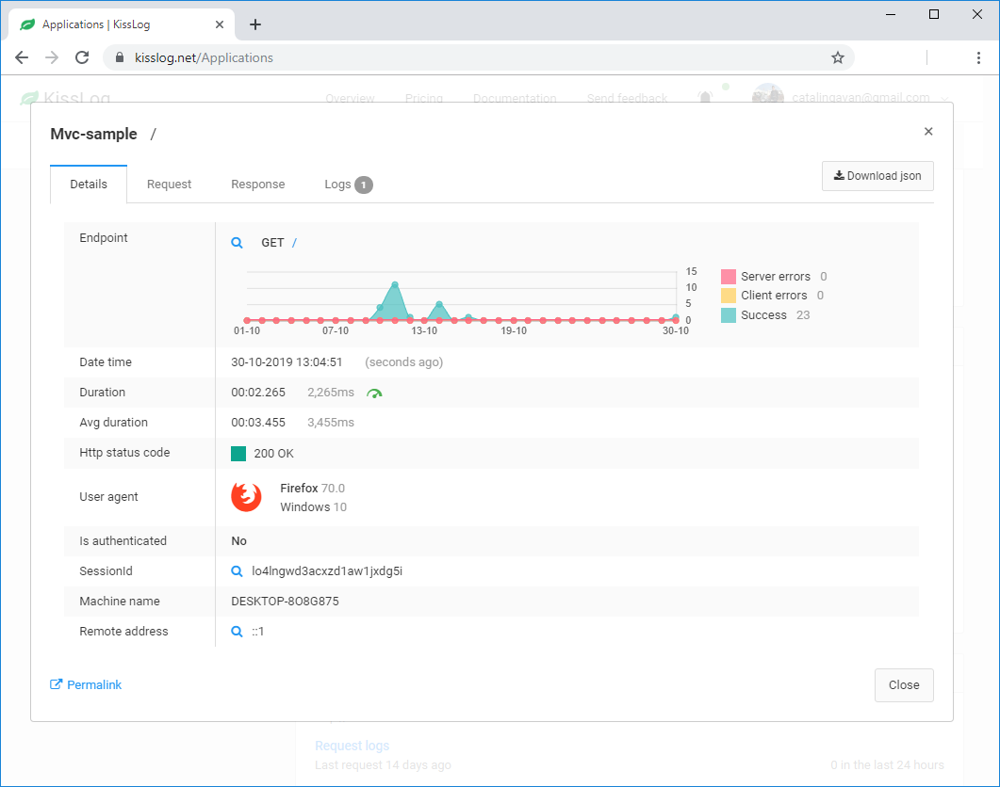
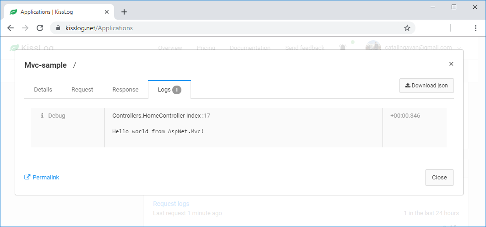

AspNet MVC
====================

These steps describe how to install and configure KissLog for an Asp.Net MVC application.

1. Install NuGet Package

.. code-block:: none

    PM> Install-Package KissLog.AspNet.Mvc

2. Update **web.config**

Replace **OrganizationID** and **ApplicationID** with Api Key values from the KissLog.net application configuration page.

.. code-block:: xml
    :caption: web.config
    :linenos:

    <configuration>
        <appSettings>
            <add key="KissLog.OrganizationId" value="OrganizationID" />
            <add key="KissLog.ApplicationId" value="ApplicationID" />
        </appSettings>
    </configuration>

3. Update **Global.asax**

.. code-block:: c#
    :linenos:
    :emphasize-lines: 15,17,29-42,45,47-52

    using KissLog.Apis.v1.Listeners;
    using KissLog.AspNet.Mvc;
    using KissLog.AspNet.Web;
    
    namespace KissLog.Samples.AspNetMvc
    {
        public class MvcApplication : System.Web.HttpApplication
        {
            protected void Application_Start()
            {
                AreaRegistration.RegisterAllAreas();
                RouteConfig.RegisterRoutes(RouteTable.Routes);
    
                // Add KissLog exception filter
                GlobalFilters.Filters.Add(new KissLogWebMvcExceptionFilterAttribute());
    
                ConfigureKissLog();
            }
    
            private void ConfigureKissLog()
            {
                // KissLog cloud listener
                KissLogConfiguration.Listeners.Add(new KissLogApiListener(new KissLog.Apis.v1.Auth.Application(
                    ConfigurationManager.AppSettings["KissLog.OrganizationId"],
                    ConfigurationManager.AppSettings["KissLog.ApplicationId"])
                ));
            }
    
            protected void Application_Error(object sender, EventArgs e)
            {
                Exception exception = Server.GetLastError();
                if (exception != null)
                {
                    var logger = Logger.Factory.Get();
                    logger.Error(exception);

                    if(logger.AutoFlush() == false)
                    {
                        Logger.NotifyListeners(logger);
                    }
                }
            }
    
            // Register HttpModule
            public static KissLogHttpModule KissLogHttpModule = new KissLogHttpModule();
    
            public override void Init()
            {
                base.Init();
    
                KissLogHttpModule.Init(this);
            }
        }
    }

4. Use the ILogger

.. code-block:: c#
    :linenos:
    :emphasize-lines: 7,10,15

    using KissLog;

    namespace KissLog.Samples.AspNetMvc.Controllers
    {
        public class HomeController : Controller
        {
            private readonly ILogger _logger;
            public HomeController()
            {
                _logger = Logger.Factory.Get();
            }
    
            public ActionResult Index()
            {
                _logger.Debug("Hello world from AspNet.Mvc!");
    
                return View();
            }
        }
    }

Testing
-------------------------------------------

To test the KissLog configuration, trigger a request on /Home/Index. The request should be visible on KissLog.net.

   Request details

   Request logs