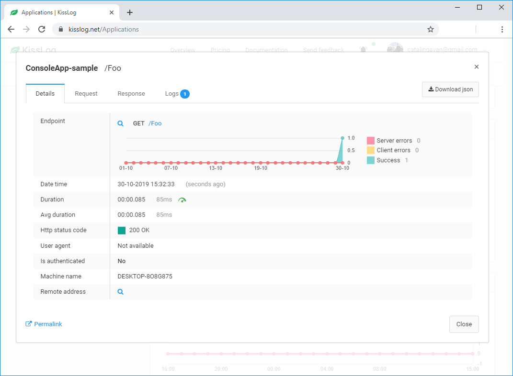
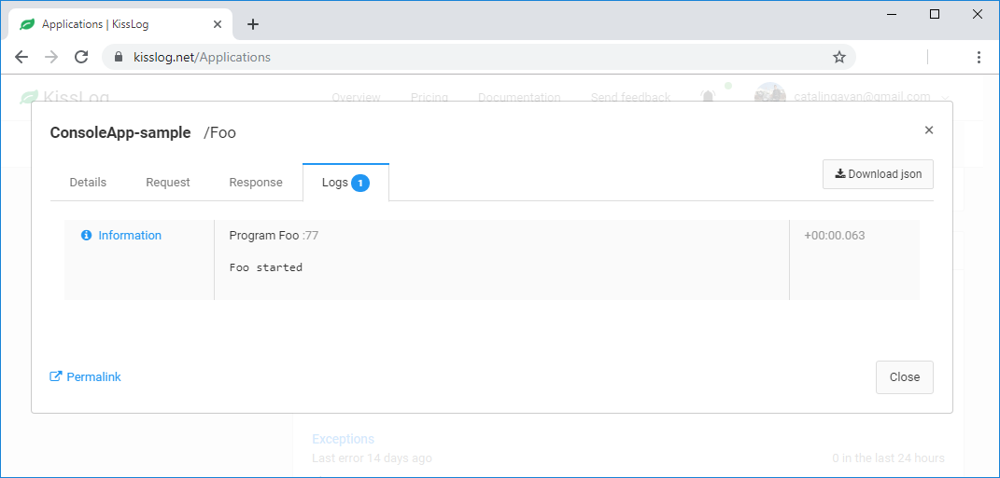

Console applications
====================

These steps describe how to install and configure KissLog for a Console application.

1. Install NuGet Packages

.. code-block:: none

    PM> Install-Package KissLog

.. code-block:: none

    PM> Install-Package KissLog.Apis.v1

2. Update **Program.cs**

Register the :doc:`KissLogApiListener <../saving-the-logs/KissLogApiListener>` with **UseAsync = false**.

Replace ``"OrganizationID"`` and ``"ApplicationID"`` with Api Key values from the :ref:`application configuration <apiKeys>` page.

.. code-block:: c#
    :linenos:
    :emphasize-lines: 10, 19-24

    using KissLog;
    using KissLog.Apis.v1.Listeners;

    namespace ConsoleApp_sample
    {
        class Program
        {
            static void Main(string[] args)
            {
                ConfigureKissLog();
            }

            static void ConfigureKissLog()
            {
                // replace the values
                string organizationId = "OrganizationID";
                string applicationId = "ApplicationID";

                ILogListener listener = new KissLogApiListener(new KissLog.Apis.v1.Auth.Application(organizationId, applicationId))
                {
                    UseAsync = false
                };

                KissLogConfiguration.Listeners.Add(listener);
            }
        }
    }

3. Use the ILogger

We log the **Foo()** method by using a **try-catch-finally** block to simulate the BEGIN and the END of the action.

.. code-block:: c#
    :linenos:
    :emphasize-lines: 10,17,27,32

    using KissLog;
    using KissLog.Apis.v1.Listeners;

    namespace ConsoleApp_sample
    {
        class Program
        {
            static void Main(string[] args)
            {
                ConfigureKissLog();

                Foo();
            }

            private static void Foo()
            {
                ILogger logger = new Logger(url: "Foo");

                try
                {
                    logger.Info("Foo started");

                    // execute foo
                }
                catch(Exception ex)
                {
                    logger.Error(ex);
                    throw;
                }
                finally
                {
                    Logger.NotifyListeners(logger);
                }
            }
        }
    }

Testing
-------------------------------------------

To test the KissLog configuration, run the Console application. The **Foo()** request should be visible on KissLog.net.

   Foo() details

   Foo() logs