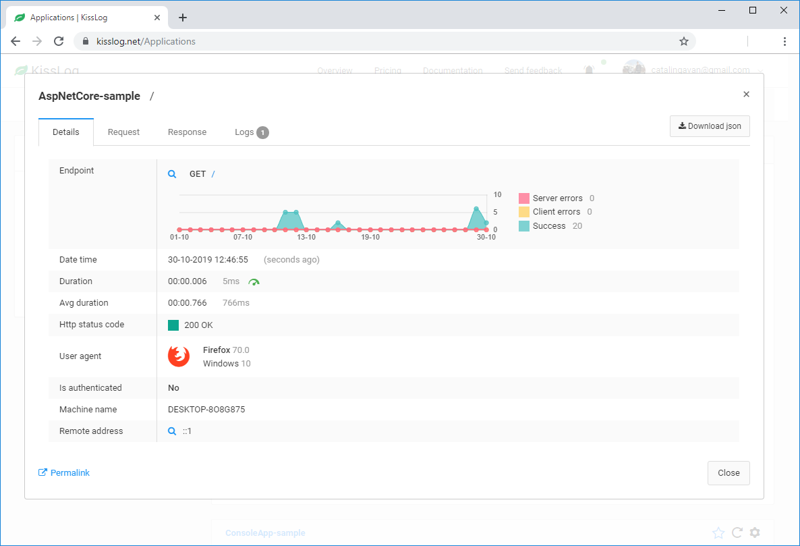
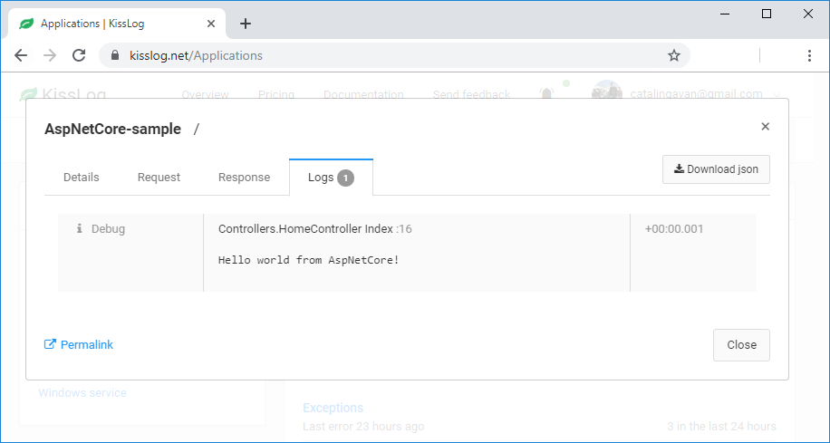

.Net Core
====================

These steps describe how to install and configure KissLog for a .NET Core application.

1. Install NuGet Package

.. code-block:: none

    PM> Install-Package KissLog.AspNetCore
   

2. Update **appSettings.json**

Get the **"KissLog.OrganizationId"** and the **"KissLog.ApplicationId"** values from the :doc:`Application Api Keys </user-interface/api-keys/index>` page.

.. code-block:: javascript
    :caption: appsettings.json

    {
        "KissLog.OrganizationId": "OrganizationID",
        "KissLog.ApplicationId": "ApplicationID"
    }

3. Update **Startup.cs**

.. code-block:: c#
    :linenos:
    :emphasize-lines: 18-22,41-46

    using KissLog.Apis.v1.Listeners;
    using KissLog.AspNetCore;
    using KissLog.Listeners;
        
    namespace KissLog.Samples.AspNetCore
    {
        public class Startup
        {
            public Startup(IConfiguration configuration)
            {
                Configuration = configuration;
            }

            public IConfiguration Configuration { get; }

            public void ConfigureServices(IServiceCollection services)
            {
                services.AddSingleton<IHttpContextAccessor, HttpContextAccessor>();
                services.AddScoped<ILogger>((context) =>
                {
                    return Logger.Factory.Get();
                });

                services.AddSession();

                services.AddMvc();
            }

            public void Configure(IApplicationBuilder app, IHostingEnvironment env)
            {
                if (env.IsDevelopment())
                {
                    app.UseDeveloperExceptionPage();
                }

                app.UseStaticFiles();

                app.UseSession();

                // make sure it is added after app.UseStaticFiles() and app.UseSession(), and before app.UseMvc()
                app.UseKissLogMiddleware(options => {
                    options.Listeners.Add(new KissLogApiListener(new KissLog.Apis.v1.Auth.Application(
                        Configuration["KissLog.OrganizationId"],
                        Configuration["KissLog.ApplicationId"])
                    ));
                });

                app.UseMvc(routes =>
                {
                    routes.MapRoute(
                        name: "default",
                        template: "{controller=Home}/{action=Index}/{id?}");
                });
            }
        }
    }

4. Use the ILogger

.. code-block:: c#
    :linenos:
    :emphasize-lines: 7,10,15

    using KissLog;

    namespace KissLog.Samples.AspNetCore.Controllers
    {
        public class HomeController : Controller
        {
            private readonly ILogger _logger;
            public HomeController(ILogger logger)
            {
                _logger = logger;
            }

            public IActionResult Index()
            {
                _logger.Debug("Hello world from AspNetCore!");

                return View();
            }
        }
    }

Testing
-------------------------------------------

To test the KissLog configuration, trigger a request on /Home/Index. The request should be visible on KissLog.net.

   Request details

   Request logs
