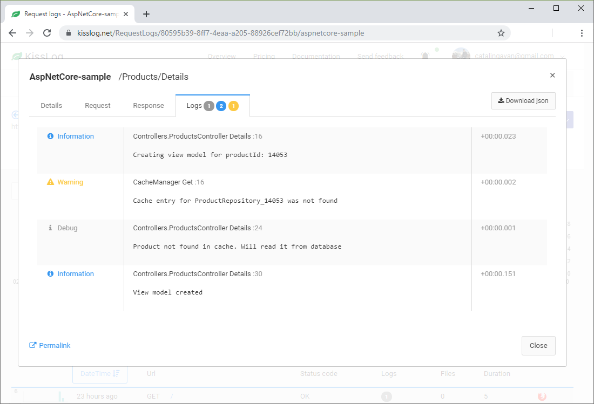

KissLogApiListener
====================

KissLogApiListener is saving the logs to KissLog.net (or KissLog.net on-premises).

Usage
---------------------

Replace "KissLog.OrganizationId" and "KissLog.ApplicationId" with Api Key values from the KissLog.net application configuration page.

.. code-block:: c#

    protected void Application_Start()
    {
        KissLogConfiguration.Listeners.Add(new KissLogApiListener(new KissLog.Apis.v1.Auth.Application(
            "KissLog.OrganizationId", "KissLog.ApplicationId"
        )));
    }

   KissLogApiListener output

Trigger events
---------------------

KissLogApiListener is using the ``OnFlush()`` event to send the logs to KissLog.net servers.

.. code-block:: c#
    :caption: Simplified implementation of the KissLogApiListener
    :linenos:
    :emphasize-lines: 17-18

    public class KissLogApiListener : ILogListener
    {
        public void OnBeginRequest(HttpRequest httpRequest, ILogger logger)
        {
            // do nothing
        }

        public void OnMessage(LogMessage message, ILogger logger)
        {
            // do nothing
        }

        public void OnFlush(FlushLogArgs args, ILogger logger)
        {
            Task.Factory.StartNew(async () =>
            {
                IKissLogApi kissLogApi = new KissLogRestApi(ApiUrl);
                await kissLogApi.SaveAsync(args);
            })
            .ConfigureAwait(false);
        }
    }

.. code-block:: none
    :caption: KissLogApiListener trigger event 

    BEGIN [GET /api/getUsers]        
    

    ILogger logger = Logger.Factory.Get();

    logger.Debug("step 1");          

    ...
    logger.Info("step n");           

    
    END [200 OK GET /api/getUsers]   <---- KissLogApiListener.OnFlush() is executed

Console applications
---------------------

For Console applications, you need to flush the listener manually.

.. code-block:: c#
    :linenos:
    :emphasize-lines: 3,17

    static void Main(string[] args)
    {
        ILogger logger = new Logger(url: "Main");

        try
        {
            
        }
        catch(Exception ex)
        {
            logger.Error(ex);
            throw;
        }
        finally
        {
            // KissLogApiListener.OnFlush() is executed
            Logger.NotifyListeners(logger);
        }
    }

When using KissLogApiListener for Console applications, specify the **UseAsync** flag to **false**.

.. code-block:: c#
    :linenos:
    :emphasize-lines: 16

    class Program
    {
        static void Main(string[] args)
        {
            ConfigureKissLog();

            // execute Main
        }

        static void ConfigureKissLog()
        {
            KissLogConfiguration.Listeners.Add(new KissLogApiListener(
                new KissLog.Apis.v1.Auth.Application("KissLog.OrganizationId", "KissLog.ApplicationId")
            )
            {
                UseAsync = false
            });
        }
    } 
