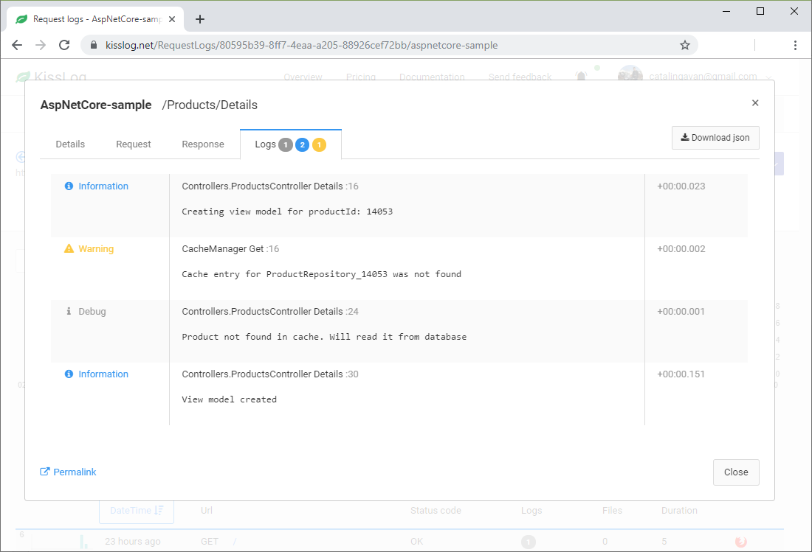

Cloud listener
====================

The `KissLogApiListener <https://github.com/KissLog-net/KissLog.Sdk/blob/master/src/KissLog.Apis.v1/Listeners/KissLogApiListener.cs>`_ saves the logs to kisslog.net (or KissLog on-premises).

   KissLogApiListener output

.. contents::
   :local:
   :depth: 1

Usage
---------------------

.. code-block:: c#

    protected void Application_Start()
    {
        ILogListener cloudListener = new KissLogApiListener(new Application("OrganizationId", "ApplicationId"))
        {
            ApiUrl = "https://api.kisslog.net"
        };

        KissLogConfiguration.Listeners.Add(cloudListener);
    }

Replace ``"OrganizationId"`` and ``"ApplicationId"`` with values from the KissLog.net application configuration page.

Trigger events
---------------------

KissLogApiListener is saving the logs at the end of the HTTP request by using the ``OnFlush()`` event.

.. code-block:: none
    :emphasize-lines: 9

    GET /Products/Details                   <---- OnBeginRequest()

    ILogger logger = Logger.Factory.Get();  

    logger.Debug("Debug message");          <---- OnMessage()  

    HTTP 200 OK                             <---- KissLogApiListener is executed

.. code-block:: c#
    :caption: Simplified implementation
    :emphasize-lines: 16

    public class KissLogApiListener : ILogListener
    {
        public void OnBeginRequest(HttpRequest httpRequest, ILogger logger)
        {
            // do nothing
        }

        public void OnMessage(LogMessage message, ILogger logger)
        {
            // do nothing
        }

        public void OnFlush(FlushLogArgs args, ILogger logger)
        {
            IKissLogApi kissLogApi = new KissLogRestApi("https://api.kisslog.net");
            kissLogApi.SaveAsync(args).ConfigureAwait(false);
        }
    }

Console applications
---------------------

For Console applications:

* the listener needs to be flushed manually (line 18)

* **UseAsync** flag must be set to ``false`` (line 26)

.. code-block:: c#
    :linenos:
    :emphasize-lines: 18,26

    static void Main(string[] args)
    {
        ConfigureKissLog();

        ILogger logger = new Logger(url: "Main");

        try
        {
            logger.Info("Executing main");
        }
        catch(Exception ex)
        {
            logger.Error(ex);
            throw;
        }
        finally
        {
            Logger.NotifyListeners(logger);
        }

        static void ConfigureKissLog()
        {
            ILogListener cloudListener = new KissLogApiListener(new Application("OrganizationId", "ApplicationId"))
            {
                ApiUrl = "https://api.kisslog.net",
                UseAsync = false
            };

            KissLogConfiguration.Listeners.Add(cloudListener);
        }
    }
