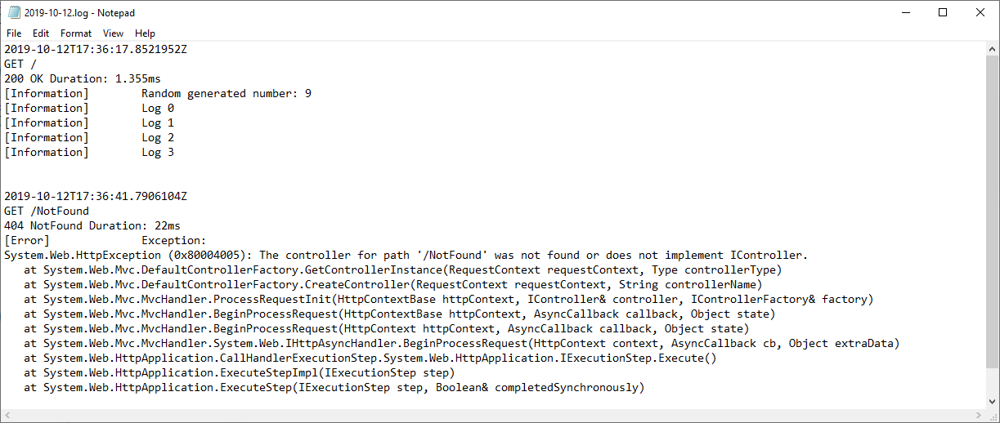
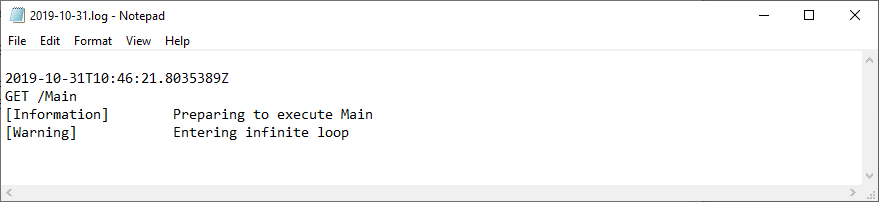

Text file listener
==========================

The `LocalTextFileListener <https://github.com/KissLog-net/KissLog.Sdk/blob/master/src/KissLog/Listeners/LocalTextFileListener.cs>`_ saves the logs on local text files.

   LocalTextFileListener output

.. contents::
   :local:
   :depth: 1

Usage
---------------------

.. code-block:: c#

    protected void Application_Start()
    {
        ILogListener textListener = new LocalTextFileListener(@"C:\\my-application\\logs")
        {
            FlushTrigger = FlushTrigger.OnMessage
        };

        KissLogConfiguration.Listeners.Add(textListener);
    }

Trigger events
---------------------

* **FlushTrigger.OnMessage**

The listener will save the logs as soon as they are created, using ``OnMessage()`` event.

.. code-block:: c#
    :linenos:
    :emphasize-lines: 7,9,11

    class Program
    {
        static void Main(string[] args)
        {
            ConfigureKissLog();

            ILogger logger = new Logger(url: "Main");   <---- LocalTextFileListener is executed

            logger.Info("Preparing to execute Main");   <---- LocalTextFileListener is executed

            logger.Warn("Entering infinite loop");      <---- LocalTextFileListener is executed

            while (true) { }

            Logger.NotifyListeners(logger);
        }
    }

* **FlushTrigger.OnFlush**

The listener will save the logs when ``Logger.NotifyListeners()`` method is triggered, using ``OnFlush()`` event.

For web applications this happens automatically at the end of the HTTP request.

.. code-block:: c#
    :linenos:
    :emphasize-lines: 13

    class Program
    {
        static void Main(string[] args)
        {
            ConfigureKissLog();

            ILogger logger = new Logger(url: "Main");   

            logger.Info("Preparing to execute Main");

            logger.Warn("Entering infinite loop");

            Logger.NotifyListeners(logger);             <---- LocalTextFileListener is executed
        }
    }

Console applications
---------------------

For Console applications it is recommended to use the **FlushTrigger.OnMessage**.

This will ensure that the logs will be saved regardless of the method execution time.

.. code-block:: c#
    :linenos:
    :emphasize-lines: 5,13,23

    class Program
    {
        static void Main(string[] args)
        {
            ConfigureKissLog();

            ILogger logger = new Logger(url: "Main");

            logger.Info("Preparing to execute Main");

            logger.Warn("Entering infinite loop");

            while (true) { }

            // will never be triggered
            Logger.NotifyListeners(logger);
        }

        static void ConfigureKissLog()
        {
            KissLogConfiguration.Listeners.Add(new LocalTextFileListener(@"C:\\my-application\\logs")
            {
                FlushTrigger = FlushTrigger.OnMessage
            });
        }
    }

   FlushTrigger.OnMessage output

