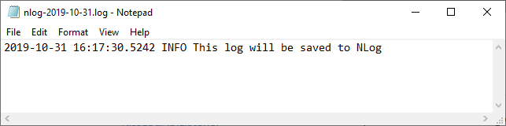
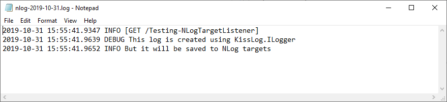
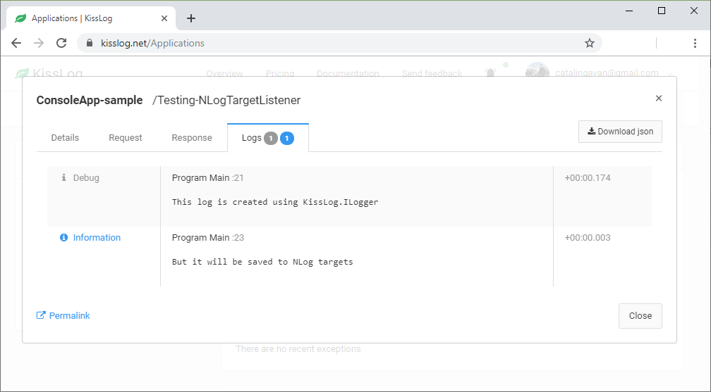

NLog listener
====================

The `NLogTargetListener <https://github.com/KissLog-net/KissLog.Sdk/blob/master/src/KissLog.Adapters.NLog/NLogTargetListener.cs>`_ is forwarding the logs to all the NLog targets defined in **NLog.config**.

This listener is useful when you want to use both KissLog and NLog outputs.

   NLogTargetListener output

.. contents::
   :local:
   :depth: 1

Usage
---------------------

.. code-block:: c#

    using KissLog;

    class Program
    {
        static void Main(string[] args)
        {
            ConfigureKissLog();

            ILogger logger = new Logger();

            logger.Info("This log will be saved to NLog");
        }

        static void ConfigureKissLog()
        {
            ILogListener nLogListener = new NLogTargetListener();
            KissLogConfiguration.Listeners.Add(nLogListener);
        }
    }

Trigger events
---------------------

NLogTargetListener is forwarding the logs to ``NLog.config`` targets as soon as they are created.

.. code-block:: c#
    :emphasize-lines: 9,11

    class Program
    {
        static void Main(string[] args)
        {
            ConfigureKissLog();

            ILogger logger = new Logger(url: "Main");

            logger.Info("Preparing to execute Main");   <---- sent to NLog targets

            logger.Warn("Entering infinite loop");      <---- sent to NLog targets

            while (true) { }

            Logger.NotifyListeners(logger);
        }
    }

.. code-block:: c#
    :caption: Simplified implementation
    :emphasize-lines: 18

    public class NLogTargetListener : ILogListener
    {
        public void OnBeginRequest(HttpRequest httpRequest, ILogger logger)
        {
            // do nothing
        }

        public void OnFlush(FlushLogArgs args, ILogger logger)
        {
            // do nothing
        }

        public void OnMessage(LogMessage message, ILogger logger)
        {
            NLog.Logger nlogLogger = NLog.LogManager.GetLogger(message.CategoryName);
            NLog.LogLevel logLevel = GetLogLevel(message.LogLevel);
            
            nlogLogger.Log(logLevel, message.Message);
        }
    }

NLog + KissLog example
---------------------------

In the example below, the **Program.cs** is configured to save the logs to:

* kisslog.net - using the ``KissLogApiListener`` listener

* ``NLog.config`` - using the ``NLogTargetListener`` listener

.. code-block:: xml
    :caption: NLog.config file

    <?xml version="1.0" encoding="utf-8" ?>
    <nlog xmlns="http://www.nlog-project.org/schemas/NLog.xsd"
        xmlns:xsi="http://www.w3.org/2001/XMLSchema-instance">
    
        <targets>
            <target xsi:type="File" name="f"
                fileName="${basedir}/logs/nlog-${shortdate}.log"
                layout="${longdate} ${uppercase:${level}} ${message}" />
        </targets>
        
        <rules>
            <logger name="*" minlevel="Trace" writeTo="f" />
        </rules>
    </nlog>
 
.. code-block:: c#

    using KissLog;

    class Program
    {
        static void Main(string[] args)
        {
            ConfigureKissLog();

            ILogger logger = new Logger(url: "Testing NLogTargetListener");

            try
            {
                logger.Debug("This log is created using KissLog.ILogger");

                logger.Info("But it will be saved to NLog targets");
            }
            catch(Exception ex)
            {
                logger.Error(ex);
                throw;
            }
            finally
            {
                Logger.NotifyListeners(logger);
            }
        }

        static void ConfigureKissLog()
        {
            ILogListener nLogListener = new NLogTargetListener(); 
            ILogListener cloudListener = new KissLogApiListener(new Application("0337cd29-a56e-42c1-a48a-e900f3116aa8", "c49f1fa1-00b8-4a43-8bc6-b327c08fb229"))
            {
                ApiUrl = "https://api.kisslog.net",
                UseAsync = false
            };

            KissLogConfiguration.Listeners.Add(nLogListener);
            KissLogConfiguration.Listeners.Add(cloudListener);
        }
    }

   NLogTargetListener output

   KissLogApiListener output

