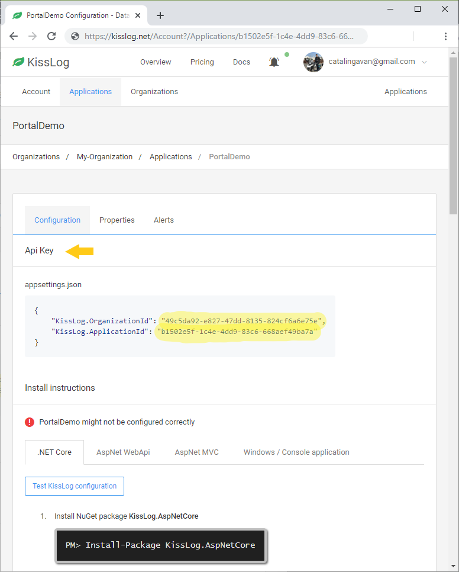

Can't see any logs
===================================

If you can't see any logs on KissLog.net, please follow these troubleshooting steps:

Step 1: Double check the :doc:`install instructions <../install-instructions/index>`
--------------------------------------------------------------------------------------

Make sure that the install instructions have been applied correctly.

Also, make sure that you register the :doc:`../saving-the-logs/KissLogApiListener` listener. This listener is saving the logs to KissLog.net.

.. code-block:: c#
    :emphasize-lines: 3-5

    protected void Application_Start()
    {
        KissLogConfiguration.Listeners.Add(new KissLogApiListener(
            new KissLog.Apis.v1.Auth.Application("KissLog.OrganizationId", "KissLog.ApplicationId")
        ));
    }

Step 2: Check the application keys
--------------------------------------------------------------------

Make sure that you use the correct application keys.

You can find them under the KissLog.net application configuration page.

Make sure you register the ``KissLogApiListener`` listener:

.. code-block:: c#
    :emphasize-lines: 7-9

    private void Application_Start()
    {
        string organizationId = "49c5da92-e827-47dd-8135-824cf6a6e75e";
        string applicationId = "b1502e5f-1c4e-4dd9-83c6-668aef49ba7a";

        // KissLog cloud listener
        KissLogConfiguration.Listeners.Add(new KissLogApiListener(
            new KissLog.Apis.v1.Auth.Application(organizationId, applicationId)
        ));
    }

Step 3: Check the internal logs
--------------------------------------------------------------------

KissLog is sending the logs to KissLog.net by creating a REST request to ``POST https://api.kisslog.net``.

If, for some reason, the request was unsuccessful, the details will be available in the internal logs.

.. code-block:: c#
    :emphasize-lines: 5

    private void Application_Start()
    {
        KissLogConfiguration.InternalLog = (string message) =>
        {
            Debug.WriteLine(message);
        };
    }

.. code-block:: none

    POST https://api.kisslog.net/api/logs/v1.0/createRequestLog begin
    POST https://api.kisslog.net/api/logs/v1.0/createRequestLog 500 ERROR
        An error occurred while sending the request.
        System.Net.Http.HttpRequestException: An error occurred while sending the request. ---> System.Net.WebException: The remote name could not be resolved: 'api.kisslog.net'
    at System.Net.HttpWebRequest.EndGetRequestStream(IAsyncResult asyncResult, TransportContext& context)
    at System.Net.Http.HttpClientHandler.GetRequestStreamCallback(IAsyncResult ar)
    --- End of inner exception stack trace ---
    at System.Runtime.CompilerServices.TaskAwaiter.ThrowForNonSuccess(Task task)
    at System.Runtime.CompilerServices.TaskAwaiter.HandleNonSuccessAndDebuggerNotification(Task task)
    at System.Net.Http.HttpClient.<FinishSendAsync>d__58.MoveNext()
    --- End of stack trace from previous location where exception was thrown ---
    at System.Runtime.CompilerServices.TaskAwaiter.ThrowForNonSuccess(Task task)
    at System.Runtime.CompilerServices.TaskAwaiter.HandleNonSuccessAndDebuggerNotification(Task task)
    at KissLog.Apis.v1.Apis.ApiClient.<PostAsJsonAsync>d__3`1.MoveNext()
    --- End of stack trace from previous location where exception was thrown ---
    at System.Runtime.CompilerServices.TaskAwaiter.ThrowForNonSuccess(Task task)
    at System.Runtime.CompilerServices.TaskAwaiter.HandleNonSuccessAndDebuggerNotification(Task task)
    at KissLog.Apis.v1.Apis.TryCatchApiClient.<PostAsJsonAsync>d__2`1.MoveNext()

Console applications
--------------------------------------------------------------------

For non-web applications, in addition to the steps above, please ensure the following:

You notify the kisslog listeners using ``Logger.NotifyListeners(logger)``.

.. code-block:: c#
    :linenos:
    :emphasize-lines: 14

    static void Main(string[] args)
    {
        ConfigureKissLog();

        ILogger logger = new Logger(url: "Main");

        try
        {
            logger.Info("Executing main");
        }
        finally
        {
            // notify the listeners
            Logger.NotifyListeners(logger);
        }
    }

When you register the ``KissLogApiListener``, specify the **UseAsync** property to **false**.

.. code-block:: c#
    :linenos:
    :emphasize-lines: 21

    namespace ConsoleApp_sample
    {
        class Program
        {
            static void Main(string[] args)
            {
                ConfigureKissLog();

                // code removed for simplicity
            }

            static void ConfigureKissLog()
            {
                string organizationId = "49c5da92-e827-47dd-8135-824cf6a6e75e";
                string applicationId = "b1502e5f-1c4e-4dd9-83c6-668aef49ba7a";

                KissLogConfiguration.Listeners.Add(new KissLogApiListener(
                    new KissLog.Apis.v1.Auth.Application(organizationId, applicationId)
                )
                {
                    UseAsync = false
                });
            }
        }
    }

KissLog.net on-premises
--------------------------------------------------------------------

If you are using KissLog.net on-premises, make sure that you provide the URL to your KissLog.Backend instance.

.. code-block:: c#
    :emphasize-lines: 7

    protected void Application_Start()
    {
        KissLogConfiguration.Listeners.Add(new KissLogApiListener(
            new KissLog.Apis.v1.Auth.Application("KissLog.OrganizationId", "KissLog.ApplicationId")
        )
        {
            ApiUrl = "http://api.my-kisslog.net"
        });
    }

Didn't help?
--------------------------------------------------------------------

Open a ticket on `GitHub issues <https://github.com/KissLog-net/KissLog.Sdk/issues>`_.