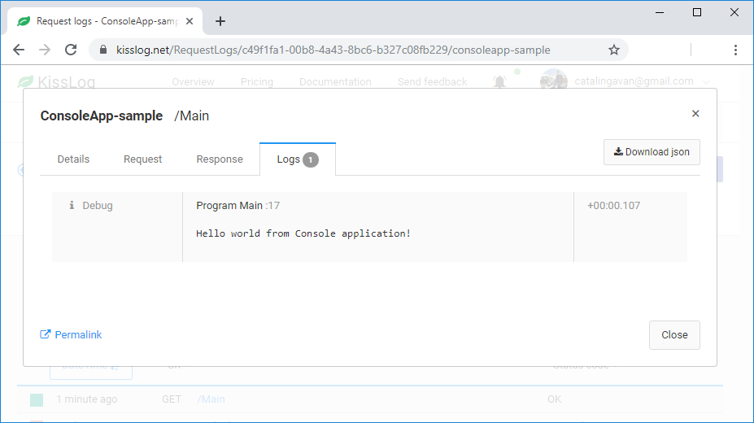

Console applications
=====================

For Console applications, you need to create and flush the ILogger manually.

This can be achieved by using a **try-catch-finally** block, which simulates the BEGIN / END of a method.

.. code-block:: c#
    :linenos:
    :emphasize-lines: 3,13,19

    static void Main(string[] args)
    {
        ILogger logger = new Logger(url: "Main");

        try
        {
            logger.Info("Executing main");

            // execute Main
        }
        catch(Exception ex)
        {
            logger.Error(ex);
            throw;
        }
        finally
        {
            // notify the listeners
            Logger.NotifyListeners(logger);
        }
    }

Notifying the listeners
--------------------------

Unlike web applications, where the listeners are notified automatically at the end of the request, in Console applications you need to notify them manually.

The log listeners are notified as following:

- ``OnBeginRequest()`` is executed automatically when the Logger instance is created

- ``OnMessage()`` is executed automatically for each log message created

- ``OnFlush()`` is executed manually by calling ``Logger.NotifyListeners()``

.. code-block:: c#

    static void Main(string[] args)
    {
        ILogger logger = new Logger(url: "Main");   // <-- OnBeginRequest()

        try
        {
            logger.Info("Executing main");          // <-- OnMessage()

            // execute Main
        }
        catch(Exception ex)
        {
            logger.Error(ex);                       // <-- OnMessage()
            throw;
        }
        finally
        {
            Logger.NotifyListeners(logger);         // <-- OnFlush()
        }
    }

Use different loggers
--------------------------

ILogger has a scoped lifetime. In Console applications, the *scope* is defined by the method itself.

If you have different entry methods, you need to create and flush the logger for each of them.

.. code-block:: c#
    :linenos:
    :emphasize-lines: 5,12

    class Program
    {
        static void SyncDatabase()
        {
            ILogger logger = new Logger(url: "SyncDatabase");

            // executing
        }

        static void ImportFromXml(string xmlPath)
        {
            ILogger logger = new Logger(url: "ImportFromXml");

            // executing
        }
    }

Full example
--------------------------

In the following example we have a Console application which is saving the logs to KissLog.net.

.. code-block:: c#
    :linenos:
    :emphasize-lines: 7,9,22

    namespace ConsoleApp_sample
    {
        class Program
        {
            static void Main(string[] args)
            {
                ConfigureKissLog();

                ILogger logger = new Logger(url: "Main");

                try
                {
                    logger.Debug("Hello world from Console application!");
                }
                catch (Exception ex)
                {
                    logger.Error(ex);
                    throw;
                }
                finally
                {
                    Logger.NotifyListeners(logger);
                }
            }

            static void ConfigureKissLog()
            {
                string organizationId = "0337cd29-a56e-42c1-a48a-e900f3116aa8";
                string applicationId = "c49f1fa1-00b8-4a43-8bc6-b327c08fb229";

                ILogListener listener = new KissLogApiListener(new KissLog.Apis.v1.Auth.Application(organizationId,applicationId))
                {
                    UseAsync = false
                };

                KissLogConfiguration.Listeners.Add(listener);
            }
        }
    }

