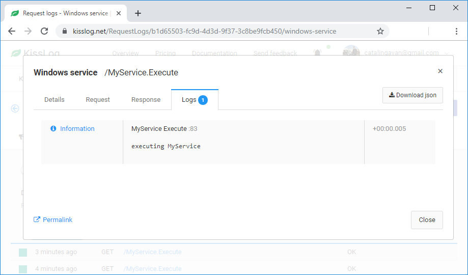
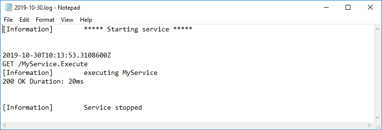

Windows services
====================

Windows services applications have the same behavior as :doc:`console-apps`.

A typical windows service application has three events:

- **OnStart()** - triggered when the service starts

- **OnStop()** - triggered when the service stops

- **Execute()** - the actual service implementation

We log the ``Execute()`` method by using a **try-catch-finally** block to simulate the BEGIN and the END of the action.

We call ``Logger.NotifyListeners(logger)`` (line 19) to ensure that the listeners will execute the **OnFlush()** event.

.. code-block:: c#
    :linenos:
    :emphasize-lines: 5,19

    public partial class MyService : ServiceBase
    {
        public void Execute(object source, ElapsedEventArgs e)
        {
            ILogger logger = new Logger(url: "MyService.Execute");

            try
            {
                logger.Info("executing MyService");

                // executing
            }
            catch(Exception ex)
            {
                logger.Error(ex);
            }
            finally
            {
                Logger.NotifyListeners(logger);
            }
        }
    }

Full example
--------------------------

.. code-block:: c#
    :linenos:
    :emphasize-lines: 10,14,21,23,32,39,53

    using KissLog;

    namespace WindowsService_sample
    {
        public partial class MyService : ServiceBase
        {
            private readonly Timer timer = new Timer();
            private readonly int _triggerInterval = 1000;

            private ILogger Logger = null;

            public MyService()
            {
                ConfigureKissLog();

                InitializeComponent();
            }

            protected override void OnStart(string[] args)
            {
                Logger = new Logger();

                Logger.Info("***** Starting service *****");

                timer.Elapsed += new ElapsedEventHandler(Execute);
                timer.Interval = _triggerInterval;
                timer.Enabled = true;
            }

            protected override void OnStop()
            {
                Logger.Info("Service stopped");

                timer.Stop();
            }

            public void Execute(object source, ElapsedEventArgs e)
            {
                ILogger logger = new Logger(url: "MyService.Execute");

                try
                {
                    logger.Info("executing MyService");

                    // executing
                }
                catch(Exception ex)
                {
                    logger.Error(ex);
                }
                finally
                {
                    KissLog.Logger.NotifyListeners(logger);
                }
            }

            private void ConfigureKissLog()
            {
                string organizationId = "0337cd29-a56e-42c1-a48a-e900f3116aa8";
                string applicationId = "b1d65503-fc9d-4d3d-9f37-3c8be9fcb450";

                // KissLog.net cloud listener
                KissLogConfiguration.Listeners.Add(new KissLogApiListener(new KissLog.Apis.v1.Auth.Application(organizationId, applicationId))
                {
                    UseAsync = false
                });

                // local text file listener
                KissLogConfiguration.Listeners.Add(new LocalTextFileListener(Path.Combine(AppDomain.CurrentDomain.BaseDirectory, "Logs"))
                {
                    FlushTrigger = FlushTrigger.OnMessage
                });
            }
        }
    }

   Windows services logs on KissLog.net

   Windows services logs on text file