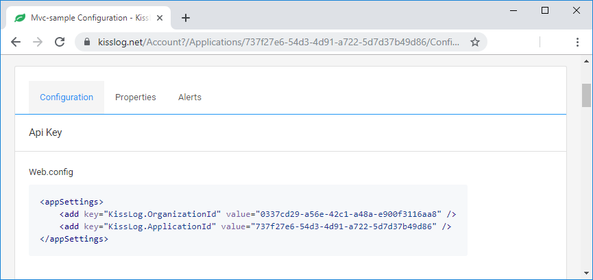
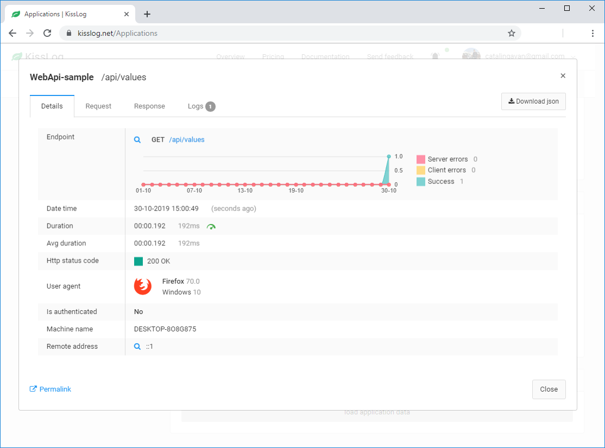
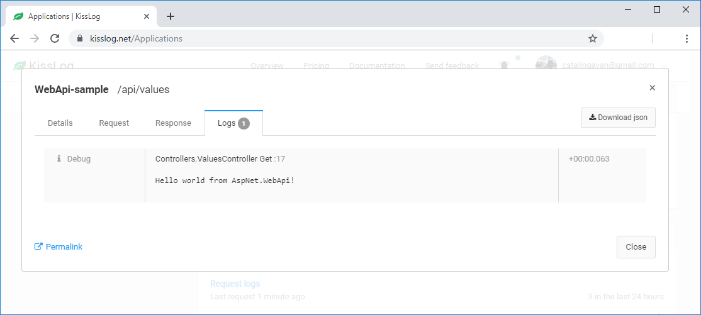

AspNet WebApi
====================

These steps describe how to install and configure KissLog for an Asp.Net WebApi application.

1. Install NuGet Package

.. code-block:: none

    PM> Install-Package KissLog.AspNet.WebApi

2. Update **web.config**

Replace **OrganizationID** and **ApplicationID** with Api Key values from the application configuration page.

.. code-block:: xml
    :linenos:

    <configuration>
        <appSettings>
            <add key="KissLog.OrganizationId" value="OrganizationID" />
            <add key="KissLog.ApplicationId" value="ApplicationID" />
        </appSettings>
    </configuration>

   KissLog.net application configuration

3. Update **Global.asax**

.. code-block:: c#
    :linenos:
    :emphasize-lines: 10, 12, 15-28, 40, 42-47

    using KissLog.Apis.v1.Listeners;
    using KissLog.AspNet.Web;
    
    namespace KissLog.Samples.WebApi
    {
        public class WebApiApplication : System.Web.HttpApplication
        {
            protected void Application_Start()
            {
                GlobalConfiguration.Configure(WebApiConfig.Register);

                ConfigureKissLog();
            }

            protected void Application_Error(object sender, EventArgs e)
            {
                Exception exception = Server.GetLastError();
                if (exception != null)
                {
                    var logger = Logger.Factory.Get();
                    logger.Error(exception);

                    if(logger.AutoFlush() == false)
                    {
                        Logger.NotifyListeners(logger);
                    }
                }
            }

            private void ConfigureKissLog()
            {
                // KissLog cloud listener
                KissLogConfiguration.Listeners.Add(new KissLogApiListener(new KissLog.Apis.v1.Auth.Application(
                    ConfigurationManager.AppSettings["KissLog.OrganizationId"],
                    ConfigurationManager.AppSettings["KissLog.ApplicationId"])
                ));
            }

            // Register HttpModule
            public static KissLogHttpModule KissLogHttpModule = new KissLogHttpModule();

            public override void Init()
            {
                base.Init();

                KissLogHttpModule.Init(this);
            }
        }
    }

4. Update **WebApiConfig.cs**

.. code-block:: c#
    :linenos:
    :emphasize-lines: 12, 15

    using KissLog.AspNet.WebApi;
    using System.Web.Http;
    using System.Web.Http.ExceptionHandling;
    
    namespace KissLog.Samples.WebApi
    {
        public static class WebApiConfig
        {
            public static void Register(HttpConfiguration config)
            {
                // Add KissLog Exception logger
                config.Services.Replace(typeof(IExceptionLogger), new KissLogExceptionLogger());
    
                // Add KissLog exception filter
                config.Filters.Add(new KissLogWebApiExceptionFilterAttribute());
    
                // Web API routes
                config.MapHttpAttributeRoutes();
    
                config.Routes.MapHttpRoute(
                    name: "DefaultApi",
                    routeTemplate: "api/{controller}/{id}",
                    defaults: new { id = RouteParameter.Optional }
                );
            }
        }
    }

5. Use the ILogger

.. code-block:: c#
    :linenos:
    :emphasize-lines: 7, 10, 16

    using KissLog;

    namespace KissLog.Samples.WebApi.Controllers
    {
        public class ValuesController : ApiController
        {
            private readonly ILogger _logger;
            public ValuesController()
            {
                _logger = Logger.Factory.Get();
            }

            // GET api/values
            public IEnumerable<string> Get()
            {
                _logger.Debug("Hello world from AspNet.WebApi!");

                return new string[] { "value1", "value2" };
            }
        }
    }

Testing
-------------------------------------------

To test the KissLog configuration, trigger a request on /api/values. The request should be visible on KissLog.net.

   Request log details

   Request logs