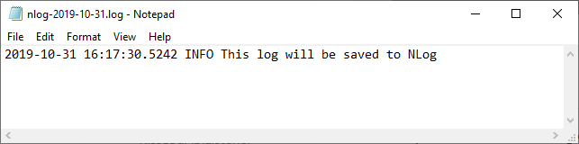
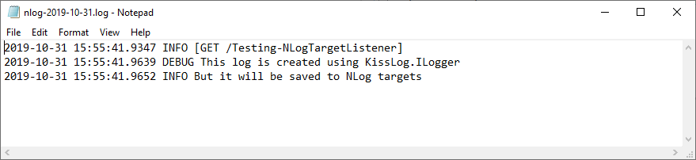
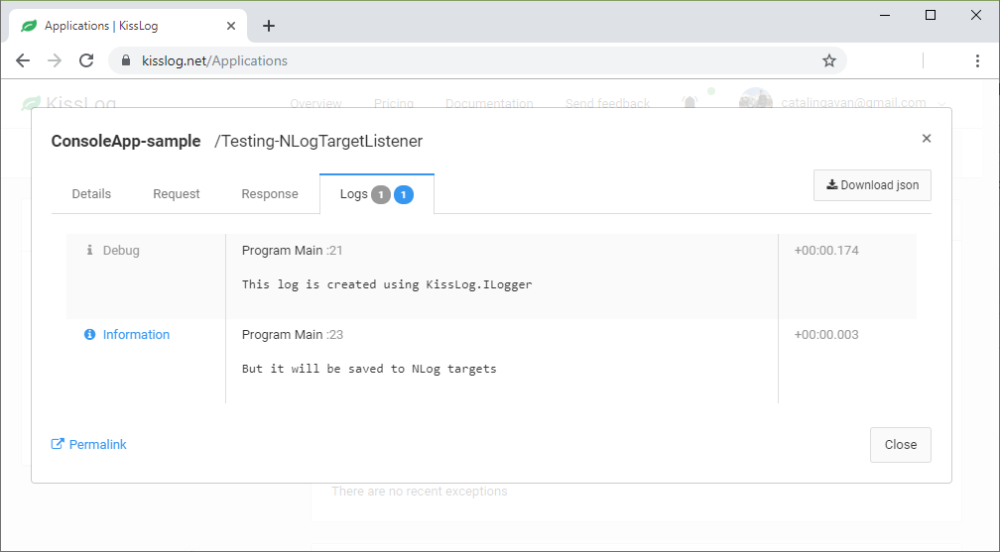

NLogTargetListener
====================

NLogTargetListener is forwarding the logs to NLog logger, implicitly to the NLog targets defined in **NLog.config**.

This listener is useful when you want to use KissLog, but also save the logs to NLog.

Usage
---------------------

.. code-block:: c#
    :linenos:
    :emphasize-lines: 1,5

    using KissLog;

    static void Main(string[] args)
    {
        KissLogConfiguration.Listeners.Add(new NLogTargetListener());

        ILogger logger = new Logger();

        logger.Info("This log will be saved to NLog");
    }

   NLogTargetListener example

NLog + KissLog example
---------------------------

In the example below, we have NLog.config which saves the NLog logs to **File** target.

All the logs created in **Program.cs** will be saved to both NLog targets and KissLog.net.

.. code-block:: xml
    :caption: NLog.config file

    <?xml version="1.0" encoding="utf-8" ?>
    <nlog xmlns="http://www.nlog-project.org/schemas/NLog.xsd"
        xmlns:xsi="http://www.w3.org/2001/XMLSchema-instance">
    
        <targets>
            <target xsi:type="File" name="f"
                fileName="${basedir}/logs/nlog-${shortdate}.log"
                layout="${longdate} ${uppercase:${level}} ${message}" />
        </targets>
        
        <rules>
            <logger name="*" minlevel="Trace" writeTo="f" />
        </rules>
    </nlog>
 
.. code-block:: c#
    :linenos:

    using KissLog;

    class Program
    {
        static void Main(string[] args)
        {
            ConfigureKissLog();

            ILogger logger = new Logger(url: "Testing NLogTargetListener");

            logger.Debug("This log is created using KissLog.ILogger");

            logger.Info("But it will be saved to NLog targets");

            // trigger KissLogApiListener.OnFlush()
            Logger.NotifyListeners(logger);
        }

        static void ConfigureKissLog()
        {
            KissLogConfiguration.Listeners.Add(new NLogTargetListener());

            KissLogConfiguration.Listeners.Add(new KissLogApiListener(
                new KissLog.Apis.v1.Auth.Application("0337cd29-a56e-42c1-a48a-e900f3116aa8", "c49f1fa1-00b8-4a43-8bc6-b327c08fb229")
            )
            {
                UseAsync = false
            });
        }
    }

   NLog file

   KissLog.net logs

Trigger events
---------------------

NLogTargetListener is forwarding the logs to NLog as soon as they are created, using the ``OnMessage()`` event.

.. code-block:: c#
    :caption: Simplified implementation of the NLogTargetListener
    :linenos:
    :emphasize-lines: 17-18

    public class NLogTargetListener : ILogListener
    {
        public void OnBeginRequest(HttpRequest httpRequest, ILogger logger)
        {
            // do nothing
        }

        public void OnFlush(FlushLogArgs args, ILogger logger)
        {
            // do nothing
        }

        public void OnMessage(LogMessage message, ILogger logger)
        {
            NLog.Logger logger = NLog.LogManager.GetLogger(message.CategoryName);
            NLog.LogLevel logLevel = GetLogLevel(message.LogLevel);
            
            logger.Log(logLevel, message.Message);
        }
    }
