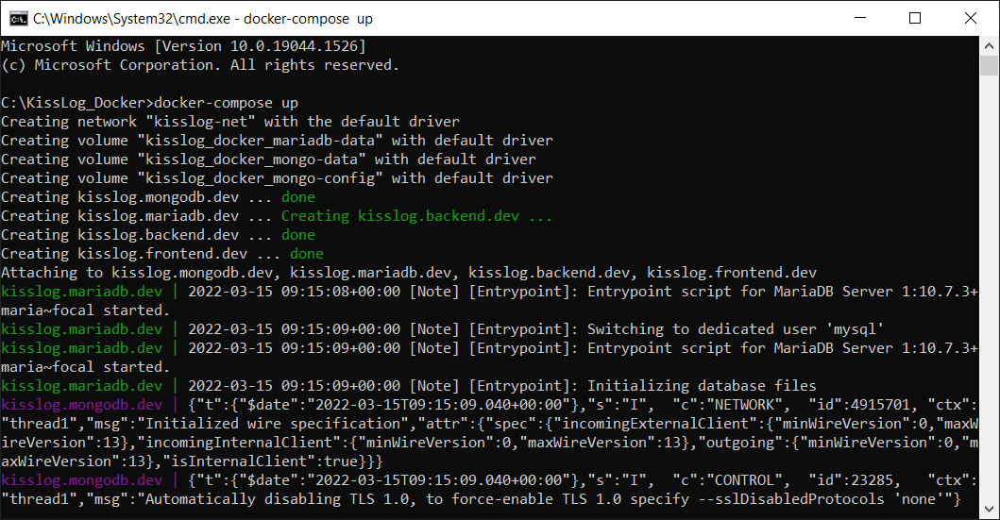

Docker
=============================

KissLog can be run as a Docker application.

The official KissLog Docker repositories are the following:

- https://hub.docker.com/r/catalingavan/kisslog.backend

- https://hub.docker.com/r/catalingavan/kisslog.frontend

Configuration
-------------------------------------------------------

To get started running KissLog as a Docker application, create the following files:

The files below can also be download from `here <https://kisslog.net/Overview/OnPremises>`_.

.. code-block:: none

    /KissLog_Docker
    ├── docker-compose.yml
    ├── backend.appsettings.json
    ├── backend.KissLog.json
    ├── frontend.appsettings.json
    └── frontend.KissLog.json

- ``docker-compose.yml`` configures the KissLog services
- ``backend.appsettings.json`` overrides the default ``KissLog.Backend\appsettings.json`` file
- ``backend.KissLog.json`` overrides the default ``KissLog.Backend\Configuration\KissLog.json`` file
- ``frontend.appsettings.json`` overrides the default ``KissLog.Frontend\appsettings.json`` file
- ``frontend.KissLog.json`` overrides the default ``KissLog.Frontend\Configuration\KissLog.json`` file

.. code-block:: none
    :caption: docker-compose.yml

    version: "3.7"
    networks:
      default:
        name: kisslog-net
        driver_opts:
          com.docker.network.driver.mtu: 1380

    services:
      backend:
        image: catalingavan/kisslog.backend:3.1.1
        container_name: kisslog.backend.dev
        restart: unless-stopped
        volumes:
          - ./backend.appsettings.json:/app/appsettings.json
          - ./backend.KissLog.json:/app/Configuration/KissLog.json
        ports:
          - "44088:80"
        links:
          - "mongodb"

      frontend:
        image: catalingavan/kisslog.frontend:3.1.1
        container_name: kisslog.frontend.dev
        restart: unless-stopped
        volumes:
          - ./frontend.appsettings.json:/app/appsettings.json
          - ./frontend.KissLog.json:/app/Configuration/KissLog.json
        ports:
          - "44080:80"
        links:
          - "backend"
          - "mariadb"

      mongodb:
        image: mongo
        container_name: kisslog.mongodb.dev
        restart: unless-stopped
        volumes:
          - mongo-data:/data/db
          - mongo-config:/data/configdb

      mariadb:
        image: mariadb
        container_name: kisslog.mariadb.dev
        restart: unless-stopped
        volumes:
          - mariadb-data:/var/lib/mysql
        environment:
          MYSQL_ROOT_PASSWORD: pass
          MYSQL_DATABASE: KissLog_Frontend_Dev

      volumes:
        mariadb-data:
        mongo-data:
        mongo-config:

.. code-block:: json
    :caption: frontend.appsettings.json

    {
        "Logging": {
            "LogLevel": {
                "Default": "Warning",
                "Microsoft": "Warning",
                "Microsoft.Hosting.Lifetime": "Warning"
            }
        },
        "ApplicationType": "OnPremises",
        "ConfigurationFilePath": "Configuration/KissLog.json",
        "KissLogCloud": "",
        "AllowedHosts": "*",
        "Kestrel": {
            "EndPoints": {
                "Http": {
                    "Url": "http://0.0.0.0:80"
                }
            }
        }
    }

.. code-block:: json
    :caption: frontend.KissLog.json (simplified version)

    {
        "KissLogBackendUrl": "http://kisslog.backend.dev",
        "KissLogFrontendUrl": "http://kisslog.frontend.dev",
        "Database": {
            "Provider": "MySql",
            "KissLogDbContext": "server=kisslog.mariadb.dev;port=3306;database=KissLog_Frontend_Dev;uid=root;password=pass;Charset=utf8;"
        }
    }

.. code-block:: json
    :caption: backend.appsettings.json

    {
        "Logging": {
            "LogLevel": {
                "Default": "Warning",
                "Microsoft": "Warning",
                "Microsoft.Hosting.Lifetime": "Warning"
            }
        },
        "ConfigurationFilePath": "Configuration/KissLog.json",
        "AllowedHosts": "*",
        "Kestrel": {
            "EndPoints": {
                "Http": {
                    "Url": "http://0.0.0.0:80"
                }
            }
        }
    }

.. code-block:: json
    :caption: backend.KissLog.json (simplified version)

    {
        "KissLogBackendUrl": "http://kisslog.backend.dev",
        "KissLogFrontendUrl": "http://kisslog.frontend.dev",
        "Database": {
            "Provider": "MongoDb",
            "MongoDb": {
                "ConnectionString": "mongodb://kisslog.mongodb.dev:27017",
                "DatabaseName": "KissLogDev"
            }
        }
    }

Build
-------------------------------------------------------

.. code-block:: none

    C:\KissLog_Docker> docker-compose up

This command will spawn all KissLog prerequisites as well as both KissLog.Backend and KissLog.Frontend applications.

- KissLog.Frontend is exposed on ``http://localhost:44080/``

- KissLog.Backend is exposed on ``http://localhost:44088/``

+------------------------------------------------------------------------------+-----------------------------------------------------------------------------+
| ``http://localhost:44080/``                                                  | ``http://localhost:44088/``                                                 |
+==============================================================================+=============================================================================+
| .. image:: images/Docker/KissLog.Frontend.localhost.png                      | .. image:: images/Docker/KissLog.Backend.localhost.png                      |
|   :alt: KissLog.Frontend                                                     |   :alt: KissLog.Backend                                                     |
+------------------------------------------------------------------------------+-----------------------------------------------------------------------------+

Destroy
----------------------------

.. code-block:: none

    C:\KissLog_Docker> docker-compose down

.. figure:: images/Docker/docker-compose-down.png
