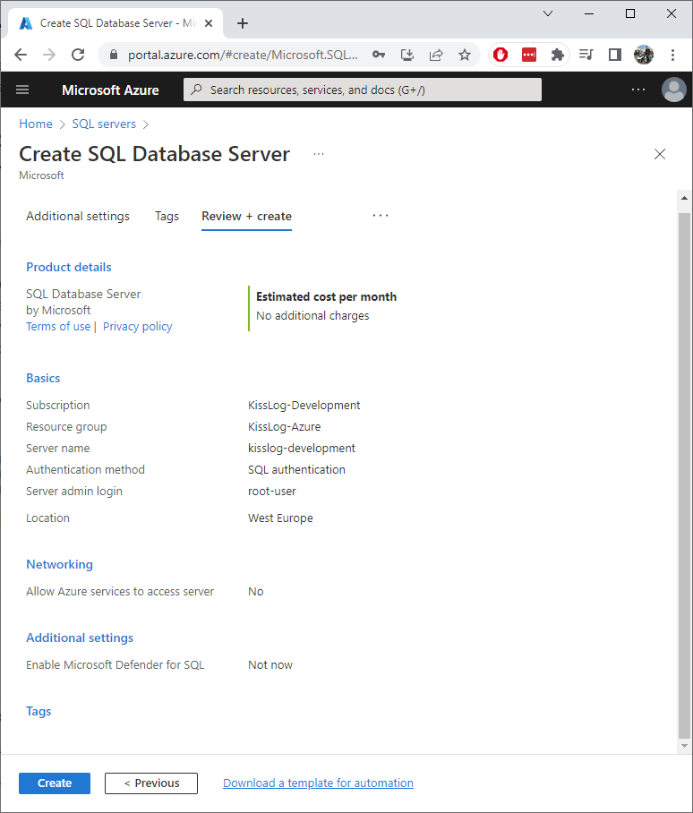
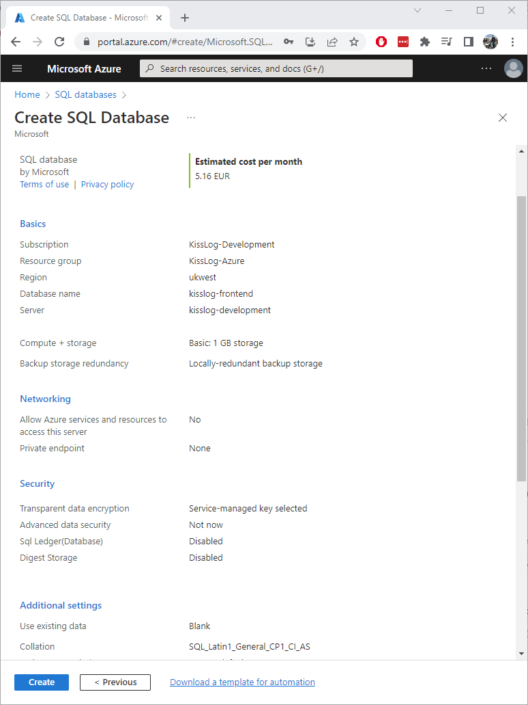

Installation guide
=============================

.. contents:: Table of contents
   :local:

Prerequisites
-------------------------------------------------------

Artifacts
~~~~~~~~~~~~~~~~~~~~~

- KissLog.Backend.AspNetCore.zip
- KissLog.Frontend.AspNetCore.zip

Artifacts can be downloaded from `here <https://kisslog.net/Overview/OnPremises>`_.

Services
~~~~~~~~~~~~~~~~~~~~~

- 1x Azure SQL Database
- 1x Azure Cosmos DB
- 1x Azure Storage account
- 2x Azure App Services

Installation
-------------------------------------------------------

Azure SQL Database
~~~~~~~~~~~~~~~~~~~~~

KissLog server does not use SQL intensively. To start with, the Standard tier or even the Basic tier should be enough. If necessary, you can always upgrade it later.

If you already have an SQL server, you can skip this step.

1. Create SQL Database Server
^^^^^^^^^^^^^^^^^^^^^^^^^^^^^^^^^^^^^^^^^^^^^^

Most of the properties remain as default. We will mention the important changes.

.. list-table::
   :header-rows: 1

   * - Basics
     - 
   * - Server name
     - any value
   * - Location
     - any value
   * - Authentication method
     - Use SQL authentication
   * - Server admin login / Password
     - any value

.. list-table::
   :header-rows: 1

   * - Networking
     - 
   * - Allow Azure services and resources to access this server
     - No

2. Create SQL Database
^^^^^^^^^^^^^^^^^^^^^^^^^^^^^^^^^^^^^^^^^^^^^^

Most of the properties remain as default. We will mention the important changes. Most of these settings can always be updated later.

.. list-table::
   :header-rows: 1

   * - Basics
     - 
   * - Database name
     - kisslog-frontend (or any value)
   * - Server
     - *<the server created at the previous step>*
   * - Want to use SQL elastic pool?
     - No
   * - Workload environment
     - Production
   * - Compute + storage
     - Basic, 1 GB storage

