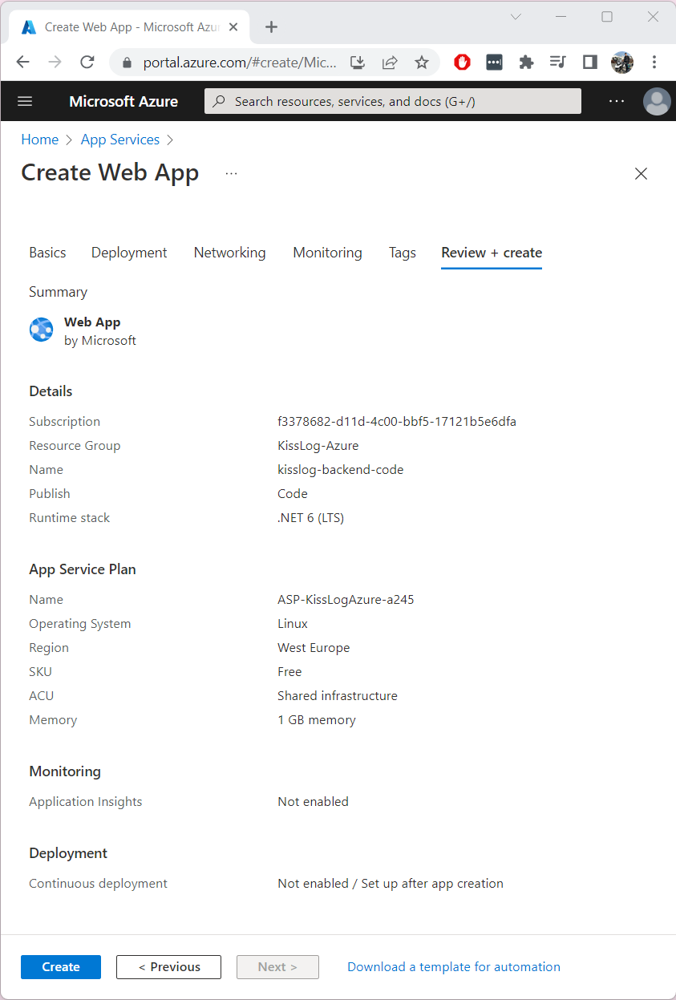

Installation guide
=============================

.. contents:: Table of contents
   :local:

Prerequisites
-------------------------------------------------------

Artifacts
~~~~~~~~~~~~~~~~~~~~~~~

- KissLog.Backend.AspNetCore.zip
- KissLog.Frontend.AspNetCore.zip

Artifacts can be downloaded from `here <https://kisslog.net/Overview/OnPremises>`_.

Services
~~~~~~~~~~~~~~~~~~~~~~~

- 1x SQL Database
- 1x Azure Cosmos DB
- 1x Storage account
- 2x App Services

Installation
-------------------------------------------------------

SQL Database
~~~~~~~~~~~~~~~~~~~~~~~

KissLog server does not use SQL intensively. The Basic or Standard tiers should be enough to start with. If necessary, you can always upgrade it later.

If you already have an SQL server, you can skip this step.

1. Create SQL Database Server
^^^^^^^^^^^^^^^^^^^^^^^^^^^^^^^^^^^^^^^^^^^^^^

Most of the properties remain as default. We will mention the important changes.

.. list-table::
   :header-rows: 1

   * - Basics
     - 
   * - Server name
     - *<any value>*
   * - Location
     - (Europe) West Europe *<or any appropriate value>*
   * - Authentication method
     - Use SQL authentication
   * - Server admin login / Password
     - *<any value>*

.. list-table::
   :header-rows: 1

   * - Networking
     - 
   * - Allow Azure services and resources to access this server
     - No

.. figure:: images/installation-guide/sql-server-ReviewAndCreate.png
    :alt: Create SQL Database Server

2. Create SQL Database
^^^^^^^^^^^^^^^^^^^^^^^^^^^^^^^^^^^^^^^^^^^^^^

Most of the properties remain as default. We will mention the important changes. Most of these settings can always be updated later.

.. list-table::
   :header-rows: 1

   * - Basics
     - 
   * - Database name
     - kisslog-frontend *(or any value)*
   * - Server
     - *<the server created at the previous step>*
   * - Want to use SQL elastic pool?
     - No
   * - Workload environment
     - Production
   * - Compute + storage
     - Basic, 1 GB storage

Azure Cosmos DB
~~~~~~~~~~~~~~~~~~~~~

KissLog server uses Azure Cosmos DB very intensively. The minimum throughtput used by the KissLog server (calculated in RU/s) highly depends on the frequency and volume of data you save.

The cost of the Azure Cosmos DB service is influenced by the throughtput (RU/s) and by the number of replicas used.

To get started, we will use a single-region `Azure Cosmos DB free tier account <https://learn.microsoft.com/en-us/azure/cosmos-db/free-tier>`_ which covers for free a maximum of 1000 RU/s.

Create an Azure Cosmos DB account. Select **Azure Cosmos DB for NoSQL**.

.. list-table::
   :header-rows: 1

   * - Basics
     - 
   * - Account Name
     - kisslog-database-nosql *(or any value)*
   * - Location
     - (Europe) West Europe *<or any appropriate value>*
   * - Capacity mode
     - Provisioned throughput
   * - Apply Free Tier Discount
     - Apply
   * - Limit total account throughput
     - Checked

.. list-table::
   :header-rows: 1

   * - Global Distribution
     - 
   * - Geo-Redundancy
     - Disable
   * - Multi-region Writes
     - Disable
   * - Availability Zones
     - Disable

.. list-table::
   :header-rows: 1

   * - Networking
     - 
   * - Connectivity method
     - All networks

.. list-table::
   :header-rows: 1

   * - Backup Policy
     - 
   * - Backup policy
     - Continuous (7 days) *(available for free)*

.. list-table::
   :header-rows: 1

   * - Encryption
     - 
   * - Data Encryption
     - Service-managed key

Storage account
~~~~~~~~~~~~~~~~~~~~~~~

KissLog server uses Azure storage account for saving blob files and for reducing the workload of Azure Cosmos DB.

.. list-table::
   :header-rows: 1

   * - Basics
     - 
   * - Storage account Name
     - kisslogstorage *(or any value)*
   * - Region
     - (Europe) West Europe *<or any appropriate value>*
   * - Performance
     - Standard
   * - Redundancy
     - Locally-redundant storage (LRS)

.. list-table::
   :header-rows: 1

   * - Advanced
     - 
   * - Require secure transfer for REST API operations
     - Yes
   * - Allow enabling public access on containers
     - No
   * - Enable storage account key access
     - Yes
   * - Default to Azure Active Directory authorization in the Azure portal
     - No
   * - Minimum TLS version
     - Version 1.2
   * - Access tier
     - Hot

.. list-table::
   :header-rows: 1

   * - Networking
     - 
   * - Network access
     - Enable public access from all networks
   * - Routing preference
     - Microsoft network routing

.. list-table::
   :header-rows: 1

   * - Data protection
     - 
   * - Enable point-in-time restore for containers
     - No
   * - Enable soft delete for blobs
     - No
   * - Enable soft delete for containers
     - No
   * - Enable soft delete for file shares
     - No
   * - Enable versioning for blobs
     - No
   * - Enable blob change feed
     - No
   * - Enable version-level immutability support
     - No

.. list-table::
   :header-rows: 1

   * - Encryption
     - 
   * - Encryption type
     - Microsoft-managed keys (MMK)
   * - Enable support for customer-managed keys
     - Blobs and files only
   * - Enable infrastructure encryption
     - No

App Services
~~~~~~~~~~~~~~~~~~~~~

KissLog server uses 2 App Services, one for KissLog.Backend application and the second for KissLog.Frontend application.

KissLog.Backend application is responsible for processing and saving all the logs to Azure Cosmos DB.
This application is CPU intensive (used for serializing/deserialzing the Azure Cosmos DB records), and uses the RAM memory for the internal queuing system.

KissLog.Frontend application is lightweight and is only responsible for displaying the user-interface.

In this tutorial we will use for both of the App Services the Free pricing plan.
However, for a reliable performance and user-experience, you should scale up the App Service plans matching your usage needs. 

.. note::
   Hotizontal scaling is not currently supported by KissLog server.

   Both KissLog.Backend and KissLog.Frontend applications must each be deployed to a single instace.

Create App Services
^^^^^^^^^^^^^^^^^^^^^^^^^^^^^^^^^^^^^^^^^^^^^^

We will create two App Services, both with the same configurations:

* kisslog-backend-code
* kisslog-frontend-code

.. list-table::
   :header-rows: 1

   * - Basics
     - 
   * - Name
     - kisslog-backend-code *(or any value)*
   * - Publish
     - Code
   * - Runtime stack
     - .NET 6 (LTS)
   * - Operating System
     - Linux
   * - Region
     - (Europe) West Europe *<or any appropriate value>*
   * - Pricing Plan
     - Free F1 (Shared infrastructure)
   * - Zone redundancy
     - Disabled

.. list-table::
   :header-rows: 1

   * - Deployment
     - 
   * - Continuous deployment
     - Disable

.. list-table::
   :header-rows: 1

   * - Networking
     - 
   * - Enable public access
     - On
   * - Enable network injection
     - Off

.. list-table::
   :header-rows: 1

   * - Monitoring
     - 
   * - Enable Application Insights
     - No

