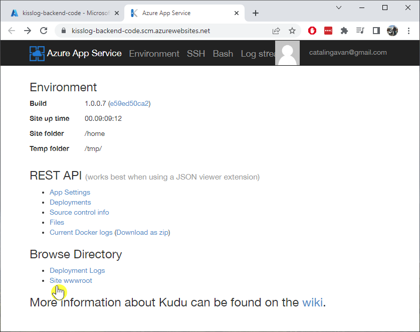
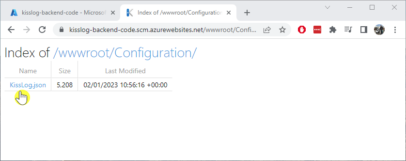
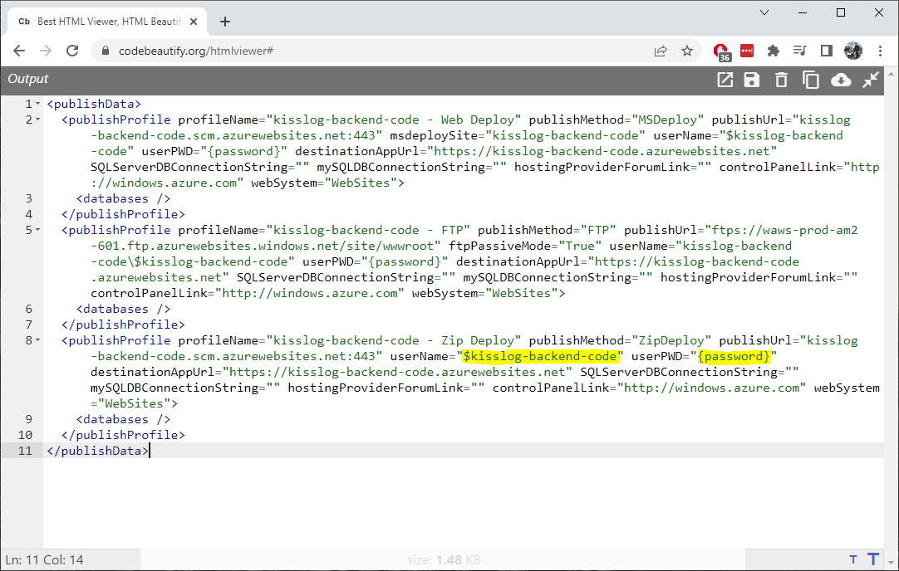
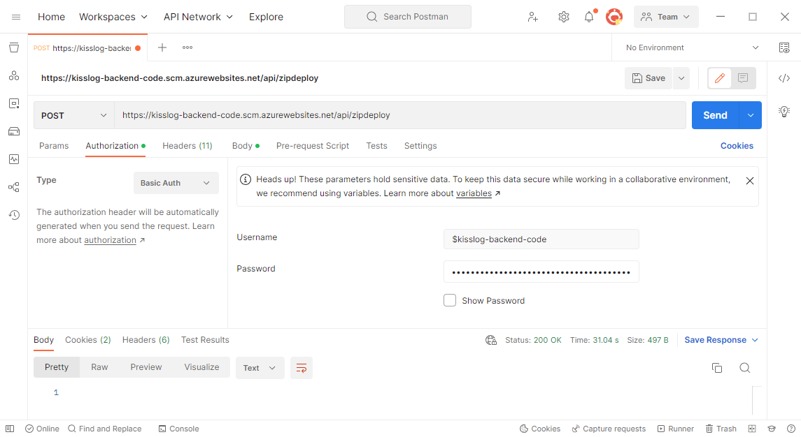
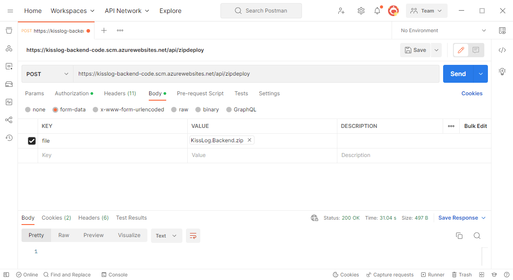

Update guide
=============================

.. contents:: Table of contents
   :local:

Prerequisites
-------------------------------------------------------

Artifacts
~~~~~~~~~~~~~~~~~~~~~~~

- KissLog.Backend.AspNetCore.zip
- KissLog.Frontend.AspNetCore.zip

Artifacts can be downloaded from `here <https://kisslog.net/Overview/OnPremises>`_.

Updating the applications
-------------------------------------------------------

Repeat the steps below for both of the App Services. Start with KissLog.Backend followed by KissLog.Frontend.

1. Download the existing configuration file
~~~~~~~~~~~~~~~~~~~~~~~~~~~~~~~~~~~~~~~~~~~~~~

Navigate on the App Service overview page. On the left menu under "Development Tools", click on the "Advanced Tools", then click on the "Go" link. This will open the Azure Kudu service.

Once on the Kudu service, navigate to the application files by clicking on "Site wwwroot" link.

The configuration file is located under ``Configuration/KissLog.json``. Copy this file locally.

2. Update the configuration file
~~~~~~~~~~~~~~~~~~~~~~~~~~~~~~~~~~~~~~~~~~~~~~

Apply the configuration changes (if any) by updating KissLog.json file. The configuration changes will be listed in the Change log.

3. Prepare the artifacts
~~~~~~~~~~~~~~~~~~~~~~~~~~~~~~~~~~~~~~~~~~~~~~

Download the KissLog server package from `here <https://kisslog.net/Overview/OnPremises>`_.

Extract the archive in a folder. Then, extract both of the resulting archives in two separate folders: `KissLog.Backend` and `KissLog.Frontend`.

Replace the ``KissLog.Backend\Configuration\KissLog.json`` with the existing configuration file.

Create a ``zip`` archive with the contents of the `KissLog.Backend` folder.

4. Upload the new code
~~~~~~~~~~~~~~~~~~~~~~~~~~~~~~~~~~~~~~~~~~~~~~

Make sure the App Service is stopped before uploading the new code.

Navigate to KissLog.Backend App Service. On top right, click on "Download publish profile" button. Open the downloaded file and copy the ``userName`` and the ``userPWD``.

| To deploy the application, send a POST request to :samp:`https://<app_name>.scm.azurewebsites.net/api/zipdeploy`.
| The POST request must contain the .zip file in the message body.
| Set the Basic Authentication header with the Username and Password values copied from the PublishProfile.

.. code-block:: none

   curl -X POST -u $kisslog-backend-code:{password} --data-binary @"<zip_file_path>" https://kisslog-backend-code.scm.azurewebsites.net/api/zipdeploy

If the update was successful, you will receive a ``200 OK`` response status code.

The new code can also be deployed with Postman.

