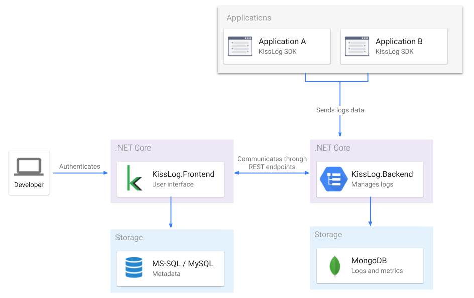

KissLog on-premises
======================

KissLog server can be installed on-premises.

Hosting KissLog server locally, all the logs will be stored and accessible only from within your in-house servers.

Artifacts
------------------------

- KissLog.Backend.AspNetCore.zip
- KissLog.Frontend.AspNetCore.zip

Artifacts can be downloaded from `here <https://kisslog.net/Overview/OnPremises>`_.

Prerequisites
------------------------

.. list-table::
   :widths: 50 50
   :header-rows: 1

   * - Server hosting
     - Azure hosting
   * - * IIS Web server with `NET Core 3.1 Runtime <https://dotnet.microsoft.com/download/dotnet-core/3.1>`_ installed
       * `MongoDB Community Server <https://www.mongodb.com/try/download/community>`_ (version >= 4.2.x)
       * `MS-SQL Server <https://www.microsoft.com/en-us/sql-server/sql-server-downloads>`_ or `MySQL Community Server <https://dev.mysql.com/downloads/mysql/>`_
     - * 2x App Service
       * 1x Azure Cosmos DB database
       * 1x SQL database

Arhitecture
------------------------

KissLog Backend
~~~~~~~~~~~~~~~~~~~~~~~~

KissLog.Backend is the application responsible for saving the logs, exceptions and all other data aggregates.

Consumer applications (the applications you develop) are sending the logs to KissLog.Backend using HTTP requests.

KissLog Frontend
~~~~~~~~~~~~~~~~~~~~~~~~

KissLog.Frontend represents the user-interface application where users (developers, business analysts, QA testers, application managers) can visualise the captured logs, exceptions and other metrics data.

Table of Contents
------------------

.. toctree::
   :maxdepth: 2
   :titlesonly:
   :includehidden:

   installation-guide
   update-guide
   kisslog-frontend/index
   kisslog-backend/index

