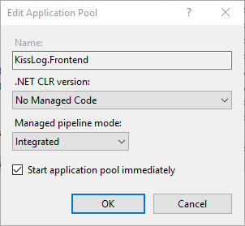
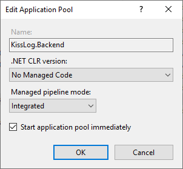
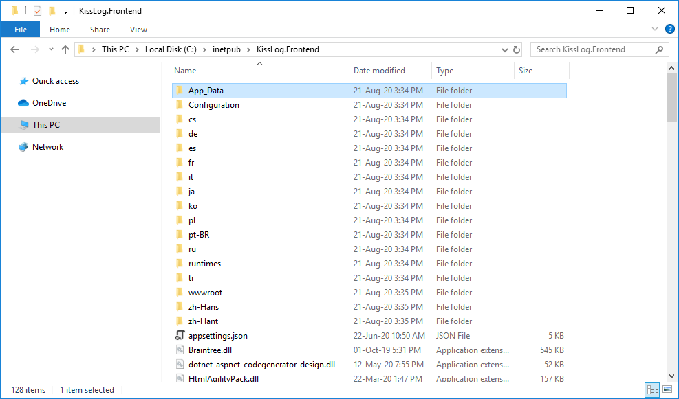
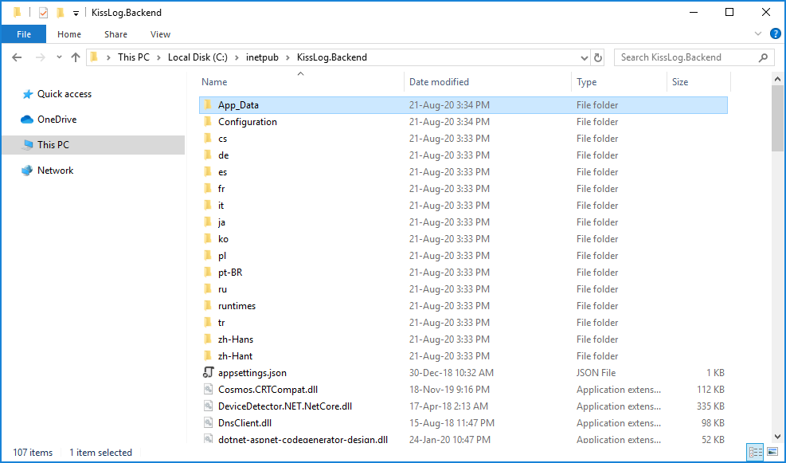
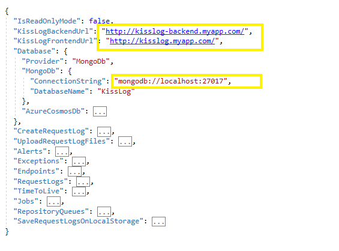
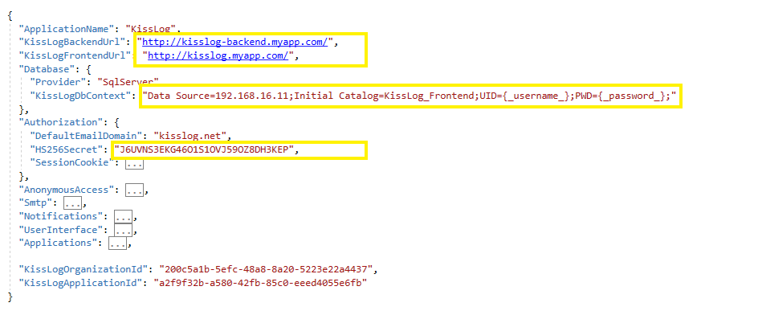

Installation guide
======================

Prerequisites
-------------------------------------------------------

**Artifacts**

- KissLog.Backend.AspNetCore.zip
- KissLog.Frontend.AspNetCore.zip

Artifacts can be downloaded from `here <https://kisslog.net/Overview/OnPremises>`_.

**Services**

- IIS Web server with `NET Core 3.1 Runtime <https://dotnet.microsoft.com/download/dotnet-core/3.1>`_ installed

- `MongoDB Community Server <https://www.mongodb.com/try/download/community>`_ (version 4.2.x)

- `MS-SQL Server <https://www.microsoft.com/en-us/sql-server/sql-server-downloads>`_ or `MySQL Community Server <https://dev.mysql.com/downloads/mysql/>`_

Installation
-------------------------------------------------------

**MongoDB**

For instructions installing MongoDB server, please check the `official tutorial <https://docs.mongodb.com/manual/tutorial/install-mongodb-on-windows/>`_.

**MS-SQL / MySql**

We will not cover the installation guide for these services. There is a high possibility that the existing server will already have a running instance of MySQL or MS-SQL server.

**IIS web applications**

1. On the machine hosting the IIS server, install `.NET Core 3.1 Runtime <https://dotnet.microsoft.com/download/dotnet-core/3.1>`_

2. Create two IIS applications, one ``KissLog.Backend`` and the second ``KissLog.Frontend``

3. Update the Application Pool settings for both of the applications to the following:

.. code-block:: none
    :caption: Application Pool settings

    .NET CLR version: No Managed Code
    Managed pipeline mode: Integrated

4. Copy into each Site folder the corresponding deploy package

Initial startup
-------------------------------------------------------

KissLog.Backend
~~~~~~~~~~~~~~~~~~~~~~~~~~~~~~~~~~~~~~~~

1. Update KissLog.Backend configuration file located under ``Configuration\KissLog.json``:

+----------------------------------------------------------------------------------------------+
| KissLogBackendUrl                                                                            |
+==============================================================================================+
| Example: ``"http://kisslog-backend.myapp.com/"``                                             |
+----------------------------------------------------------------------------------------------+
| Root url pointing to the KissLog.Backend site                                                |
+----------------------------------------------------------------------------------------------+

+----------------------------------------------------------------------------------------------+
| KissLogFrontendrl                                                                            |
+==============================================================================================+
| Example: ``"http://kisslog.myapp.com/"``                                                     |
+----------------------------------------------------------------------------------------------+
| Root url pointing to the KissLog.Frontend site                                               |
+----------------------------------------------------------------------------------------------+

+----------------------------------------------------------------------------------------------+
| Database.MongoDb.ConnectionString                                                            |
+==============================================================================================+
| Example: ``"mongodb://localhost:27017"``                                                     |
+----------------------------------------------------------------------------------------------+
| Connection string used to connect to the MongoDB server                                      |
+----------------------------------------------------------------------------------------------+

2. Make a single request to the KissLog.Backend root URL ("/").

If the startup process went successful, a ``200 OK "Running"`` response will be returned.

This will bootstrap all the necessary components, including configuration validation and MongoDB database generation.

.. figure:: images/installation-guide/KissLogBackend-Startup.png
    :alt: KissLog.Backend Startup

KissLog.Frontend
~~~~~~~~~~~~~~~~~~~~~~~~~~~~~~~~~~~~~~~~

1. Update KissLog.Frontend configuration file located under ``Configuration\KissLog.json``:

+----------------------------------------------------------------------------------------------+
| KissLogBackendUrl                                                                            |
+==============================================================================================+
| Example: ``"http://kisslog-backend.myapp.com/"``                                             |
+----------------------------------------------------------------------------------------------+
| Root url pointing to the KissLog.Backend site                                                |
+----------------------------------------------------------------------------------------------+

+----------------------------------------------------------------------------------------------+
| KissLogFrontendrl                                                                            |
+==============================================================================================+
| Example: ``"http://kisslog.myapp.com/"``                                                     |
+----------------------------------------------------------------------------------------------+
| Root url pointing to the KissLog.Frontend site                                               |
+----------------------------------------------------------------------------------------------+

+------------------------------------------------------------------------------------------------------------------+
| Database.KissLogDbContext                                                                                        |
+==================================================================================================================+
| Example: ``"Data Source=192.168.16.11;Initial Catalog=KissLog_Frontend;UID={_username_};PWD={_password_};"``     |
+------------------------------------------------------------------------------------------------------------------+
| Database connection string                                                                                       |
+------------------------------------------------------------------------------------------------------------------+

+------------------------------------------------------------------------------------------------------------------+
| Authorization.HS256Secret                                                                                        |
+==================================================================================================================+
| Example: ``"J6UVNS3EKG46O1S1OVJ59OZ8DH3KEP"``                                                                    |
+------------------------------------------------------------------------------------------------------------------+
| Represents the authentication JWT signature key.                                                                 |
|                                                                                                                  |
| In order to authenticate to this KissLog application, the user must provide a JWT token                          |
| which has been signed with the same key (HS256Secret) that has been specified here.                              |
|                                                                                                                  |
| The authentication JWT can be created programmatically, or online using https://jwt.io/.                         |
+------------------------------------------------------------------------------------------------------------------+

2. Make a single request to the KissLog.Frontend root URL ("/").

If the startup process went successful, you will see the home page.

.. figure:: images/installation-guide/KissLogFrontend-Startup.png
    :alt: KissLog.Frontend Startup

