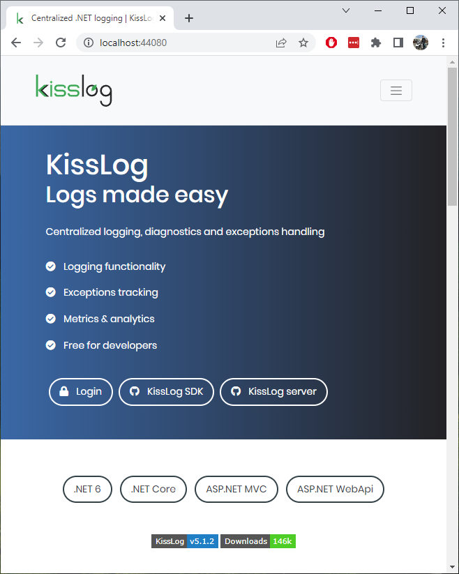
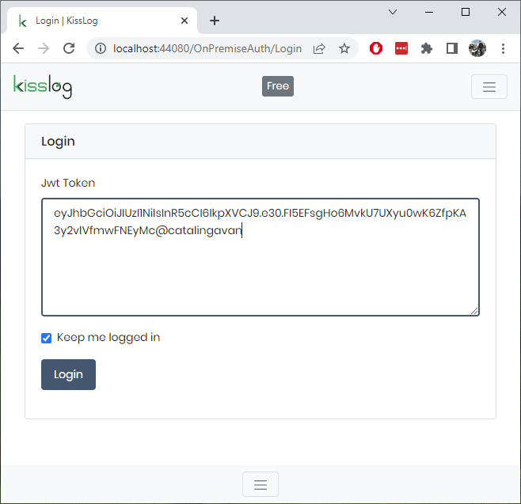
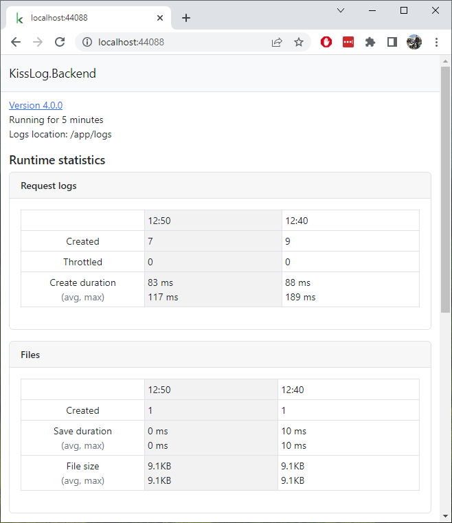
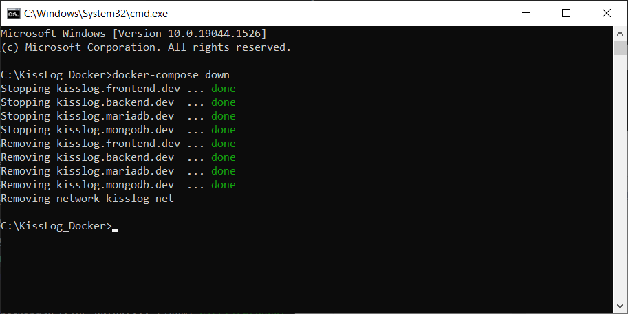

Docker
=============================

KissLog can be run as a Docker application, thanks to `Marcio <https://github.com/zimbres>`_ valuable contribution.

The official KissLog Docker repositories are the following:

- https://hub.docker.com/r/catalingavan/kisslog.backend

- https://hub.docker.com/r/catalingavan/kisslog.frontend

Running KissLog as a Docker application will automatically install all the necessary prerequisites.

.. contents:: Table of contents
   :local:

Docker files
-------------------------------------------------------

To get started running KissLog as a Docker application, create the following files:

.. code-block:: none

    /KissLog_Docker
    ├── docker-compose.yml
    ├── backend.appsettings.json
    ├── backend.KissLog.json
    ├── frontend.appsettings.json
    └── frontend.KissLog.json

.. admonition:: Download Docker files
   :class: note

   Full working example of the files above can be found on `https://github.com/KissLog-net/KissLog-server <https://github.com/KissLog-net/KissLog-server/tree/main/Docker>`_.

KissLog.Frontend will read the configuration options from ``KissLog_Docker\frontend.KissLog.json``.

KissLog.Backend will read the configuration options from ``KissLog_Docker\backend.KissLog.json``.

.. code-block:: none
    :caption: docker-compose.yml

    version: "3.7"
    networks:
    default:
        name: kisslog-net
        driver_opts:
        com.docker.network.driver.mtu: 1380

    services:
    backend:
        image: catalingavan/kisslog.backend:4.0.0
        container_name: kisslog.backend.dev
        restart: unless-stopped
        volumes:
        - ./backend.appsettings.json:/app/appsettings.json
        - ./backend.KissLog.json:/app/Configuration/KissLog.json
        ports:
        - "44088:80"
        links:
        - "mongodb"

    frontend:
        image: catalingavan/kisslog.frontend:4.0.0
        container_name: kisslog.frontend.dev
        restart: unless-stopped
        volumes:
        - ./frontend.appsettings.json:/app/appsettings.json
        - ./frontend.KissLog.json:/app/Configuration/KissLog.json
        ports:
        - "44080:80"
        links:
        - "backend"
        - "mariadb"

    mongodb:
        image: mongo:6.0.4
        container_name: kisslog.mongodb.dev
        restart: unless-stopped
        volumes:
        - mongo-data:/data/db
        - mongo-config:/data/configdb

    mariadb:
        image: mariadb:10.8
        container_name: kisslog.mariadb.dev
        restart: unless-stopped
        volumes:
        - mariadb-data:/var/lib/mysql
        environment:
        MYSQL_ROOT_PASSWORD: pass
        MYSQL_DATABASE: KissLog_Frontend_Dev

    volumes:
    mariadb-data:
    mongo-data:
    mongo-config:

.. code-block:: json
    :caption: frontend.appsettings.json

    {
        "Logging": {
            "LogLevel": {
                "Default": "Warning",
                "Microsoft": "Warning",
                "Microsoft.Hosting.Lifetime": "Warning"
            }
        },
        "ApplicationType": "OnPremises",
        "AllowedHosts": "*",
        "Kestrel": {
            "EndPoints": {
                "Http": {
                    "Url": "http://0.0.0.0:80"
                }
            }
        }
    }

.. code-block:: json
    :caption: frontend.KissLog.json (simplified version)

    {
        "KissLogBackendUrl": "http://kisslog.backend.dev",
        "KissLogFrontendUrl": "http://kisslog.frontend.dev",
        "Database": {
            "Provider": "MySql",
            "KissLogDbContext": "server=kisslog.mariadb.dev;port=3306;database=KissLog_Frontend_Dev;uid=root;password=pass;Charset=utf8;"
        }
    }

.. code-block:: json
    :caption: backend.appsettings.json

    {
        "Logging": {
            "LogLevel": {
                "Default": "Warning",
                "Microsoft": "Warning",
                "Microsoft.Hosting.Lifetime": "Warning"
            }
        },
        "AllowedHosts": "*",
        "Kestrel": {
            "EndPoints": {
                "Http": {
                    "Url": "http://0.0.0.0:80"
                }
            }
        }
    }

.. code-block:: json
    :caption: backend.KissLog.json (simplified version)

    {
        "KissLogBackendUrl": "http://kisslog.backend.dev",
        "KissLogFrontendUrl": "http://kisslog.frontend.dev",
        "Database": {
            "Provider": "MongoDb",
            "MongoDb": {
                "ConnectionString": "mongodb://kisslog.mongodb.dev:27017",
                "DatabaseName": "KissLogDev"
            }
        }
    }

Build
-------------------------------------------------------

To spawn KissLog and all the necessary prerequisites, use ``docker-compose up`` command.

.. code-block:: none

    C:\KissLog_Docker> docker-compose up

After all the services have been created, you can access the applications on the following urls:

- KissLog.Frontend: http://localhost:44080/
- KissLog.Backend: http://localhost:44088/

To authenticate, use the following token:

.. code-block:: none

    eyJhbGciOiJIUzI1NiIsInR5cCI6IkpXVCJ9.e30.FI5EFsgHo6MvkU7UXyu0wK6ZfpKA3y2vlVfmwFNEyMc@your.name.here

.. figure:: images/docker-compose-up.png

   docker-compose up

   KissLog.Frontend

   KissLog.Frontend login

   KissLog.Backend

Destroy
----------------------------

.. code-block:: none

    C:\KissLog_Docker> docker-compose down

   docker-compose down

