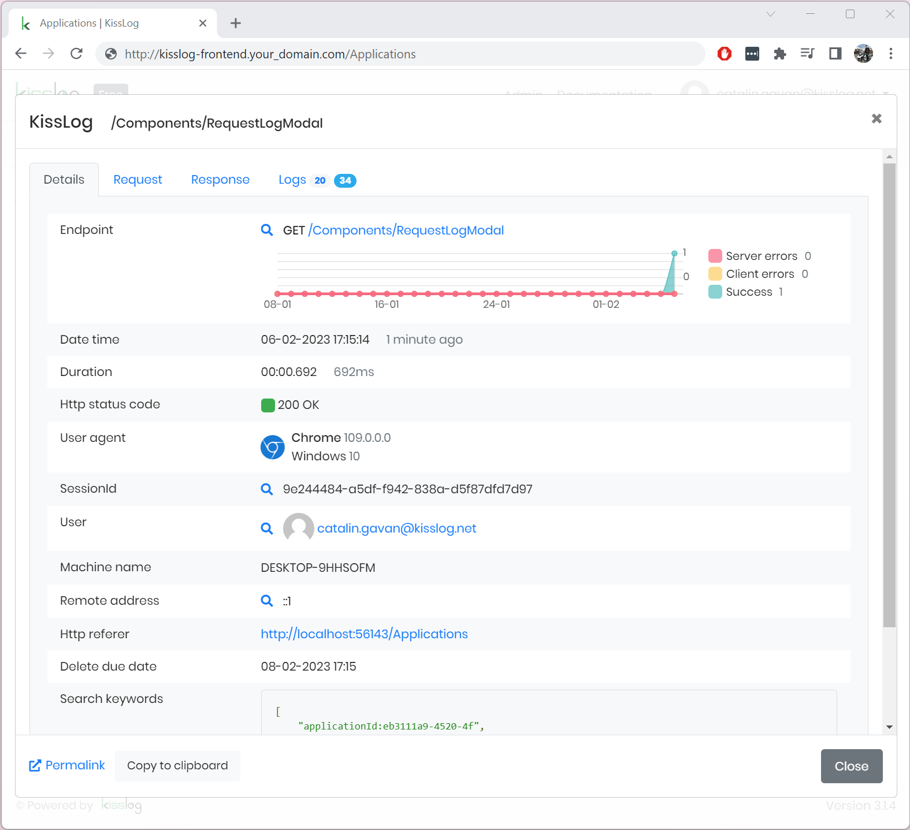

Installation guide
=============================

.. contents:: Table of contents
   :local:

Prerequisites
-------------------------------------------------------

Artifacts
~~~~~~~~~~~~~~~~~~~~~

- KissLog.Backend.AspNetCore.zip
- KissLog.Frontend.AspNetCore.zip

Artifacts can be downloaded from `here <https://kisslog.net/Overview/OnPremises>`_.

Services
~~~~~~~~~~~~~~~~~~~~~

- IIS Web server with `ASP.NET Core Runtime 6 <https://dotnet.microsoft.com/en-us/download/dotnet/6.0>`_ installed

- `MongoDB Community Server <https://www.mongodb.com/try/download/community>`_ (version >= 6.0.x)

- `MS-SQL Server <https://www.microsoft.com/en-us/sql-server/sql-server-downloads>`_ or `MySQL Community Server <https://dev.mysql.com/downloads/mysql/>`_

Installation
-------------------------------------------------------

MongoDB
~~~~~~~~~~~~~~~~~~~~~

For instructions installing MongoDB server, please check the `official tutorial <https://docs.mongodb.com/manual/tutorial/install-mongodb-on-windows/>`_.

MS-SQL / MySql
~~~~~~~~~~~~~~~~~~~~~

We will not cover the installation guide for these services.

IIS web applications
~~~~~~~~~~~~~~~~~~~~~~~~~~~~~~~~~~~~~~~~~~

1) On the machine hosting the IIS server, install `ASP.NET Core Runtime 6 <https://dotnet.microsoft.com/en-us/download/dotnet/6.0>`_.

2) Create two IIS applications:

   * KissLog.Backend
   * KissLog.Frontend

3) Update the Application Pool settings for both of the applications to the following:

.. list-table::
   :header-rows: 1

   * - KissLog.Frontend
     - KissLog.Backend
   * - .. image:: images/installation-guide/KissLogFrontend-ApplicationPool.png
         :alt: KissLog.Frontend Application Pool
     - .. image:: images/installation-guide/KissLogBackend-ApplicationPool.png
         :alt: KissLog.Backend Application Pool

4) Copy into each IIS application folder the corresponding deploy package

.. list-table::
   :header-rows: 1

   * - KissLog.Frontend
     - KissLog.Backend
   * - C:\\inetpub\\wwwroot\\KissLog.Frontend

       .. image:: images/installation-guide/KissLogFrontend-Folder.png
         :alt: KissLog.Frontend folder
     
     - C:\\inetpub\\wwwroot\\KissLog.Backend
       
       .. image:: images/installation-guide/KissLogBackend-Folder.png
         :alt: KissLog.Backend folder

.. note::
   Hotizontal scaling is not currently supported by KissLog server.

   Both KissLog.Backend and KissLog.Frontend applications must each be deployed to a single instace.

Configuration
-------------------------------------------------------

On the first deployment you need to update the required configuration options.

The configuration file for each application (KissLog.Frontend and KissLog.Backend) is located under ``Configuration\KissLog.json``.

KissLog.Backend 
~~~~~~~~~~~~~~~~~~~~~~~~~~~~~~~~~~~~~~~~~~

Replace the following mandatory properties with corresponding values:

.. list-table::
   :header-rows: 1

   * - Property
     - Value
   * - KissLogBackendUrl
     - http://kisslog-backend.your_domain.com
   * - KissLogFrontendUrl
     - http://kisslog-frontend.your_domain.com
   * - Database.Provider
     - MongoDb
   * - Database.MongoDb.ConnectionString
     - mongodb://localhost:27017
   * - Files.Provider
     - MongoDb

KissLog.Frontend 
~~~~~~~~~~~~~~~~~~~~~~~~~~~~~~~~~~~~~~~~~~

Replace the following mandatory properties with corresponding values:

.. list-table::
   :header-rows: 1

   * - Property
     - Value
   * - KissLogBackendUrl
     - http://kisslog-backend.your_domain.com
   * - KissLogFrontendUrl
     - https://kisslog-frontend.your_domain.com
   * - Database.Provider
     - SqlServer
   * - Database.ConnectionString
     - Data Source=192.168.16.11;Initial Catalog=KissLog_Frontend;UID={_username_};PWD={_password_};

Initial startup
-------------------------------------------------------

After the configuration files have been updated, you can run the applications.

The initial startup  will bootstrap all the necessary components including MongoDB and SQL databases.

Startup logs (including errors) will be generated under ``logs`` folder:

* ``C:\inetpub\wwwroot\KissLog.Backend\logs``

* ``C:\inetpub\wwwroot\KissLog.Frontend\logs``

Startup steps 
~~~~~~~~~~~~~~~~~~~~~~~~~~~~~~~~~~~~~~~~~~

1) Make a single request to KissLog.Backend root URL ("http://kisslog-backend.your_domain.com")

   If everything went successful, you will see the KissLog.Backend home page.

   .. figure:: images/installation-guide/kisslog-backend-running.png
       :alt: KissLog.Backend home page

2) Make a single request to the KissLog.Frontend root URL ("http://kisslog-frontend.your_domain.com").

   If the startup process went successful, you will see the home page.

   .. figure:: images/installation-guide/kisslog-frontend-running.png
       :alt: KissLog.Frontend home page

Post deployment
-------------------------------------------------------

Your KissLog server is running and ready to process the logs. You can update your dotnet applications to start sending the logs to the newly created KissLog.Backend IIS application.

Make sure you update the configuration values, respectively the "OrganizationId", "ApplicationId" and "ApiUrl".

.. code-block:: csharp

    KissLogConfiguration.Listeners
        .Add(new RequestLogsApiListener(new Application(Configuration["KissLog.OrganizationId"], Configuration["KissLog.ApplicationId"]))
        {
            ApiUrl = "http://kisslog-frontend.your_domain.com"
        });

Troubleshooting
-------------------------------------------------------

Startup logs (including errors) will be available under ``\logs`` folder. Here should be the first place to check.

* ``C:\inetpub\wwwroot\KissLog.Backend\logs``

* ``C:\inetpub\wwwroot\KissLog.Frontend\logs``

Quick checklist
~~~~~~~~~~~~~~~~~~~~~~~~~~~~~~~~~~~~~~~~~~

1) Make sure you deploy and run KissLog.Backend first

2) If there are any confiuguration errors, you should see them under the ``\logs`` folder.

3) KissLog.Backend will try to connect to MongoDB. If the MongoDB server is not reachable, you should see an error:

   .. code-block:: none
       :caption: C:\\inetpub\\wwwroot\\KissLog.Backend\\Logs\\06-02-2023.log

       KissLog.Backend startup failed
       DatabaseName: KissLogBackend
       Exception: A timeout occured after 30000ms selecting a server using CompositeServerSelector{ Selectors = MongoDB.Driver.MongoClient+AreSessionsSupportedServerSelector, LatencyLimitingServerSelector{ AllowedLatencyRange = 00:00:00.0150000 } }. Client view of cluster state is { ClusterId : "1", ConnectionMode : "Automatic", Type : "Unknown", State : "Disconnected", Servers : [{ ServerId: "{ ClusterId : 1, EndPoint : "Unspecified/localhost3:27017" }", EndPoint: "Unspecified/localhost:27017", ReasonChanged: "Heartbeat", State: "Disconnected", ServerVersion: , TopologyVersion: , Type: "Unknown", HeartbeatException: "MongoDB.Driver.MongoConnectionException: An exception occurred while opening a connection to the server.
       ---> System.Net.Sockets.SocketException (11001): No such host is known.

4) | KissLog.Frontend will try to connect to MS-SQL / MySql server.
   | On the first run, KissLog.Frontend will also create the database (if not already exists).
   | Any database errors, such as connection errors or database permissions, will be saved under the ``\Logs`` folder.
 
   | **Important:**
   | If the SQL user does not have permissions to create the database, you will have to create it manually.
   | The database generation script will be generated under ``KissLog.Frontend\logs\{Provider}-database.sql.txt``.

5) | KissLog applications (KissLog.Frontend and KissLog.Backend) connect to each other using HTTP requests.
   | Make sure there is no firewall blocking the connection.

6) | If the application fails to start and there are no log messages, enable IIS logs:
   | Update ``web.config``, set ``<aspNetCore stdoutLogEnabled="true" />``, then restart the application.

   .. code-block:: xml
       :caption: C:\\inetpub\\wwwroot\\KissLog.Backend\\web.config

       <?xml version="1.0" encoding="utf-8"?>
       <configuration>
           <location path="." inheritInChildApplications="false">
               <system.webServer>
                   <handlers>
                       <add name="aspNetCore" path="*" verb="*" modules="AspNetCoreModuleV2" resourceType="Unspecified" />
                   </handlers>
                   <aspNetCore processPath="dotnet" arguments=".\KissLog.Backend.AspNetCore.dll" stdoutLogEnabled="true" stdoutLogFile=".\logs\stdout" hostingModel="inprocess" />
               </system.webServer>
           </location>
       </configuration>
       <!--ProjectGuid: 4EC40754-6618-4D7D-B45E-C7FE1D6B8EF6-->

   | **Important:**
   | Create an empty ``logs`` folder if one does not already exist.

7) If no logs are generated (including no IIS logs), double check that you have `ASP.NET Core Runtime 6 <https://dotnet.microsoft.com/en-us/download/dotnet/6.0>`_ installed.

Need help?
-------------------------------------------------------

Open a `GitHub issue <https://github.com/KissLog-net/KissLog.Sdk/issues>`_ or send an email to catalingavan@gmail.com.
