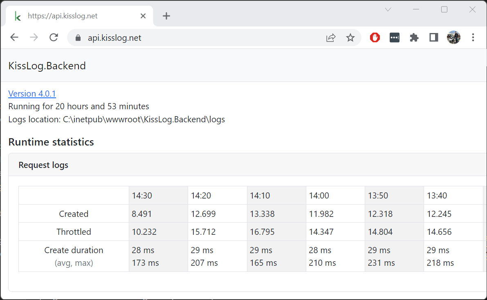

Change log
===============

KissLog.Backend 4.0.1
--------------------------

Release date: 27-02-2023

https://github.com/KissLog-net/KissLog-server/releases/tag/KissLog.Backend-v4.0.1

Runtime intervals are now displayed in local time-zone.

KissLog.Backend 4.0.0
--------------------------

Release date: 23-02-2023

https://github.com/KissLog-net/KissLog-server/releases/tag/KissLog.Backend-v4.0.0

The application has been completely rewritten from scratch on .NET 6.0 framework and it is using the latest version of MongoDB 6.0 server.

With this refactoring, KissLog.Backend becomes more efficient, more stable and more adaptive for future development.

This update comes with important improvements for Microsoft Azure hosting, reducing the Cosmos DB usage by up to 40%.

.. note::
   Unfortunately, the new KissLog.Backend data schema is incompatible with the old data schema (MongoDb or AzureCosmosDb).

   After updating to KissLog.Backend 4.0.0, all the existing logs and metrics will be lost. 

   If you are updating an existing instance of KissLog.Backend, please update the MongoDB server to 6.0 and point to a new :ref:`DatabaseName <on-premises/kisslog-backend/configuration/index:database>`.

**KissLog.json** changes:

The configuration file has been restructured. Please start with the `template <https://github.com/KissLog-net/KissLog-server/blob/main/KissLog.Backend/KissLog.json>`_ and replace the values you need.
