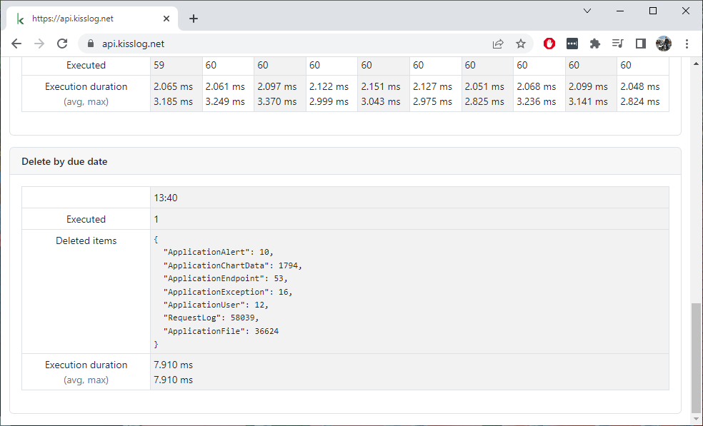

Change log
===============

KissLog.Backend 5.0.0
--------------------------

Release date: 11-05-2023

https://github.com/KissLog-net/KissLog-server/releases/tag/KissLog.Backend-v5.0.0

This release contains improvements related to alerts functionality.

If you are updating an existing instance of KissLog.Backend application, you must delete the existing records from ``AlertDefinitionInvocation`` collection before starting the new application.

.. code-block:: none
    :caption: >_MONGOSH

    > use KissLog
    < 'switched to db KissLog'
    KissLog> db.AlertDefinitionInvocation.deleteMany({})
    < {
        acknowledged: true,
        deletedCount: 23
      }

KissLog.Backend 5.0.0 is only compatible with KissLog.Frontend 5.0.0, and, for this reason, both applications must be updated at the same time.

KissLog.Backend 4.0.3
--------------------------

Release date: 31-03-2023

https://github.com/KissLog-net/KissLog-server/releases/tag/KissLog.Backend-v4.0.3

Displaying "Delete by due date" runtime statistics.

KissLog.Backend 4.0.2
--------------------------

Release date: 24-03-2023

https://github.com/KissLog-net/KissLog-server/releases/tag/KissLog.Backend-v4.0.2

Fixed javascript evaluator engine which would randomly throw errors while evaluating the alerts.

.. code-block:: none

    14:54:10.8568072Z, Error                Error trying to evaluate Javascript code:
    function(context, callback) {
        var requestLog = context.RequestLog;
        var httpStatusCode = requestLog.HttpProperties.Response.HttpStatusCode;

        return callback(httpStatusCode >= 500);
    }
    System.IndexOutOfRangeException: Index was outside the bounds of the array.
    at Jint.Engine.get_Realm()
    at Jint.Engine.GetValue(String propertyName)
    at Jint.Engine.Invoke(String propertyName, Object thisObj, Object[] arguments)
    at Jint.Engine.Invoke(String propertyName, Object[] arguments)

KissLog.Backend 4.0.1
--------------------------

Release date: 27-02-2023

https://github.com/KissLog-net/KissLog-server/releases/tag/KissLog.Backend-v4.0.1

Runtime intervals are now displayed in local time-zone.

KissLog.Backend 4.0.0
--------------------------

Release date: 23-02-2023

https://github.com/KissLog-net/KissLog-server/releases/tag/KissLog.Backend-v4.0.0

The application has been completely rewritten from scratch on .NET 6.0 framework and it is using the latest version of MongoDB 6.0 server.

With this refactoring, KissLog.Backend becomes more efficient, more stable and more adaptive for future development.

This update comes with important improvements for Microsoft Azure hosting, reducing the Cosmos DB usage by up to 40%.

.. note::
   Unfortunately, the new KissLog.Backend data schema is incompatible with the old data schema (MongoDb or AzureCosmosDb).

   After updating to KissLog.Backend 4.0.0, all the existing logs and metrics will be lost. 

   If you are updating an existing instance of KissLog.Backend, please update the MongoDB server to 6.0 and point to a new :ref:`DatabaseName <on-premises/kisslog-backend/configuration/index:database>`.

**KissLog.json** changes:

The configuration file has been restructured. Please start with the `template <https://github.com/KissLog-net/KissLog-server/blob/main/KissLog.Backend/KissLog.json>`_ and replace the values you need.
