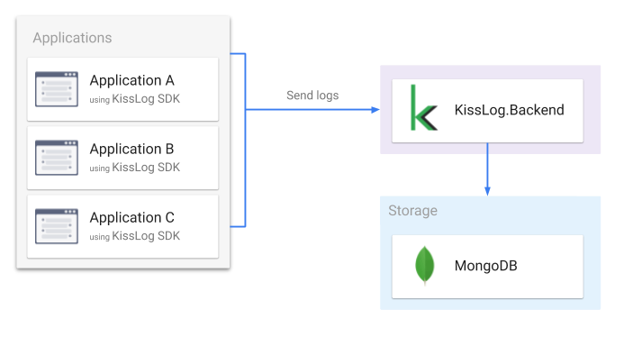

KissLog.Backend
=================================

.. contents:: Table of contents
   :local:

About
------------------------------

KissLog.Backend application is responsible for saving and centralizing the logs data.

KissLog.Backend exposes REST endpoints which can be used to save and to query the data.

    KissLog.Backend architecture

Related resources
------------------

.. toctree::
   :maxdepth: 2
   :titlesonly:
   :includehidden:

   configuration/index
   change-log
