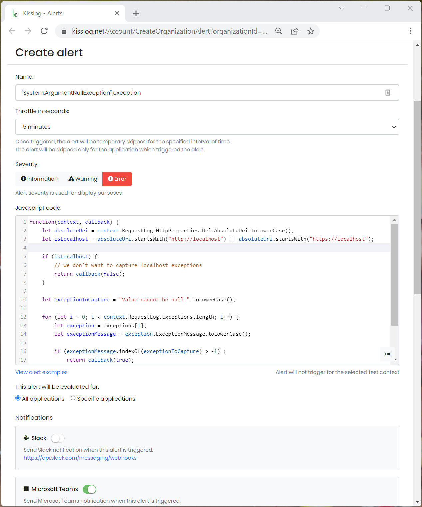

Change log
===============

KissLog.Frontend 5.0.0
--------------------------

Release date: 11-05-2023

https://github.com/KissLog-net/KissLog-server/releases/tag/KissLog.Frontend-v5.0.0

This release contains improvements related to alerts functionality.

Alerts have been moved under Organization configuration.
With this change, the same alert can be used to evaluate requests generated by multiple applications.

.. note::
   If you are updating an existing instance of KissLog.Frontend, all the created alerts configurations will be lost and will need to be created again.

   Additionally, the database changes must be applied manually.

   KissLog.Frontend 5.0.0 is only compatible with KissLog.Backend 5.0.0, and, for this reason, both applications must be updated at the same time.

Database changes
*******************************

.. code-block:: sql

    CREATE TABLE [Alert] (
        [Id] nvarchar(450) NOT NULL,
        [Organization_Id] nvarchar(450) NOT NULL,
        [Name] nvarchar(256) NOT NULL,
        [Description] nvarchar(1000) NULL,
        [Severity] nvarchar(100) NOT NULL,
        [JavascriptCode] nvarchar(max) NOT NULL,
        [ThrottleInSeconds] int NOT NULL,
        [DateTimeCreated] datetime2 NOT NULL,
        [DateTimeUpdated] datetime2 NOT NULL,
        [IsActive] bit NOT NULL,
        [AppliesTo] nvarchar(2000) NULL,
        [SlackNotification] nvarchar(2000) NULL,
        [MicrosoftTeamsNotification] nvarchar(2000) NULL,
        [EmailNotification] nvarchar(2000) NULL,
        [WebhookNotification] nvarchar(2000) NULL,
        CONSTRAINT [PK_Alert] PRIMARY KEY ([Id]),
        CONSTRAINT [FK_Alert_Organization_Organization_Id] FOREIGN KEY ([Organization_Id]) REFERENCES [Organization] ([Id]) ON DELETE CASCADE
    );

    CREATE INDEX [IX_Alert_Organization_Id] ON [Alert] ([Organization_Id]);

    DROP TABLE [OrganizationSlackConfiguration];
    DROP TABLE [ApplicationAlert];
    DROP TABLE [ApplicationAlertEmailNotification];
    DROP TABLE [ApplicationAlertSlackNotification];

    -- if [CustomProperty] table exists
    DROP TABLE [CustomProperty];

KissLog.Frontend 4.0.0
--------------------------

Release date: 23-02-2023

https://github.com/KissLog-net/KissLog-server/releases/tag/KissLog.Frontend-v4.0.0

The application has been rebuilt on .NET 6.0 framework.

Although the application does not introduce any breaking changes, KissLog.Frontend 4.0.0 is only compatible with KissLog.Backend 4.0.0, which contains :ref:`breaking changes <on-premises/kisslog-backend/change-log:KissLog.Backend 4.0.0>`.

**KissLog.json** changes:

.. list-table::
   :header-rows: 1

   * - Property
     -
   * - "AppVersion"
     - renamed to "StaticResourcesVersion"
   * - "InternalLogs.DirectoryPath"
     - removed
   * - "InternalLogs.MinimumStatusCode"
     - removed
   * - "Database.KissLogDbContext"
     - renamed to "Database.ConnectionString"
