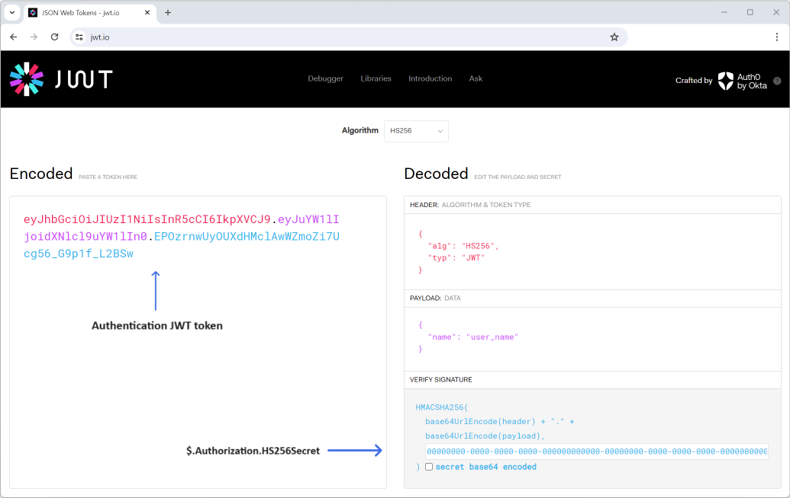
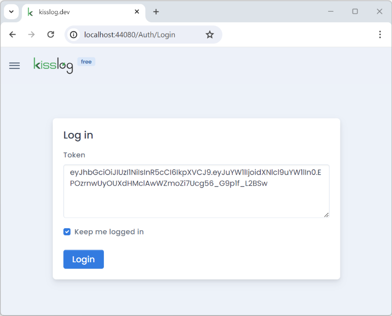

KissLog.Frontend
=================================

.. contents:: Table of contents
   :local:

About
------------------------------

KissLog.Frontend is a user-interface application used by developers to visualize the captured errors, logs and other metrics data.

KissLog.Frontend is generating the user-interface by consuming KissLog.Backend REST endpoints.

.. figure:: images/kisslog-frontend-architecture.png
    :alt: KissLog.Frontend arhitecture

    KissLog.Frontend arhitecture

Authentication
------------------------------

KissLog.Frontend uses a JSON Web Token (JWT) for authentication.

The authentication JWT must be signed with the secret provided under ``Authorization.HS256Secret`` property from the :ref:`KissLog.json <on-premises/kisslog-frontend/configuration:Authorization>` file.

For the default value of "Authorization.HS256Secret" ("00000000-0000-0000-0000-000000000000-00000000-0000-0000-0000-000000000000"), you can use the following authentication JWT:

.. code-block:: none
    
    eyJhbGciOiJIUzI1NiIsInR5cCI6IkpXVCJ9.e30.HP79qro7bvfH7BneUy5jB9Owc_5D2UavFDulRETAl9E

Authenticated user name can be specified in one of the following options:

- at the end of the JWT using ``token@username``

- in the JWT payload using any of these properties: "emailAddress", "email", "name", "username", "user"

Creating the JWT
^^^^^^^^^^^^^^^^^^^^^^^^^^^^

The authentication JWT can be created programmatically or online (using https://jwt.io/, for example).  

Tips
^^^^^^^^^^^^^^^^^^^^^^^^^^^^

You can automate the login process by specifying the JWT as a query string parameter: `/Auth/Login?token={JWT}`.

For example, you can bookmark this URL and, once accessed, KissLog will automatically login the user using the bookmarked token.

.. code-block:: none
    
    http://kisslog.myapp.com/Auth/Login?token=eyJhbGciOiJIUzI1NiIsInR5cCI6IkpXVCJ9.e30.HP79qro7bvfH7BneUy5jB9Owc_5D2UavFDulRETAl9E

Related resources
------------------

.. toctree::
   :maxdepth: 2
   :titlesonly:
   :includehidden:

   configuration
   change-log