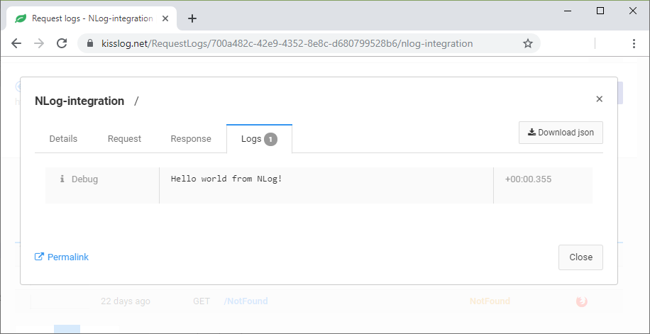
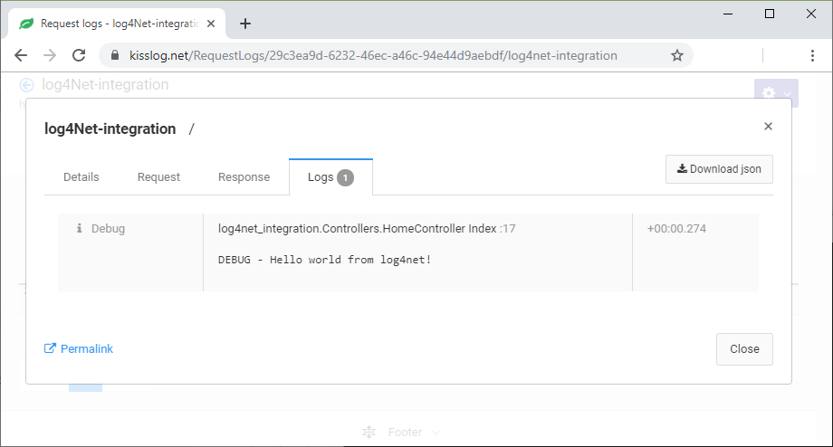

About KissLog
====================

KissLog represents a powerful logging and monitoring solution for .NET applications.

Some of the main features of KissLog are:

- Automatically captures and logs all the exceptions

- Monitors all the HTTP traffic

- Lightweight, configurable SDK

- Centralized logging using `KissLog.net <https://kissLog.net/>`_ cloud or on-premises integration

.. figure:: images/centralized-logging.png
   :alt: KissLog.net centralized logging
   :align: center

   KissLog.net centralized logging

Framework support
-------------------------

- :doc:`../docs/install-instructions/netcore`
- :doc:`../docs/install-instructions/aspnet-webapi`
- :doc:`../docs/install-instructions/aspnet-mvc`
- :doc:`../docs/install-instructions/console-applications`

Basic usage
-------------------------

.. code-block:: c#
    :emphasize-lines: 1,8,13

    using KissLog;

    public class HomeController : Controller
    {
        private readonly ILogger _logger;
        public HomeController()
        {
            _logger = Logger.Factory.Get();
        }

        public IActionResult Index()
        {
            _logger.Debug("Hello World!");

            return View();
        }
    }

Setup
-------------------------

Register listeners
~~~~~~~~~~~~~~~~~~~~~~~~~~

KissLog saves the logs by using **ILogListener** listeners.

Listeners are registered at application startup using the ``KissLogConfiguration.Listeners`` container.

.. code-block:: c#

    protected void Application_Start()
    {
        // KissLog.net cloud listener
        string organizationId = "d625d5c8-ef47-4cd5-bf2d-6b0a1fa7fda4";
        string applicationId = "39bb675d-5c13-4bd8-9b5a-1d368da020a2";
        KissLogConfiguration.Listeners.Add(new KissLogApiListener(
            new KissLog.Apis.v1.Auth.Application(organizationId, applicationId)
        ));

        // NLog listener
        KissLogConfiguration.Listeners.Add(new NLogTargetListener());

        // custom listener
        KissLogConfiguration.Listeners.Add(new MyCustomListener());
    }

Configuration
~~~~~~~~~~~~~~~~~~~~~~~~~~

``KissLogConfiguration.Options`` provides a number of properties and runtime handlers used to customize the logs output.

.. code-block:: c#

    protected void Application_Start()
    {
        KissLogConfiguration.Options
            .JsonSerializerSettings.Converters.Add(new StringEnumConverter());

        KissLogConfiguration.Options
            .ShouldLogResponseBody((listener, logArgs, defaultValue) =>
            {
                int responseStatusCode = (int)logArgs.WebProperties.Response.HttpStatusCode;
                return responseStatusCode >= 400;
            });

        KissLogConfiguration.Options
            .AppendExceptionDetails((Exception ex) =>
            {
                // log EntityFramework validation errors
                if (ex is DbEntityValidationException dbException)
                {
                    StringBuilder sb = new StringBuilder();
                    sb.AppendLine("DbEntityValidationException:");

                    foreach (var error in dbException.EntityValidationErrors.SelectMany(p => p.ValidationErrors))
                    {
                        string message = string.Format("Field: {0}, Error: {1}", error.PropertyName, error.ErrorMessage);
                        sb.AppendLine(message);
                    }

                    return sb.ToString();
                }

                return null;
            });
    }

Integration with other loggers
----------------------------------

NLog
~~~~~~~~~

If you use **NLog** in your application, you can register the KissLog target, which will save all the NLog logs to `KissLog.net <https://kissLog.net/>`_.

.. code-block:: none

    PM> Install-Package KissLog.Adapters.NLog

.. code-block:: xml
    :caption: NLog.config
    :linenos:
    :emphasize-lines: 3,6,9

    <nlog>
        <extensions>
            <add assembly="KissLog.Adapters.NLog" />
        </extensions>
        <targets>
            <target name="kisslog" type="KissLog" layout="${message}" />
        </targets>
        <rules>
            <logger name="*" minlevel="Trace" writeTo="kisslog" />
        </rules>
    </nlog>

.. code-block:: c#
    :linenos:
    :emphasize-lines: 1,5,8,13

    using NLog;

    public class HomeController : Controller
    {
        private readonly ILogger _logger;
        public HomeController()
        {
            _logger = LogManager.GetCurrentClassLogger();
        }

        public ActionResult Index()
        {
            _logger.Debug("Hello world from NLog!");

            return View();
        }
    }

   NLog logs on KissLog.net

log4Net
~~~~~~~~~

If you use **log4Net** in your application, you can register the KissLog appender, which will save all the log4net logs to `KissLog.net <https://kissLog.net/>`_.

.. code-block:: none

    PM> Install-Package KissLog.Adapters.log4net

.. code-block:: xml
    :caption: log4net.config
    :linenos:
    :emphasize-lines: 4,6-8

    <log4net>
      <root>
        <level value="ALL" />
        <appender-ref ref="KissLog" />
      </root>
      <appender name="KissLog" type="KissLog.Adapters.log4net.KissLogAppender, KissLog.Adapters.log4net">
        <layout type="log4net.Layout.SimpleLayout"></layout>
      </appender>
    </log4net>

.. code-block:: c#
    :linenos:
    :emphasize-lines: 1,5,8,13

    using log4net;

    public class HomeController : Controller
    {
        private readonly ILog _logger;
        public HomeController()
        {
            _logger = LogManager.GetLogger(System.Reflection.MethodBase.GetCurrentMethod().DeclaringType);
        }

        public ActionResult Index()
        {
            _logger.Debug("Hello world from log4net!");

            return View();
        }
    }

   log4net logs on KissLog.net

Samples
----------------------------------

Check the `code samples <https://github.com/KissLog-net/KissLog.samples>`_ for more examples of using KissLog.

Feedback
----------------------------------

Please use the `GitHub issues <https://github.com/KissLog-net/KissLog.Sdk/issues>`_ section to report bugs, suggestions and general feedback.

Contributing
----------------------------------

All contributions are very welcomed: code, documentation, samples, bug reports, feature requests.

License
----------------------------------

`BSD license <https://github.com/KissLog-net/KissLog.Sdk/blob/master/LICENSE.md>`_

Table of Contents
------------------

.. toctree::
   :maxdepth: 2
   :titlesonly:
   :includehidden:

   self
   on-premises
   ../docs/index
   ../licensing/index