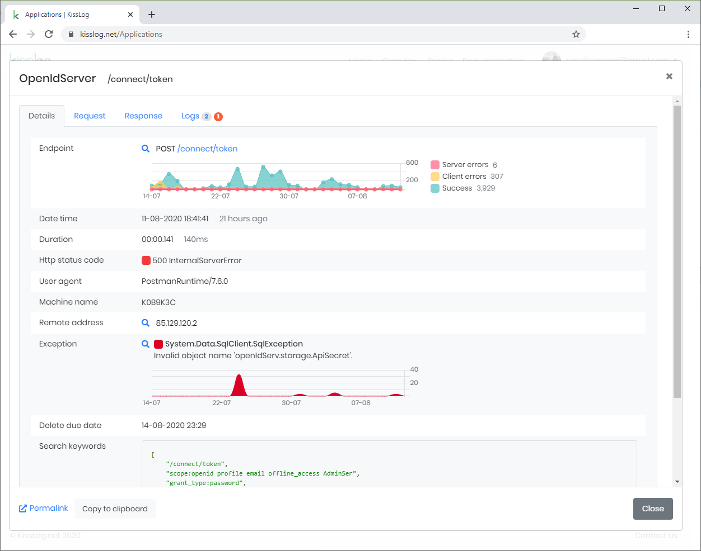

About KissLog
====================

KissLog represents a powerful logging and monitoring solution for .NET applications.

Some of the main features of KissLog are:

- Automatically captures and logs all the exceptions

- Monitors all the HTTP traffic

- Lightweight, configurable SDK

- Centralized logging using `KissLog.net <https://kissLog.net/>`_ cloud or on-premises integration

   KissLog.net centralized logging

Table of Contents
------------------

.. toctree::
   :maxdepth: 2
   :titlesonly:
   :includehidden:

   self
   ../SDK/index
   ../on-premises/index
   ../licensing/index