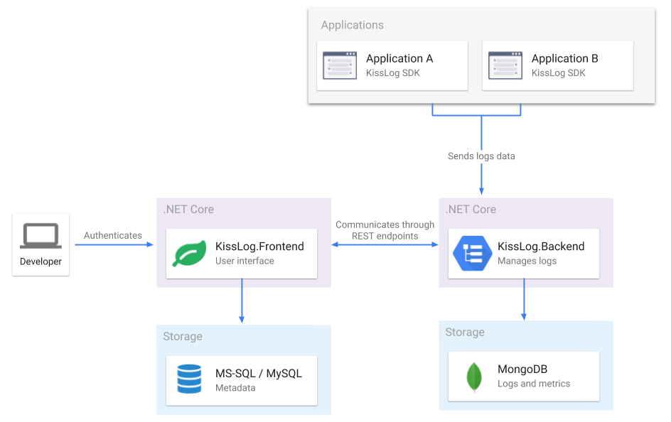
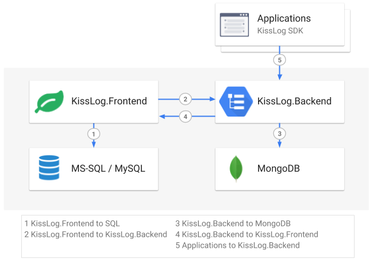

KissLog on-premises
======================

KissLog can be installed on-premises.

Using KissLog on-premises, all the data will be stored and accessible only from within your in-house servers.

If you would like to try KissLog.net on-premises for free, please send an email to catalingavan@gmail.com.

Configuration guide
------------------------

`Download configuration guide.pdf <https://kisslog.net/Overview/DownloadConfigurationGuide>`_

Arhitecture
------------------------

KissLog on-premises consists of two .NET Core 2.0 web applications.

KissLog.Frontend
~~~~~~~~~~~~~~~~~~~~~~

User-interface application used by users (developers, IT administrators, application managers
and implementation consultants) to visualise the captured errors, logs and other metrics data.

KissLog.Backend
~~~~~~~~~~~~~~~~~~~~~~

Backend application responsible for managing the logs data. Exposes REST endpoints which
can be used to save and to query the logs.

   KissLog arhitecture

   KissLog network

