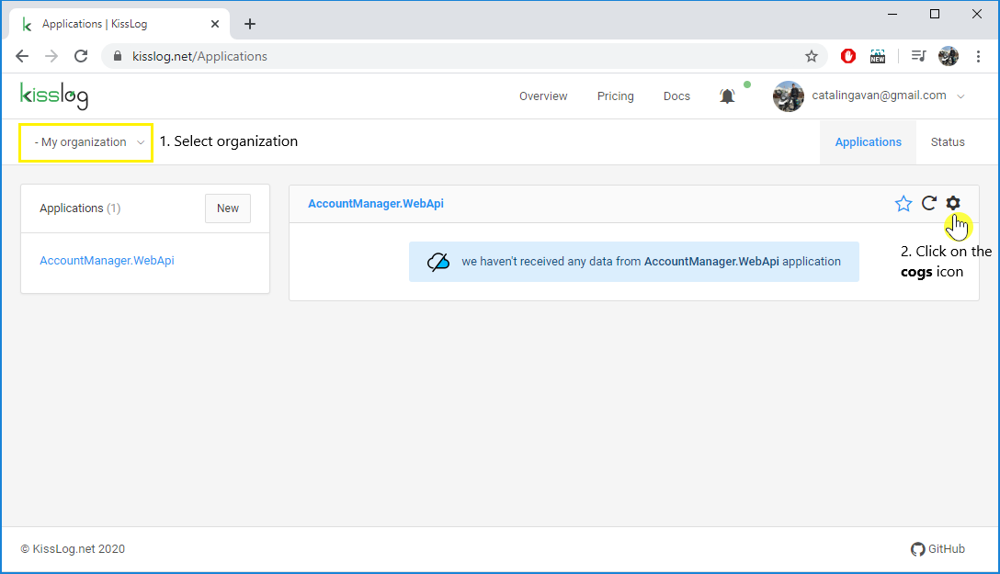
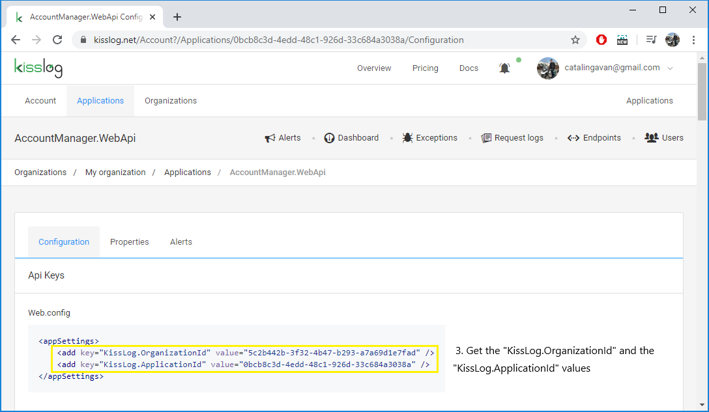

Application Api Keys
============================

To access the application Api Keys:

#. Navigate to ``/Applications`` url

#. **Select the organization** from the top left dropdown menu

#. Click on the **cogs** icon under the application panel

#. Get the **"KissLog.OrganizationId"** and the **"KissLog.ApplicationId"** values

.. _apiKeys:

Usage
-----------------------------------

The **Api Keys** values are used by the `KissLog.CloudListener` to identify the application on kisslog.net.

.. code-block:: c#
    :emphasize-lines: 3,4

    protected void Application_Start()
    {
        string organizationId = "5c2b442b-3f32-4b47-b293-a7a69d1e7fad";
        string applicationId = "0bcb8c3d-4edd-48c1-926d-33c684a3038a";

        ILogListener cloudListener = new RequestLogsApiListener(new Application(organizationId, applicationId))
        {
            ApiUrl = "https://api.kisslog.net"
        };

        KissLogConfiguration.Listeners.Add(cloudListener);
    }