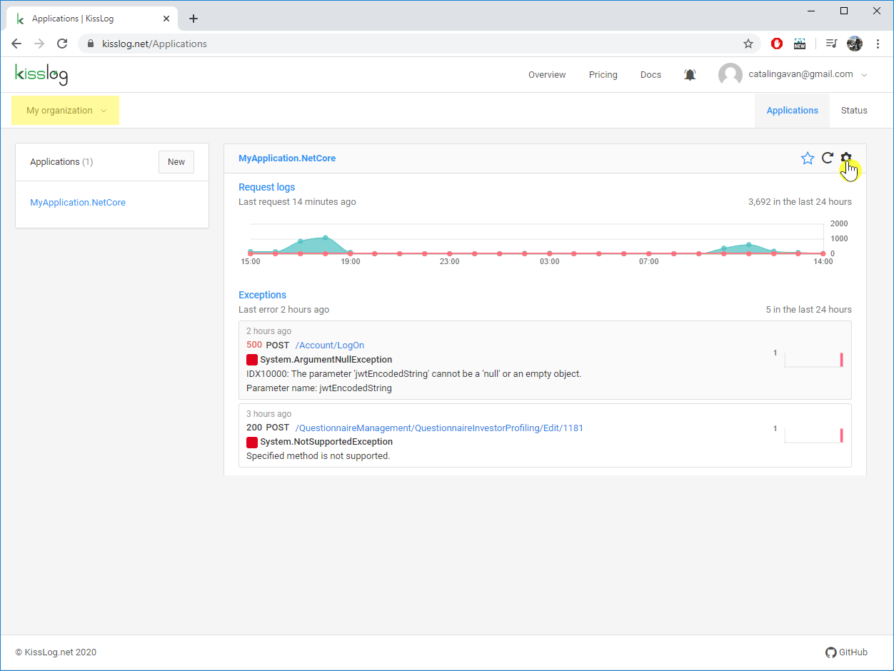
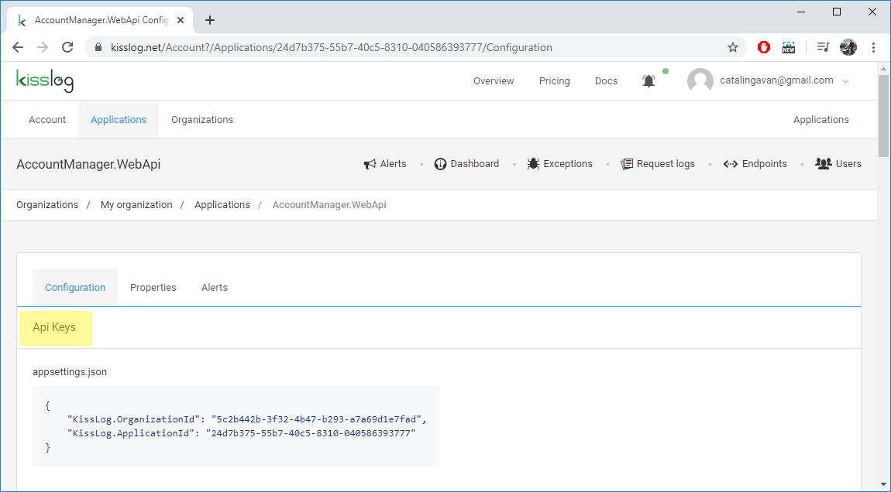

Application configuration
============================

.. contents::
   :local:
   :depth: 1

Navigation
-----------------------------------

To access the Application configuration page:

#. Navigate to ``/Applications`` menu

#. Select the organization from the top left dropdown menu

#. Click on the top-right **cogs** icon under the application panel

.. _apiKeys:

Api Keys
-----------------------------------

The **Api Keys** serves as the unique application idenfier, and it consists of two keys:

* KissLog.OrganizationId

* KissLog.ApplicationId

When using the :doc:`KissLogApiListener </docs/saving-the-logs/KissLogApiListener>` listener, you must provide both of these values.

.. code-block:: c#

    protected void Application_Start()
    {
        string organizationId = "5c2b442b-3f32-4b47-b293-a7a69d1e7fad";
        string applicationId = "24d7b375-55b7-40c5-8310-040586393777";

        ILogListener cloudListener = new KissLogApiListener(new Application(organizationId, applicationId))
        {
            ApiUrl = "https://api.kisslog.net"
        };

        KissLogConfiguration.Listeners.Add(cloudListener);
    }