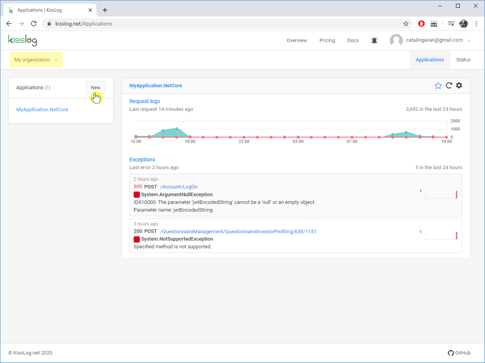
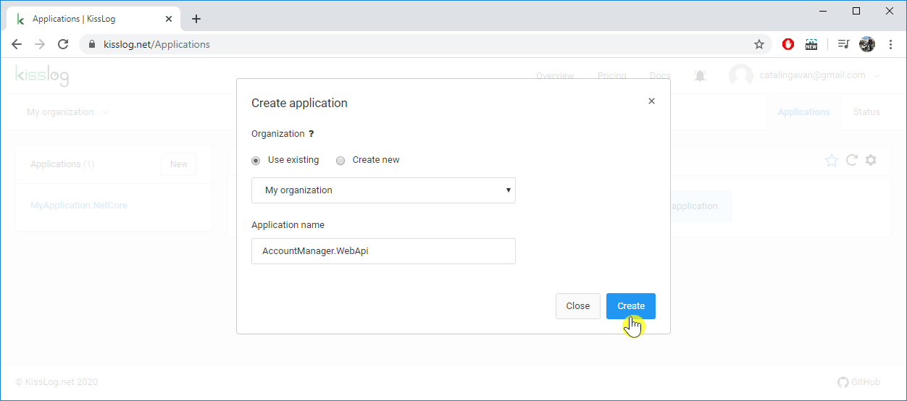
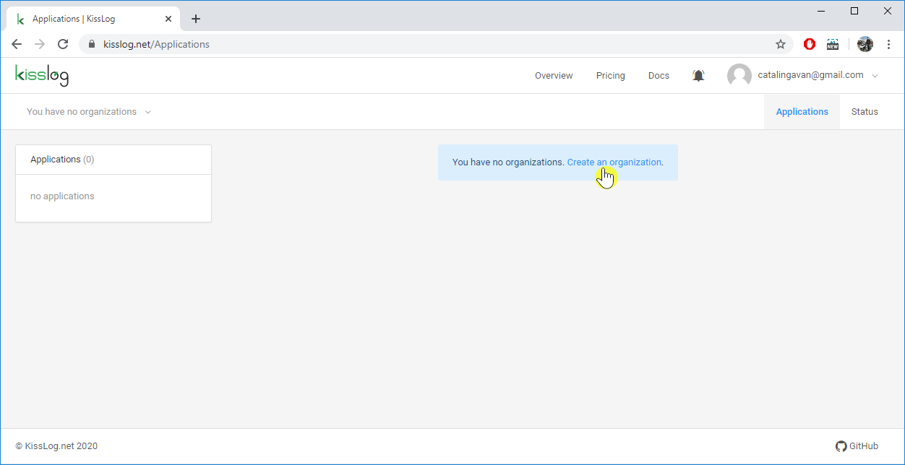
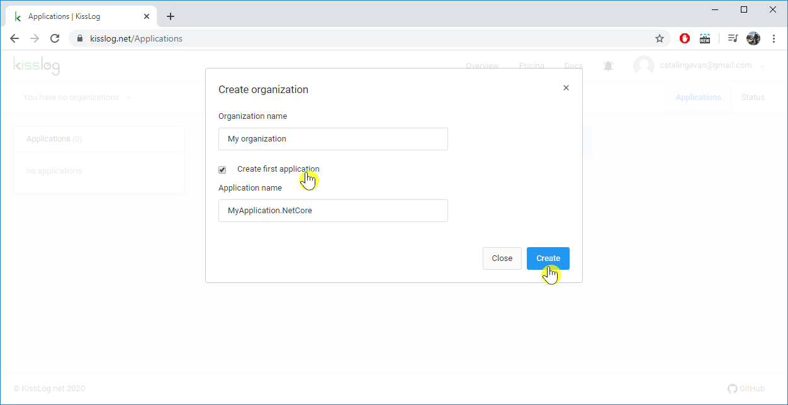

Create application
============================

.. contents::
   :local:
   :depth: 1

Add to existing organization
-----------------------------------

#. Navigate on the ``/Applications`` menu

#. Select the organization from the top left dropdown menu

#. On the Applications menu, click on the **New** button

#. Provide value for the **Application name**

#. Click **Create**

#. Once created, you will be redirected to the Application configuration page

No existing organization
-----------------------------------

#. Navigate on the ``/Applications`` menu

#. Click on the **Create an organization** link

#. Provide values for **Organization name** and **Application name**

#. Click **Create**

#. Once created, you will be redirected to the Application configuration page

